# THREADS.md — execution contexts, flows, and the Rust thread design

This document elaborates decisions **7**, **12**, **19**, **20**, **21**, **22**, **23**, **24**
and **25** of `DECISIONS.md` into something a phase-2 translator can follow without making a
choice. Where an inventory in `files/` or `sweeps/` proposed an alternative, `DECISIONS.md` wins
and the alternative is not repeated here.

Decision 38 forbids `SAFETY` comments and doc comments in the code. Every soundness argument that
would have been a comment lives in §12 of this document, numbered, and every `unsafe impl Send` or
`unsafe impl Sync` in the tree cites one of those numbers in its commit message, never in the
source.

Each subsystem below is drawn twice: the C mechanism first, then its Rust counterpart, so the two
can be read against each other. The C diagrams are the ones from `sweeps/threads.md`, kept intact
where they were already right.

Conventions used throughout, per decision 37: `window_id`, `space_id`, `display_id`,
`process_id`, `process_serial_number`, `window_manager`, `space_manager`, `display_manager`,
`event_loop_owned_state`. No binding is ever abbreviated.

Contents:

1. Inventory of the execution contexts in the C daemon
2. The Rust design, context by context — with the threads-and-channels diagrams
3. The `Event` enum — with the event-lifecycle diagrams
4. Start-up under decision 12 — with the start-up diagrams
5. Refcons and liveness, decisions 20 and 21 — with the window-destruction diagrams
6. The process table, decision 22 — with the KVO re-entrancy diagram
7. The mouse state split, decision 23
8. Animation, decision 24 — with the animation-lifecycle diagrams
9. Child processes, decision 25 — with the child-spawning diagrams
10. The message lifecycle — with the message-lifecycle diagrams
11. Every atomic in the C source, and what replaces it
12. Soundness invariants

---

## 1. Inventory of the execution contexts in the C daemon

### 1.1 The nine contexts

| Tag | What it is | How many | Created at | Dies at |
| --- | --- | --- | --- | --- |
| **MAIN** | the process main thread, running the CFRunLoop that `[NSApp run]` enters | 1 | process start | never; there is no shutdown path |
| **EVENTLOOP** | one pthread running `event_loop_run` | 1 | `pthread_create` at `src/event_loop.c:1718` | never; `is_running` is set `true` at `src/event_loop.c:1717` and never cleared |
| **MSGLOOP** | one pthread running `message_loop_run` | 1 | `pthread_create` at `src/message.c:3042` | never; `g_message_loop.is_running` is likewise never cleared |
| **CVLINK** | a `CVDisplayLink` output-callback thread, one per in-flight animation batch | 0..n | `CVDisplayLinkCreateWithActiveCGDisplays` + `CVDisplayLinkStart` at `src/window_manager.c:700-702` | `CVDisplayLinkStop` / `CVDisplayLinkRelease` at `src/window_manager.c:595-596`, on the tick where `t == 1.0` |
| **PROXY** | short-lived pthreads that capture a window image and build its SLS proxy window | 0..window_count per batch | `pthread_create` at `src/window_manager.c:666` | `pthread_join` at `src/window_manager.c:680`, same batch |
| **CHILD(config)** | `fork`ed child that execs the config file | exactly 1, at start-up; `exec_config_file` has one caller, `src/yabai.c:348` | `fork` at `src/misc/helpers.h:477` | `execvp` at `src/misc/helpers.h:482` |
| **CHILD(signal-flush)** | `fork`ed child that owns one batch of queued signals | 1 per non-empty flush | `fork` at `src/event_signal.c:64` | `exit(EXIT_SUCCESS)` at `src/event_signal.c:96` |
| **CHILD(signal-exec)** | grandchild that execs one user command | 1 per matching subscriber | `fork` at `src/event_signal.c:83` | `execvp` at `src/event_signal.c:92` |
| **CLIENT** | `yabai -m …`, a separate single-threaded process | 1 | `client_send_message` at `src/yabai.c:54` | `exit` at `src/yabai.c:212` |

There is no thread pool, no concurrent libdispatch queue and no asynchronous I/O anywhere in the
daemon. Every `dispatch_after` in the tree targets `dispatch_get_main_queue()`
(`src/event_loop.c:93,157,1478,1516,1520`), so it schedules work back onto MAIN.

### 1.2 MAIN — every source on the run loop

Up to `src/yabai.c:350` MAIN runs straight-line start-up code; from `[NSApp run]` onward it is a
CFRunLoop pump. Everything that wakes it is a run-loop source:

| Source | Installed at | Callback | Events it posts |
| --- | --- | --- | --- |
| Carbon application events | `InstallEventHandler` `src/process_manager.c:251`, from `process_manager_begin` at `src/yabai.c:299` | `process_handler` `src/process_manager.c:151` | `APPLICATION_LAUNCHED` `:183`, `APPLICATION_TERMINATED` `:194`, `APPLICATION_FRONT_SWITCHED` `:200` |
| Per-application AX observer | `CFRunLoopAddSource(CFRunLoopGetMain(), …)` `src/application.c:57` | `application_notification_handler` `src/application.c:6` | `WINDOW_CREATED` `:9`, `WINDOW_FOCUSED` `:12`, `WINDOW_MOVED` `:14`, `WINDOW_RESIZED` `:16`, `WINDOW_TITLE_CHANGED` `:18`, `MENU_OPENED` `:20`, `MENU_CLOSED` `:22`, `WINDOW_MINIMIZED` `:24`, `WINDOW_DEMINIMIZED` `:26`, `WINDOW_DESTROYED` `:38` |
| Mission-control AX observer on Dock.app | `CFRunLoopAddSource(CFRunLoopGetMain(), …)` `src/mission_control.c:87` | `mission_control_notification_handler` `src/mission_control.c:59` | `MISSION_CONTROL_SHOW_ALL_WINDOWS` `:62`, `…SHOW_FRONT_WINDOWS` `:64`, `…SHOW_DESKTOP` `:66`, `MISSION_CONTROL_EXIT` `:68` |
| SLS connection notify procs, events 1204 / 1327 / 1328 / 808 / 804 / 1202 | `SLSRegisterConnectionNotifyProc` `src/yabai.c:322,323,326,329,330,333` | `connection_handler` `src/mission_control.c:7` | `MISSION_CONTROL_ENTER` `:10`, `SLS_SPACE_CREATED` `:13`, `SLS_SPACE_DESTROYED` `:16`, `SLS_WINDOW_ORDERED` `:19`, `SLS_WINDOW_DESTROYED` `:22`; event 1202 only stamps `__last_cmd_tab_time` `:24` |
| CGEventTap, HID tap, head-insert | `CGEventTapCreate` `src/mouse_handler.c:278`, source added `:288` in `kCFRunLoopCommonModes` | `mouse_handler` `src/mouse_handler.c:21` | `MOUSE_DOWN` `:34`, `MOUSE_UP` `:44`, `MOUSE_DRAGGED` `:61`, `MOUSE_MOVED` `:67`; the dock-swipe branch only writes `__pending_gesture` / `__last_gesture_time` `:76-79` |
| Display reconfiguration | `CGDisplayRegisterReconfigurationCallback` `src/display_manager.c:505` | `display_handler` `src/display.c:6` | `DISPLAY_ADDED` `:9`, `DISPLAY_REMOVED` `:11`, `DISPLAY_MOVED` `:13`, `DISPLAY_RESIZED` `:15` |
| `NSWorkspace` notification centre | `-[workspace_context init]` `src/workspace.m:157-180` | `activeDisplayDidChange:` `:281`, `activeSpaceDidChange:` `:286`, `didHideApplication:` `:291`, `didUnhideApplication:` `:297`, `didWake:` `:261` | `DISPLAY_CHANGED`, `SPACE_CHANGED`, `APPLICATION_HIDDEN`, `APPLICATION_VISIBLE`, `SYSTEM_WOKE` |
| `NSDistributedNotificationCenter` | `src/workspace.m:182-185`, `:192-195` | `didChangeMenuBarHiding:` `:266`, `didChangeDockPref:` `:276` | `MENU_BAR_HIDDEN_CHANGED`, `DOCK_DID_CHANGE_PREF` |
| `NSNotificationCenter` | `src/workspace.m:187-190` | `didRestartDock:` `:271` | `DOCK_DID_RESTART` |
| KVO on `NSRunningApplication` | `addObserver:` `src/workspace.m:73` and `:83` | `-observeValueForKeyPath:ofObject:change:context:` `src/workspace.m:209` | `APPLICATION_LAUNCHED` `:232` and `:256` |
| `dispatch_after` onto the main queue | `src/event_loop.c:93,157,1478,1516,1520` | anonymous blocks | `APPLICATION_LAUNCHED` `:95,:159`, `MISSION_CONTROL_CHECK_FOR_EXIT` `:1479,:1517`, `MISSION_CONTROL_EXIT` `:1521` |

MAIN must not block. The CGEventTap is a synchronous filter: `mouse_handler` returns the possibly
modified, possibly `NULL` event to the window server (`src/mouse_handler.c:39,55,86`). A slow MAIN
gets the tap disabled by the OS and re-delivered as `kCGEventTapDisabledByTimeout`, re-enabled at
`src/mouse_handler.c:26-30`. This is the entire reason the event-loop thread exists.

### 1.3 MAIN — what it reads and writes

* `g_process_manager.process`: `table_add` `src/process_manager.c:182`, `table_remove` `:190`,
  `table_find` through `process_manager_find_process` `:162,186,197` and from the `dispatch_after`
  blocks `src/event_loop.c:94,158`. The table is MAIN-owned after start-up.
* `struct process` fields: `terminated` release store `src/process_manager.c:189`,
  `ns_application` release store `:66`, `policy` plain write `src/workspace.m:107,110,230`.
* `struct window`: only the `id_ptr` compare-and-swap at `src/application.c:36`. Nothing else.
* `g_mouse_state`: `handle` relaxed load `src/mouse_handler.c:28`, `modifier` plain read `:36,65`,
  `consume_mouse_click` / `drag_detected` / `consumed_event` `:37,38,46-54,60`.
* The four file-scope flags at `src/event_loop.c:11-14`.
* `g_mission_control_observer` `src/mission_control.c:46-50`, at start-up only.
* The event queue, through `event_loop_post`.

MAIN never touches `g_window_manager`, `g_space_manager` or `g_display_manager` after
`[NSApp run]`, with only the start-up exceptions listed in §4.1.

### 1.4 EVENTLOOP

`event_loop_run` (`src/event_loop.c:1647-1682`) is the single consumer. Every one of the 40
`EVENT_HANDLER_*` bodies runs here and only here, because the only call sites are the X-macro
switch at `src/event_loop.c:1665` and the one direct call
`EVENT_HANDLER_WINDOW_DESTROYED(window, 0)` at `src/event_loop.c:965`, itself inside a handler.

Transitively, EVENTLOOP owns all of `window_manager.c`, `space_manager.c`, `view.c`, `window.c`,
`display_manager.c`, `rule.c`, the drop-action half of `mouse_handler.c`, `event_signal_push`,
and all of `message.c`'s `handle_*` dispatch, because `EVENT_HANDLER(DAEMON_MESSAGE)`
(`src/event_loop.c:1614`) calls `handle_message` at `:1634`.

The state it owns: `g_window_manager`, `g_space_manager`, `g_display_manager`,
`g_mission_control_mode`, `g_process_manager.front_pid` / `last_front_pid` / `switch_event_time`
(`src/event_loop.c:382-384`), `g_signal_event[]` and `g_signal_storage`, the `is_menu_open` /
`ffm_value` pair (`src/event_loop.c:1561-1562`), `g_event_bytes`
(`src/window_manager.c:1280-1317`), and the `ts` temporary arena.

`g_process_manager.finder_psn` belongs with them, with one qualification: it is written once on
MAIN, inside `process_manager_begin` (`src/process_manager.c:223`), and read only on EVENTLOOP
(`src/window_manager.c:1927`, `:2104`, `:2475`). The write precedes the hand-off point of
decision 12, so it is an EVENTLOOP-owned field that start-up fills in, exactly like
`front_pid`, `last_front_pid` and `switch_event_time` (`src/process_manager.c:248-250`).

EVENTLOOP blocks on purpose and is not latency-critical: `usleep(40000)` at
`src/window_manager.c:1313`, the `usleep(100000)` native-fullscreen spin loops at
`src/window_manager.c:2278,2291,2309`, every `scripting_addition_*` call's blocking `recv`
(`src/sa.m:431`), `pthread_join` on the proxy threads (`src/window_manager.c:680`), and the two
unbounded blocking `read` calls in `DAEMON_MESSAGE` (`src/event_loop.c:1622,1626`).

### 1.5 MSGLOOP

`message_loop_run` (`src/message.c:3003-3013`) is three lines: `accept`, `continue` on `-1`,
`event_loop_post(&g_event_loop, DAEMON_MESSAGE, NULL, sockfd)`. It touches no manager state; the
accepted descriptor travels as `param1` and ownership transfers to EVENTLOOP.

### 1.6 CVLINK

`window_manager_animate_window_list_thread_proc` (`src/window_manager.c:537-600`) touches exactly
two pieces of shared state, `g_window_manager.window_animations_table` and
`window_animations_lock`, plus the read-only `g_cv_host_clock_frequency`. It never dereferences
`animation_list[i].window` — only `wid` and `proxy`. That is why a `struct window *` can sit in
the animation record at all: it is dereferenced only on EVENTLOOP, at `src/window_manager.c:694`.

### 1.7 PROXY

`window_manager_build_window_proxy_thread_proc` (`src/window_manager.c:507-533`) touches only its
own `struct window_animation *` and the batch's SLS connection. No globals, no allocator, no
autorelease pool. Spawned while the animations mutex is held (`src/window_manager.c:666`) and
joined immediately after it is released (`:680`), so it is a parallel-for.

### 1.8 The forked children

`exec_config_file` (`src/misc/helpers.h:463-487`) forks at `:477`; the child evaluates
`file_can_execute` and `execvp`s `/usr/bin/env` at `:479-482`.

`event_signal_flush` (`src/event_signal.c:60-97`) forks at `:64`; the parent zeroes
`g_signal_storage.used` and returns; the child walks the batch, runs `event_signal_filter`
(POSIX regex) per subscriber, forks a grandchild at `:83`, calls `setenv` four times at `:86-89`
and `execvp`s at `:92`, and finally `exit(EXIT_SUCCESS)` at `:96`. Reaping is by
`signal(SIGCHLD, SIG_IGN)` at `src/yabai.c:151`; there is no `waitpid` anywhere.

`regex_match`, `buf_len`, `debug` and `setenv` between `fork` and `exec` are not
async-signal-safe. Decision 25 removes every one of them from the child.

### 1.9 CLIENT

`main` (`src/yabai.c:261`) calls `parse_arguments` first (`:264`), and every `--*-service`,
`--*-sa`, `--version`, `--help` and `-m/--message` branch calls `exit` inside `parse_arguments`
(`src/yabai.c:201,207,212,216,220,224,228,232,236,240`). The client path is
`main` → `parse_arguments` → `client_send_message` → `socket_open` / `socket_connect` / `send` /
`shutdown(SHUT_WR)` → blocking `read` loop → `socket_close` → `exit(code)`
(`src/yabai.c:54-124`). No run loop, no threads, no globals beyond `errno`.

In Rust this is a separate module reachable from `main` before anything else is built, and it must
not name `EventLoopOwnedState`, the channel or any manager type.

---

## 2. The Rust design, context by context

### 2.1 One C primitive, one Rust primitive

| C primitive | Where | Rust replacement | Decision |
| --- | --- | --- | --- |
| `pthread_create(&event_loop->thread, …)` `src/event_loop.c:1718` | EVENTLOOP | `std::thread::Builder::new().name("yabai-event-loop").spawn(move \|\| …)` | 12 |
| `pthread_create(&g_message_loop.thread, …)` `src/message.c:3042` | MSGLOOP | `std::thread::Builder::new().name("yabai-message-loop").spawn(move \|\| …)` | 12 |
| `pthread_create` + `pthread_join` `src/window_manager.c:666,680` | PROXY | `std::thread::scope` | 24 |
| Michael–Scott MPSC queue + 512 KiB wrapping arena `src/event_loop.c:1684-1703`, `src/misc/memory_pool.h:29-45` | event queue | `std::sync::mpsc::channel::<Event>()` | 19 |
| `sem_open` / `sem_unlink` / `sem_wait` / `sem_post` `src/event_loop.c:1678,1702,1709-1710` | EVENTLOOP wake-up | `Receiver::recv` blocking, `Receiver::try_recv` draining | 19 |
| `[[NSAutoreleasePool alloc] init]` / `[pool drain]` `src/event_loop.c:1653,1677` | drain batch | `objc2::rc::autoreleasepool` around the drain batch | 19 |
| `pthread_mutex_t window_animations_lock` `src/window_manager.h:84` | animations | `Arc<Mutex<Table<WindowId, WindowAnimationHandle>>>` | 24 |
| `volatile bool skip` `src/view.h:75` | animation cancel | `AtomicBool` | 24 |
| `proxy.tx` / `ty` / `tw` / `th` raced between CVLINK and EVENTLOOP | animation | `AtomicU32` holding `f32::to_bits` | 24 |
| `__sync_bool_compare_and_swap(&window->id_ptr, …)` `src/application.c:36`, `src/event_loop.c:280` and nine probes | liveness | `WindowLivenessCell` `compare_exchange` and `load` | 21 |
| `struct process *` through the queue `src/process_manager.c:183,194,200` | process | `Arc<Process>` | 22 |
| `g_process_manager.process` table | process table | `Mutex<Table<ProcessSerialNumber, Arc<Process>>>` | 16, 22 |
| `g_mouse_state` `src/mouse_handler.h:62-81` | mouse | a static of atomics plus a field of `EventLoopOwnedState` | 23 |
| `fork` + `setenv` + `execvp` `src/event_signal.c:64,83-92` | children | `libc::fork` + `execvp`, everything precomputed in the parent, `_exit` | 25 |
| `fork` + `execvp` `src/misc/helpers.h:477-482` | config child | same | 25 |
| `CVDisplayLinkSetOutputCallback` `src/window_manager.c:701` | CVLINK | `unsafe extern "C" fn` trampoline over `Arc::into_raw` | 24 |
| `dispatch_after(..., dispatch_get_main_queue(), ^{ … })` `src/event_loop.c:93,157,1478,1516,1520` | MAIN re-entry | `dispatch2` `dispatch_after_f` with an `extern "C" fn` and a leaked `Box` context | 11 |
| the nine mutable globals `src/yabai.c:27-52` | ownership | one `EventLoopOwnedState` moved into the event-loop thread, plus `OnceLock` statics | 12, 18 |

That table is the whole list. The manager graph is not behind an `Arc<Mutex<_>>`, there is no
global accessor for any manager, and no dependency outside the eleven crates decision 11 names is
introduced by anything in this document.

### 2.2 MAIN

`[NSApp run]` stays. Every callback stays an `unsafe extern "C" fn` with the exact C signature
(`OBSERVER_CALLBACK`, `CONNECTION_CALLBACK`, `DISPLAY_EVENT_HANDLER`, `MOUSE_HANDLER`,
`PROCESS_EVENT_HANDLER` written out in full, since decision 37 keeps the C names but Rust has no
signature macro). Each body does the minimum and then sends one `Event`.

Decision 7 makes `panic = "unwind"` mandatory in every profile, with a hook installed as the first
statement of `main` that prints and calls `std::process::abort`. That gives every callback the
right behaviour without a `catch_unwind` at each boundary: a panic inside an ObjC or CF frame
prints and aborts before unwinding reaches the foreign frame. `objc2::exception::catch` is used
only where the C deliberately swallows an ObjC exception, which is the four `@try`/`@catch` pairs
at `src/workspace.m:56-62,93-99,226-228,251-253` and the two at
`src/event_loop.c:112-118,131-137`.

What MAIN can reach:

```rust
static EVENT_SENDER: OnceLock<Sender<Event>> = OnceLock::new();
static MOUSE_TAP_SHARED_STATE: MouseTapSharedState = MouseTapSharedState::new();
static PENDING_WINDOW_FOCUS: AtomicBool = AtomicBool::new(false);
static PENDING_GESTURE: AtomicBool = AtomicBool::new(false);
static LAST_GESTURE_TIME: AtomicU64 = AtomicU64::new(0);
static LAST_CMD_TAB_TIME: AtomicU64 = AtomicU64::new(0);
static PROCESS_MANAGER_TABLE: OnceLock<Mutex<Table<ProcessSerialNumber, Arc<Process>>>> = OnceLock::new();
```

Edition 2024 implies a toolchain in which `std::sync::mpsc::Sender<T>` is `Sync` whenever
`T: Send`, so `OnceLock<Sender<Event>>` needs no `unsafe impl` of its own; it needs only
`Event: Send`, which holds by the automatic impl once every CF payload is a `SendCFRetained`
(§3.1, invariant 1 in §12).

Posting from a callback is always the same three lines, and it is infallible in the same sense
`event_loop_post` is:

```rust
fn event_loop_post(event: Event)
{
    if let Some(event_sender) = EVENT_SENDER.get() {
        let _ = event_sender.send(event);
    }
}
```

A `send` on a channel whose receiver has been dropped returns the event back in the error, which
drops it and releases whatever it owned. That case cannot arise while the daemon lives, because
the receiver is owned by the event-loop thread and the event-loop thread never returns.

### 2.3 EVENTLOOP

`EventLoopOwnedState` holds everything decision 12 puts on this thread. The struct is defined once,
in `patterns/state-and-ownership.md` §1.1, and is reproduced here field for field and in the same
order, because the whole of §4 argues about it:

```rust
pub struct EventLoopOwnedState {
    pub process_manager: ProcessManager,
    pub display_manager: DisplayManager,
    pub space_manager: SpaceManager,
    pub window_manager: WindowManager,
    pub mouse_drag_state: MouseDragState,
    pub mission_control_mode: MissionControlMode,
    pub signal_event: [Vec<Signal>; SIGNAL_TYPE_COUNT],
    pub signal_storage: Vec<PendingSignal>,
    pub focus_follows_mouse_suspended_value: FfmMode,
    pub is_menu_open: i32,
}

unsafe impl Send for EventLoopOwnedState {}
```

`ProcessManager` is what is left of `struct process_manager` (`src/process_manager.h:17-28`) once
the table and the Carbon installation are taken out of it by decision 22:

```rust
pub struct ProcessManager {
    pub front_process_id: i32,
    pub last_front_process_id: i32,
    pub switch_event_time: f64,
    pub finder_process_serial_number: ProcessSerialNumber,
}
```

All four are written by `process_manager_begin` — `finder_process_serial_number` at
`src/process_manager.c:223`, the other three at `:248-250` — which is why that function takes
`&mut ProcessManager` and why step 6 of §4.2 builds the state before step 8 runs it.
`front_process_id`, `last_front_process_id` and `switch_event_time` are then read and written on
EVENTLOOP only (`src/event_loop.c:382-384`), and
`finder_process_serial_number` is read on EVENTLOOP only
(`src/window_manager.c:1927`, `:2104`, `:2475`); none of them belongs in the `Mutex`-guarded
process table of §6.

There is no `key_event_bytes` field. `g_event_bytes` (`src/yabai.c:42`, allocated and zeroed at
`:141-142`) is gone, as `patterns/state-and-ownership.md` §1.2 records: it becomes a zeroed
`[u8; 0x100]` local in each of the two functions that use it,
`window_manager_make_key_window` (`src/window_manager.c:1280-1290`) and
`window_manager_focus_window_without_raise` (`src/window_manager.c:1298-1317`). Both `memset`
bytes `0..0xf8` before every use and never read `0xf8..0x100`. One `DEVIATIONS.md` line.

There is no `event_sender` field either. Every producer, on whatever thread, posts through the
`EVENT_SENDER` `OnceLock` of §2.2, including the handlers running on EVENTLOOP itself
(`src/event_loop.c:167`, `:917`, `src/window_manager.c:1467`). The `Sender` is a process-wide
value, not event-loop-owned state, so decision 13's "no function reaches event-loop-owned state
through a global" does not apply to it.

`EventLoopOwnedState` is deliberately `!Sync`: it contains `CFRetained` handles and raw
`AXUIElementRef`s. It is `Send` by invariant 2 in §12, and `Send` is all the move into the thread
needs.

Every handler is a free function taking the managers it touches as explicit `&mut` parameters, in
the C parameter order with any manager the C reached through a global appended (decision 13). The
dispatch is the single place that owns the whole struct:

```rust
fn event_loop_run(event_receiver: Receiver<Event>, mut event_loop_owned_state: EventLoopOwnedState)
{
    while let Ok(first_event_of_batch) = event_receiver.recv() {
        objc2::rc::autoreleasepool(|_autorelease_pool| {
            let mut event = first_event_of_batch;
            loop {
                event_loop_dispatch(&mut event_loop_owned_state, event);
                event_signal_flush(&mut event_loop_owned_state);
                match event_receiver.try_recv() {
                    Ok(next_event) => event = next_event,
                    Err(_) => break,
                }
            }
        });
    }
}
```

Three properties of `src/event_loop.c:1647-1682` that this preserves exactly:

1. The autorelease pool wraps a whole drain batch, not one event. Objects autoreleased by a
   handler live until the queue runs empty, as at `src/event_loop.c:1653` and `:1677`.
2. `event_signal_flush` runs after every single event, at the position of
   `src/event_loop.c:1670`. The fork it performs is observable in the ordering of child processes
   against later events, so it may not be hoisted out of the loop.
3. FIFO across all producers.

Two things it deliberately does not preserve, both of which decision 19 removes: the semaphore's
over-signalling, which made `sem_wait` return on an empty queue and the loop churn one empty
autorelease pool, and the wrapping arena, which recycled live event nodes after roughly 21 845
unconsumed posts (`src/misc/memory_pool.h:39-42`). Both are recorded as one line each in
`DEVIATIONS.md`.

`ts_reset()` at `src/event_loop.c:1671` has no counterpart: decision 17 replaces the `ts` arena
with owned `Vec` and `String`, so a handler's temporaries are dropped when the handler returns.
Because decision 17 also makes queued signals own their strings, the "flush before reset" coupling
that `src/event_signal.c` depended on disappears with it.

### 2.4 MSGLOOP

`UnixListener::bind` cannot be used. It performs `socket`, `bind` **and** `listen` in one call,
and the C chmods the path between the bind and the listen:
`unlink` (`src/message.c:3021`), `socket` (`:3023`), `bind` (`:3027`), `chmod(socket_path, 0600)`
(`:3031`, returning false if it fails), `listen(…, SOMAXCONN)` (`:3035`), `fcntl FD_CLOEXEC`
(`:3039`). Before `listen` a connect attempt gets `ECONNREFUSED`, so the C has no window in which
the socket is both reachable and world-accessible. `UnixListener::bind` would open exactly that
window — the listener is already accepting while the path still carries the umask-derived mode,
and every `yabai -m` command reaches `handle_message` through it
(`src/event_loop.c:1614-1644`). The C's order is kept instead, and the listener is adopted from
the raw descriptor afterwards:

```rust
fn message_loop_begin(socket_path: &Path, event_sender: Sender<Event>) -> bool
{
    let _ = std::fs::remove_file(socket_path);

    let socket_descriptor = unsafe { libc::socket(libc::AF_UNIX, libc::SOCK_STREAM, 0) };
    if socket_descriptor == -1 { return false }

    let mut socket_address: libc::sockaddr_un = unsafe { std::mem::zeroed() };
    socket_address.sun_family = libc::AF_UNIX as libc::sa_family_t;
    if !socket_address_write_path(&mut socket_address, socket_path) { return false }

    if unsafe {
        libc::bind(
            socket_descriptor,
            &socket_address as *const libc::sockaddr_un as *const libc::sockaddr,
            std::mem::size_of::<libc::sockaddr_un>() as libc::socklen_t,
        )
    } == -1 { return false }

    if std::fs::set_permissions(socket_path, Permissions::from_mode(0o600)).is_err() { return false }

    if unsafe { libc::listen(socket_descriptor, libc::SOMAXCONN) } == -1 { return false }

    unsafe {
        libc::fcntl(
            socket_descriptor,
            libc::F_SETFD,
            libc::FD_CLOEXEC | libc::fcntl(socket_descriptor, libc::F_GETFD),
        );
    }

    let listener = unsafe { UnixListener::from_raw_fd(socket_descriptor) };
    std::thread::Builder::new()
        .name("yabai-message-loop".to_string())
        .spawn(move || message_loop_run(listener, event_sender))
        .is_ok()
}

fn message_loop_run(listener: UnixListener, event_sender: Sender<Event>)
{
    loop {
        let Ok(stream) = listener.accept() else { continue };
        let _ = event_sender.send(Event::DaemonMessage(stream.0));
    }
}
```

`socket_address_write_path` is the `snprintf` into `sun_path` at `src/message.c:3020`, truncating
at `sizeof(sun_path)` exactly as the C does. `SOMAXCONN` is passed explicitly rather than taken
from std's backlog of `128`; on macOS the two are the same value, and writing the constant keeps
the equivalence from depending on that.

The descriptor leaks when a later step fails, exactly as it does in C: `src/message.c:3028`,
`:3032` and `:3036` all `return false` without closing `g_message_loop.sockfd`, and
`message_loop_begin` failing is fatal at `src/yabai.c:344-346`. `UnixListener::from_raw_fd` is
reached only on the success path, so nothing closes the descriptor twice.

Accepted streams from std are `FD_CLOEXEC`, where the C's are not (`src/message.c:3039` sets it on
the listening descriptor only). That is a behaviour change — a client descriptor can no longer be
inherited by a signal command — and it is recorded in `DEVIATIONS.md`.

### 2.5 CVLINK

`CVDisplayLink` is declared by hand in `src/ffi/`, as decision 11 requires for everything outside
the listed crates other than `objc2-core-video`'s own surface. The callback keeps the C signature
and reclaims its context on the final tick:

```rust
unsafe extern "C" fn window_manager_animate_window_list_thread_proc(
    link: CVDisplayLinkRef,
    now: *const CVTimeStamp,
    output_time: *const CVTimeStamp,
    flags: CVOptionFlags,
    flags_out: *mut CVOptionFlags,
    data: *mut c_void,
) -> CVReturn
```

`data` is `Arc::into_raw(Arc::clone(&animation_context)) as *mut c_void`, produced at the position
of `src/window_manager.c:701`. On the tick where `t == 1.0` the callback rebuilds the `Arc` with
`Arc::from_raw` and drops it, at the position of the `free(context)` at
`src/window_manager.c:593`. On every other tick it borrows through
`ManuallyDrop<Arc<AnimationContext>>` so the count is untouched.

### 2.6 PROXY

```rust
std::thread::scope(|scope| {
    for window_animation in animation_context.animation_list.iter() {
        if window_animation.needs_a_builder_thread() {
            scope.spawn(|| window_manager_build_window_proxy_thread_proc(window_animation, &animation_context));
        }
    }
});
```

`thread::scope` joins at the closing brace, which is the position of the `pthread_join` loop at
`src/window_manager.c:680`. The `ts_alloc_list(pthread_t, window_count)` array at
`src/window_manager.c:615` disappears with it.

The C falls back to running the builder inline when `pthread_create` fails
(`src/window_manager.c:669`). `Scope::spawn` panics instead of returning an error, and under
decision 7 a panic aborts. The fallback is therefore kept explicitly: the spawn goes through
`std::thread::Builder::new().spawn_scoped(scope, …)`, which returns `io::Result`, and an `Err`
runs `window_manager_build_window_proxy_thread_proc` inline on the spawning thread, exactly as
`src/window_manager.c:669` does.

### 2.7 Children

Decision 25: `libc::fork` plus `execvp`, so the `SIGPIPE` and `SIGCHLD` dispositions set at
`src/yabai.c:151-152` are inherited exactly as in C, and the double fork of
`src/event_signal.c:64,83` is kept. The full design is §9.

### 2.8 CLIENT

`client_send_message` (`src/yabai.c:54-124`) becomes a module that uses only `UnixStream`,
`Write`, `Read` and `std::process::exit`. It is called from `parse_arguments` before any static is
initialised, so it can neither observe nor create the daemon's state.

### 2.9 Diagram — threads and channels in C

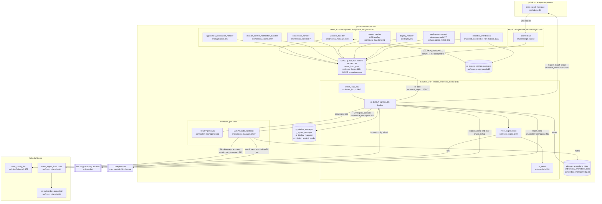

### 2.10 Diagram — threads and channels in Rust

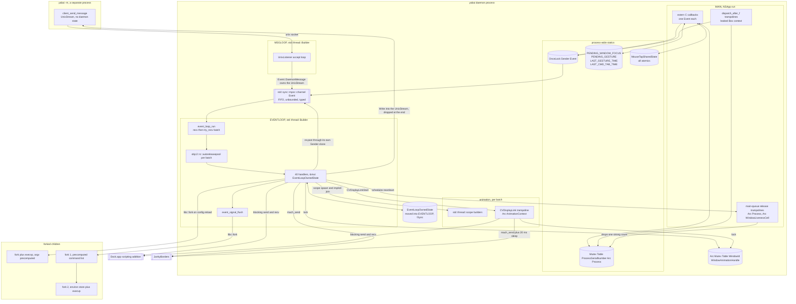

---

## 3. The `Event` enum

`struct event` (`src/event_loop.h:55-61`) is `{ enum event_type type; int param1; void *context;
struct event *next; }`, where `context` is sometimes an owning pointer, sometimes a borrowed
pointer and sometimes an integer pushed through `(void *)(intptr_t)`. Decision 19 replaces the
pair with one variant per entry of `EVENT_TYPE_LIST`, each owning its payload, and replaces every
hand-written `CFRelease` / `free` / `close` with `Drop`.

### 3.1 The enum

```rust
enum Event {
    ApplicationLaunched(Arc<Process>),
    ApplicationTerminated(Arc<Process>),
    ApplicationFrontSwitched(Arc<Process>),
    ApplicationVisible(ProcessId),
    ApplicationHidden(ProcessId),
    WindowCreated(SendCFRetained<AXUIElement>),
    WindowDestroyed(WindowId),
    WindowFocused(WindowId),
    WindowMoved(WindowId),
    WindowResized(WindowId),
    WindowMinimized(WindowId),
    WindowDeminimized(WindowId),
    WindowTitleChanged(WindowId),
    SlsWindowOrdered(WindowId),
    SlsWindowDestroyed(WindowId),
    SlsSpaceCreated(SpaceId),
    SlsSpaceDestroyed(SpaceId),
    SpaceChanged,
    DisplayAdded(DisplayId),
    DisplayRemoved(DisplayId),
    DisplayMoved(DisplayId),
    DisplayResized(DisplayId),
    DisplayChanged,
    MouseDown { event: SendCFRetained<CGEvent>, modifier: MouseModifier },
    MouseUp { event: SendCFRetained<CGEvent> },
    MouseDragged { event: SendCFRetained<CGEvent> },
    MouseMoved { event: SendCFRetained<CGEvent>, modifier: MouseModifier },
    MissionControlShowAllWindows,
    MissionControlShowFrontWindows,
    MissionControlShowDesktop,
    MissionControlEnter,
    MissionControlCheckForExit,
    MissionControlExit,
    DockDidRestart,
    MenuOpened(WindowId),
    MenuClosed,
    MenuBarHiddenChanged,
    DockDidChangePref,
    SystemWoke,
    DaemonMessage(UnixStream),
}
```

Forty variants, in the order of `src/event_loop.h:6-46`. The order is not observable — nothing
passes an `event_type` across a process boundary — so decision 31 does not require explicit
discriminants here, and none are written.

There is **no** `unsafe impl Send for Event`. `CFRetained<T>` is neither `Send` nor `Sync`, so
every CF payload is wrapped in the `SendCFRetained<T>` newtype that
`patterns/memory-text-and-os-objects.md` §1.14 defines — one newtype, one soundness argument
(invariant 1 in §12), used for the four mouse variants and for `WindowCreated`. The remaining
payloads are `Arc<Process>` (`Send` by invariant 3), `UnixStream` (`Send` in std) and `Copy`
scalars, so `Event` is `Send` by the automatic impl and nothing is asserted about it by hand. It
is deliberately not `Sync`, and nothing needs it to be.

### 3.2 Variant table

| Variant | C `context` / `param1` | Owned payload | Constructed on | What `Drop` releases |
| --- | --- | --- | --- | --- |
| `ApplicationLaunched` | `struct process *`, borrowed | `Arc<Process>` | MAIN: `src/process_manager.c:183`, `src/workspace.m:232`, `:256`, and the two `dispatch_after` blocks `src/event_loop.c:95,159` | one strong count; the table holds another |
| `ApplicationTerminated` | `struct process *`, moved, already removed from the table at `src/process_manager.c:190` | `Arc<Process>` | MAIN: `src/process_manager.c:194` | one strong count, the table's, moved into the event |
| `ApplicationFrontSwitched` | `struct process *`, borrowed | `Arc<Process>` | MAIN: `src/process_manager.c:200`; EVENTLOOP: `src/event_loop.c:167` | one strong count |
| `ApplicationVisible` | `(void *)(intptr_t) pid_t` | `ProcessId` | MAIN: `src/workspace.m:300` | nothing |
| `ApplicationHidden` | `(void *)(intptr_t) pid_t` | `ProcessId` | MAIN: `src/workspace.m:294` | nothing |
| `WindowCreated` | `AXUIElementRef` at +1 | `SendCFRetained<AXUIElement>` | MAIN: `src/application.c:9` | `CFRelease`, replacing the four early releases at `src/event_loop.c:554,557,560,563` |
| `WindowDestroyed` | `struct window *`, moved | `WindowId` | MAIN: `src/application.c:38`, after the claim; EVENTLOOP: `src/event_loop.c:965` | nothing; the `Window` is removed from `WindowManager` by the handler |
| `WindowFocused` | `(void *)(intptr_t) uint32_t` | `WindowId` | MAIN: `src/application.c:12`; EVENTLOOP: `src/event_loop.c:917`, `src/window_manager.c:1467` | nothing |
| `WindowMoved` | `(void *)(intptr_t) uint32_t` | `WindowId` | MAIN: `src/application.c:14` | nothing |
| `WindowResized` | `(void *)(intptr_t) uint32_t` | `WindowId` | MAIN: `src/application.c:16` | nothing |
| `WindowMinimized` | `struct window *`, borrowed refcon | `WindowId` | MAIN: `src/application.c:24` | nothing |
| `WindowDeminimized` | `struct window *`, borrowed refcon | `WindowId` | MAIN: `src/application.c:26` | nothing |
| `WindowTitleChanged` | `(void *)(intptr_t) uint32_t` | `WindowId` | MAIN: `src/application.c:18` | nothing |
| `SlsWindowOrdered` | `(void *)(intptr_t) uint32_t` | `WindowId` | MAIN: `src/mission_control.c:19` | nothing |
| `SlsWindowDestroyed` | `(void *)(intptr_t) uint32_t` | `WindowId` | MAIN: `src/mission_control.c:22` | nothing |
| `SlsSpaceCreated` | `(void *)(intptr_t) uint64_t` | `SpaceId` | MAIN: `src/mission_control.c:13` | nothing |
| `SlsSpaceDestroyed` | `(void *)(intptr_t) uint64_t` | `SpaceId` | MAIN: `src/mission_control.c:16` | nothing |
| `SpaceChanged` | `NULL` | none | MAIN: `src/workspace.m:288` | nothing |
| `DisplayAdded` | `(void *)(intptr_t) uint32_t` | `DisplayId` | MAIN: `src/display.c:9` | nothing |
| `DisplayRemoved` | `(void *)(intptr_t) uint32_t` | `DisplayId` | MAIN: `src/display.c:11` | nothing |
| `DisplayMoved` | `(void *)(intptr_t) uint32_t` | `DisplayId` | MAIN: `src/display.c:13` | nothing |
| `DisplayResized` | `(void *)(intptr_t) uint32_t` | `DisplayId` | MAIN: `src/display.c:15` | nothing |
| `DisplayChanged` | `NULL` | none | MAIN: `src/workspace.m:283` | nothing |
| `MouseDown` | `CGEventRef` at +1, `param1` is the modifier byte | `SendCFRetained<CGEvent>`, `MouseModifier` | MAIN: `src/mouse_handler.c:34` | `CFRelease`, replacing `src/event_loop.c:1151` |
| `MouseUp` | `CGEventRef` at +1 | `SendCFRetained<CGEvent>` | MAIN: `src/mouse_handler.c:44` | `CFRelease`, replacing `src/event_loop.c:1232` |
| `MouseDragged` | `CGEventRef` at +1 | `SendCFRetained<CGEvent>` | MAIN: `src/mouse_handler.c:61` | `CFRelease`, replacing `src/event_loop.c:1244` and `:1342` |
| `MouseMoved` | `CGEventRef` at +1, `param1` is the modifier byte, never read by the handler | `SendCFRetained<CGEvent>`, `MouseModifier` | MAIN: `src/mouse_handler.c:67` | `CFRelease`, replacing `src/event_loop.c:1449` |
| `MissionControlShowAllWindows` | `NULL` | none | MAIN: `src/mission_control.c:62` | nothing |
| `MissionControlShowFrontWindows` | `NULL` | none | MAIN: `src/mission_control.c:64` | nothing |
| `MissionControlShowDesktop` | `NULL` | none | MAIN: `src/mission_control.c:66` | nothing |
| `MissionControlEnter` | `NULL` | none | MAIN: `src/mission_control.c:10` | nothing |
| `MissionControlCheckForExit` | `NULL` | none | MAIN, `dispatch_after`: `src/event_loop.c:1479`, `:1517` | nothing |
| `MissionControlExit` | `NULL` | none | MAIN: `src/mission_control.c:68`; MAIN, `dispatch_after`: `src/event_loop.c:1521` | nothing |
| `DockDidRestart` | `NULL` | none | MAIN: `src/workspace.m:271` | nothing |
| `MenuOpened` | `(void *)(intptr_t) uint32_t`, computed and never read | `WindowId` | MAIN: `src/application.c:20` | nothing |
| `MenuClosed` | `NULL` | none | MAIN: `src/application.c:22` | nothing |
| `MenuBarHiddenChanged` | `NULL` | none | MAIN: `src/workspace.m:266` | nothing |
| `DockDidChangePref` | `NULL` | none | MAIN: `src/workspace.m:276` | nothing |
| `SystemWoke` | `NULL` | none | MAIN: `src/workspace.m:261` | nothing |
| `DaemonMessage` | `param1` is the accepted descriptor, moved | `UnixStream` | MSGLOOP: `src/message.c:3009` | `close`, replacing the `fclose` at `src/event_loop.c:1637` exclusive-or the `socket_close` at `:1643` |

Three entries in that table are where the type system does real work.

**`WindowCreated`.** In C the `+1` from `src/application.c:9` is released on four distinct early
exits and adopted by `window_create` on the fifth path (`src/window.c:1099`), which is also why
`if (!window) return;` at `src/event_loop.c:566` is correct. With `SendCFRetained<AXUIElement>`
the four early exits become plain `return`s and the fifth moves the value into
`Window::reference`, whose `Drop` carries the release that `window_destroy` performs at
`src/window.c:1142`. `Window::reference` is therefore spelled `SendCFRetained<AXUIElement>` too —
the same type the variant carries, because the value is moved from one into the other and no
conversion happens on the way.

**`WindowMinimized` and `WindowDeminimized`.** These are the only two events whose C `context` is
a live `struct window *` that the EVENTLOOP handler dereferences without owning. Decision 14
forbids that pointer, so the payload is the window id read from the refcon's liveness cell, and
the handler looks the window up in `WindowManager.window`. A lookup miss is exactly the case where
C would have dereferenced a freed pointer.

**`DaemonMessage`.** The fd is moved into the variant and dropped by the handler; "closed exactly
once" stops being an argument about two code paths and becomes ownership.

### 3.3 Diagram — event lifecycle in C, OS callback to handler

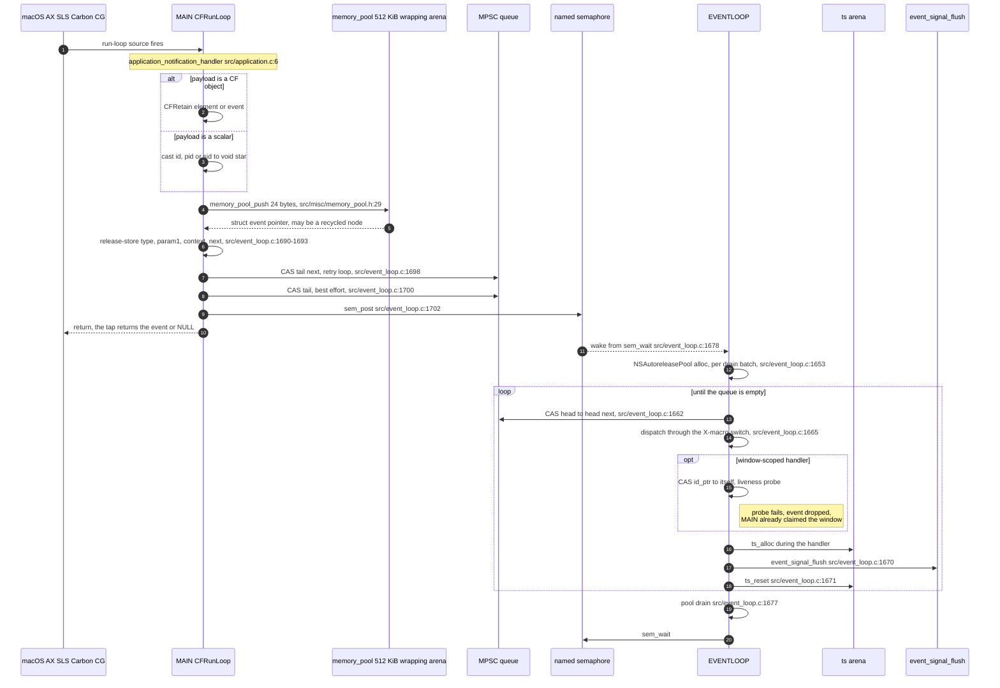

### 3.4 Diagram — event lifecycle in Rust

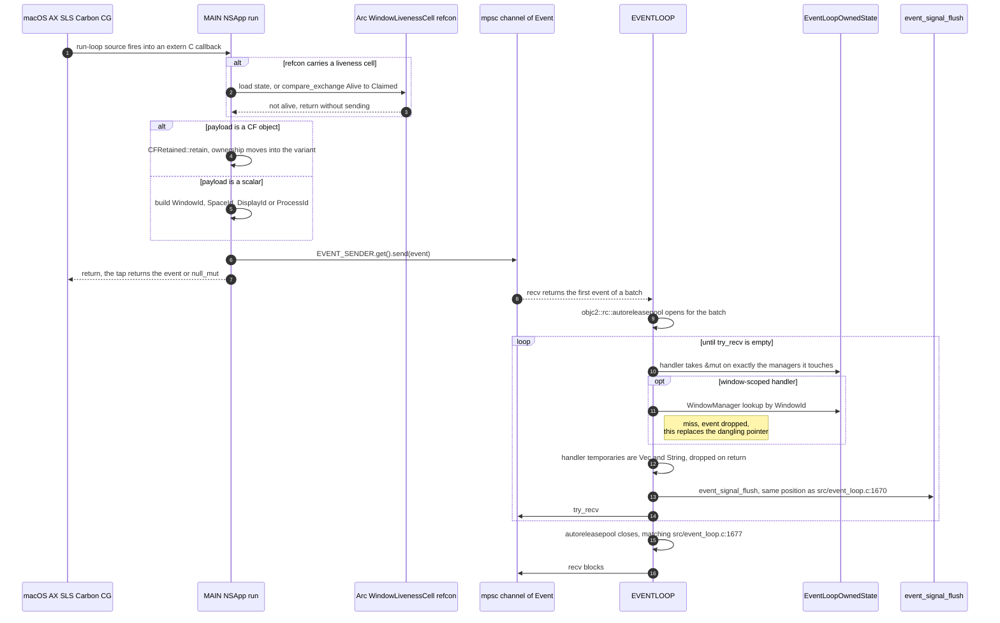

---

## 4. Start-up under decision 12

### 4.1 What `main` does in C

`main` (`src/yabai.c:261-353`), in order:

| # | C line | Statement | Thread effect |
| --- | --- | --- | --- |
| 1 | `:264` | `parse_arguments` | may `exit`; the client path never returns |
| 2 | `:267-277` | `is_root`, `ax_privilege`, `SLSGetSpaceManagementMode` guards | none |
| 3 | `:279-285` | `ts_init(MEGABYTES(8))`, `memory_pool_init(&g_signal_storage, KILOBYTES(256))` | none |
| 4 | `:287` | `configure_settings_and_acquire_lock` | writes every process-wide value; `signal(SIGCHLD, SIG_IGN)` and `signal(SIGPIPE, SIG_IGN)` at `:151-152`; `fcntl(F_SETLK)` at `:177` |
| 5 | `:291` | `event_loop_begin` | **EVENTLOOP starts here, before any manager exists** |
| 6 | `:295` | `workspace_event_handler_begin` | installs eight NS observers |
| 7 | `:299` | `process_manager_begin` | fills the process table, installs the Carbon handler |
| 8 | `:303` | `display_manager_begin` | registers the display callback |
| 9 | `:307` | `mouse_handler_begin` | creates and arms the event tap |
| 10 | `:311-334` | `mission_control_observe`, `SLSRegisterConnectionNotifyProc` ×6 | installs the remaining sources |
| 11 | `:336` | `window_manager_init` | **this is where the tables and `window_animations_lock` are created**, `src/window_manager.c:2727-2734` |
| 12 | `:337-338` | `space_manager_begin`, `window_manager_begin` | `window_manager_begin` iterates the process table on MAIN and calls `workspace_application_observe_activation_policy` at `src/window_manager.c:2753` |
| 13 | `:341` | `update_window_notifications` | reads `g_window_manager.window` on MAIN |
| 14 | `:344` | `message_loop_begin` | MSGLOOP starts |
| 15 | `:348` | `exec_config_file` | forks the config child |
| 16 | `:350` | `[NSApp run]` | the run loop turns for the first time |

The window between step 5 and step 11 is a latent hazard: EVENTLOOP is alive while
`g_window_manager` is still zeroed. It is safe because every event producer installed in that
window is a main run-loop callback and the main run loop does not turn until step 16.
`process_manager_begin` enumerates with `GetNextProcess` (`src/process_manager.c:211`) and posts
nothing, so EVENTLOOP goes straight to `sem_wait` and sleeps until step 16.

Two producers do run before `[NSApp run]`, both reached synchronously from `window_manager_begin`
at step 12:

* `workspace_application_observe_activation_policy` (`src/window_manager.c:2753`), whose
  `NSKeyValueObservingOptionInitial` fires `-observeValueForKeyPath:` synchronously on MAIN
  (`src/workspace.m:83`, `:209`). The `activationPolicy` branch is `src/workspace.m:211-234` and
  its `event_loop_post(APPLICATION_LAUNCHED)` is at `src/workspace.m:232`. (`:256` is the
  `finishedLaunching` branch, `src/workspace.m:236-257`, which this observation cannot reach.)
  **That post does not normally happen.** It is gated by `[result intValue] != process->policy` at
  `src/workspace.m:216`, and `window_manager_begin` has called
  `workspace_application_is_observable(process)` one line earlier, at `src/window_manager.c:2741`,
  which assigns `process->policy = [application activationPolicy]` at `src/workspace.m:107`. The
  Initial change's new value is that same activation policy, so the branch is not taken. It fires
  only when the policy actually changes between `:2741` and the delivery of the Initial
  notification, or when `ns_application` was null at `:2741` (policy forced to
  `NSApplicationActivationPolicyProhibited`, `src/workspace.m:110`) and non-null by the time
  `:2753` subscribes.
* `window_manager_add_existing_application_windows` → `window_manager_create_and_add_window`,
  which posts `WINDOW_FOCUSED` at `src/window_manager.c:1467` when the new window matches a queued
  lost-focus event. The lost-focus table is empty at start-up, so this too fires only on a race.

So the C's ordering here is not load-bearing after all: the window between step 5 and step 11 is
safe for the general reason, not because of any one path. Neither of these two posts happens on
the ordinary start-up, and if one did, the C would handle it against managers that step 11 had
just finished initialising.

### 4.2 What `main` does in Rust

Decision 12 splits `event_loop_begin` in two. The channel is created at the position of the C's
step 5 (`src/yabai.c:291`); the thread is spawned after the C's step 13 (`src/yabai.c:341`). The
step numbers in the table below are the Rust ones and do not line up with §4.1's.

| # | Rust statement | Position against C |
| --- | --- | --- |
| 0 | `std::panic::set_hook` printing and calling `std::process::abort` | new, first statement of `main`, decision 7 |
| 1 | `parse_arguments` | `src/yabai.c:264` |
| 2 | the three guards | `src/yabai.c:267-277` |
| 3 | — | `src/yabai.c:279-285` disappears; decision 17 replaced both arenas with owned collections |
| 4 | `configure_settings_and_acquire_lock`, filling the `OnceLock` statics of decision 18 | `src/yabai.c:287` |
| 5 | `let (event_sender, event_receiver) = std::sync::mpsc::channel::<Event>();` then `EVENT_SENDER.set(event_sender.clone())` | `src/yabai.c:291`, the channel half of `event_loop_begin` |
| 6 | `let mut event_loop_owned_state = EventLoopOwnedState::default();` | the C's BSS zeroing of `g_process_manager` … `g_mission_control_mode` (`src/yabai.c:28-37`), which exists from process start; step 8 writes into it |
| 7 | `workspace_event_handler_begin` | `src/yabai.c:295` |
| 8 | `process_manager_begin(&mut event_loop_owned_state.process_manager)`, which also fills `PROCESS_MANAGER_TABLE` | `src/yabai.c:299` |
| 9 | `display_manager_begin(&mut event_loop_owned_state.display_manager)` | `src/yabai.c:303` |
| 10 | `mouse_handler_begin` | `src/yabai.c:307` |
| 11 | `mission_control_observe` and the six `SLSRegisterConnectionNotifyProc` calls | `src/yabai.c:311-334` |
| 12 | `window_manager_init(&mut event_loop_owned_state.window_manager)` | `src/yabai.c:336` |
| 13 | `space_manager_begin(&mut event_loop_owned_state.space_manager)` then `window_manager_begin(&mut event_loop_owned_state.space_manager, &mut event_loop_owned_state.window_manager)` | `src/yabai.c:337-338` |
| 14 | `update_window_notifications(&event_loop_owned_state.window_manager)` | `src/yabai.c:341` |
| 15 | `std::thread::Builder::new().name("yabai-event-loop").spawn(move \|\| event_loop_run(event_receiver, event_loop_owned_state))` | **the thread half of `event_loop_begin`, moved here** |
| 16 | `message_loop_begin(socket_path, event_sender)` | `src/yabai.c:344` |
| 17 | `exec_config_file` | `src/yabai.c:348` |
| 18 | `NSApp run` | `src/yabai.c:350` |

Step 6 is the one step with no statement of its own in C, and it is why the construction is split
from `window_manager_init` rather than folded into it. In C the managers are BSS globals: they
exist, zeroed, from process start, and `process_manager_begin` writes `pm->finder_psn`
(`src/process_manager.c:223`) and `pm->front_pid` / `pm->last_front_pid` /
`pm->switch_event_time` (`:248-250`) into `g_process_manager` at step 8. `EventLoopOwnedState`
has to exist by then for those four writes to have somewhere to go, so it is built at the position
of the C's zero-initialisation, with `Default` reproducing it (decision 32 keeps
`WindowId(0)` / `SpaceId(0)` / `DisplayId(0)` meaning "none", which is what `view_create`'s
`memset` and `window_manager_init` rely on). `window_manager_init`
(`src/window_manager.c:2727-2734`), which creates the tables and the animations mutex, keeps its
own position at step 12. This is `patterns/state-and-ownership.md` §1.4 step 3, spelled out.

### 4.3 Proof that no event is lost

An event can only be lost if it is sent before the channel exists or after the receiver is
dropped.

*Before.* The only ways to send are `EVENT_SENDER.get()`, used by every producer on every thread
(§2.2), and the `event_sender` clone that MSGLOOP owns. `EVENT_SENDER` is filled at step 5; every
producer that MAIN can run is installed at step 7 or later, and MSGLOOP does not exist until step
16. So no send precedes step 5. If one somehow did, `EVENT_SENDER.get()` returns `None` and the
event is dropped — the same outcome a pre-`event_loop_begin` `event_loop_post` would have had in
C, which would have dereferenced a null `event_loop->tail`.

*After.* The receiver is owned by the closure of step 15 and lives as long as `event_loop_run`,
which never returns. It is therefore never dropped while the process runs.

*In between.* Between step 5 and step 15 the channel is unbounded and nothing consumes it, so
anything sent in that window is queued rather than lost. The argument does not rest on
enumerating what can send, but it is worth knowing that almost nothing can:

* Every producer installed at steps 7 through 11 — the eight `NSWorkspace` observers, the Carbon
  handler, the display reconfiguration callback, the event tap, the Dock's AX observer and the six
  `SLSRegisterConnectionNotifyProc` registrations — delivers through the main run loop, and the
  main run loop does not turn until step 18.
* `process_manager_begin` enumerates with `GetNextProcess` (`src/process_manager.c:211`) and posts
  nothing.
* Step 13 is the only step that can post synchronously, through `window_manager_begin`: the
  Initial KVO callback at `src/workspace.m:232` and the lost-focus `WINDOW_FOCUSED` at
  `src/window_manager.c:1467`. §4.1 shows that neither fires on the ordinary start-up — the first
  is gated by `[result intValue] != process->policy` (`src/workspace.m:216`) immediately after
  `src/window_manager.c:2741` wrote that same value, the second by a table that is still empty.

Whatever does get sent in that window is handled in order once step 15 starts the thread, before
any event from a run-loop source, because the run loop does not turn until step 18 and `mpsc` is
FIFO. The C handles such an event earlier in wall-clock terms but in exactly the same order
relative to every other event, because no other event exists yet.

### 4.4 Proof that no state is touched from two threads

`EventLoopOwnedState` is a local of `main` from step 6 until step 15, where it is moved into the
spawned closure. After the move `main` cannot name it: that is a compile error, not a convention.
Steps 8, 9, 12, 13 and 14 are therefore the complete list of main-thread accesses to manager
state, and they are exactly the accesses the C makes at `src/yabai.c:299`, `:303` and `:336-341`.

From step 15 onward MAIN can reach only:

| What MAIN reaches | Type | Why it is sound |
| --- | --- | --- |
| `EVENT_SENDER` | `OnceLock<Sender<Event>>` | `Sender<Event>` is `Sync` for `Event: Send`; invariant 1 |
| `PROCESS_MANAGER_TABLE` | `Mutex<Table<…, Arc<Process>>>` | §6; the lock is never held across an ObjC or AX call |
| `MOUSE_TAP_SHARED_STATE` | a struct of atomics only | §7; no `unsafe impl` needed |
| the four shared flags | `AtomicBool` and `AtomicU64` | §11 |
| the `OnceLock` statics of decision 18 | read-only after step 4 | written once before any thread exists |
| an AX or KVO refcon | `Arc<WindowLivenessCell>` or `Arc<Process>` | §5, §6; immutable plus atomic, invariants 3 and 4 |

Nothing in that list names a manager. That is decision 12 and decision 13 working together: no
function reaches event-loop-owned state through a global, so there is no global for MAIN to reach
through.

Two start-up details that the reordering must not lose:

* `window_manager_begin` iterates the process table (`src/window_manager.c:2740`) and calls
  `application_create`, `application_observe` and `workspace_application_observe_activation_policy`
  inside the loop. Per §6.2 the lock is not held across those calls: the loop snapshots
  `Vec<Arc<Process>>` under the lock, in the table's bucket order which decision 16 preserves,
  releases the lock and then iterates the snapshot.
* `window_manager_init` (`src/window_manager.c:2727-2734`) creates `window_animations_lock`. In
  Rust it is step 12, and the `Arc<Mutex<_>>` of decision 24 is created there — not by the
  `Default` of step 6, which only reproduces the C's zeroed BSS. A clone of that `Arc` is what
  every `AnimationContext` later carries.

### 4.5 Diagram — start-up in C

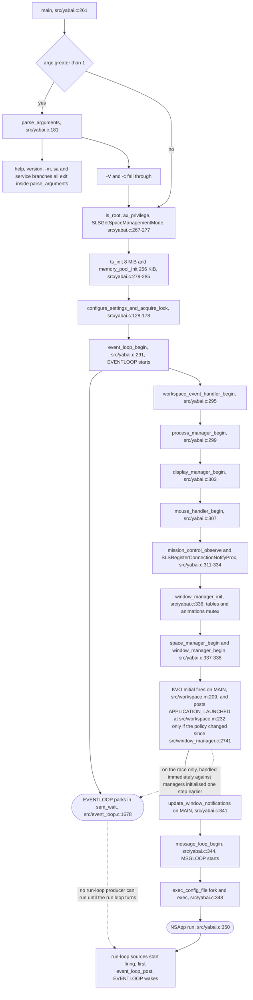

### 4.6 Diagram — start-up in Rust

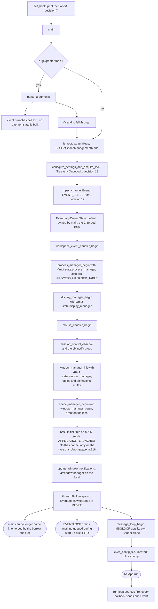

---

## 5. Refcons and liveness — decisions 20 and 21

### 5.1 Every refcon in the C daemon

| Registration | Refcon C passes | Dereferenced on MAIN? | Rust refcon |
| --- | --- | --- | --- |
| `AXObserverAddNotification` ×7, `src/application.c:47` | `struct application *` | no — the seven application-level branches of `application_notification_handler` use `element`, never `context` | `process_id` as an integer, `process_id as isize as *mut c_void` |
| `AXObserverAddNotification` ×3, `src/window.c:10` | `struct window *` | yes, at `src/application.c:36` | `Arc::into_raw(Arc<WindowLivenessCell>)`, one raw count for all three registrations, minted before the loop — §5.4 |
| `AXObserverAddNotification` ×4, `src/mission_control.c:81-84` | `NULL` | — | null, unchanged |
| `SLSRegisterConnectionNotifyProc` ×6, `src/yabai.c:322-333` | `NULL` | — | null, unchanged |
| `InstallEventHandler`, `src/process_manager.c:251` | `&g_process_manager`, a global with process lifetime | yes | `&'static Mutex<Table<…>>` obtained from `PROCESS_MANAGER_TABLE`, so no refcon pointer is minted at all |
| `CGEventTapCreate`, `src/mouse_handler.c:278` | `&g_mouse_state`, a global with process lifetime | yes | `&'static MouseTapSharedState`, §7 |
| `CGDisplayRegisterReconfigurationCallback`, `src/display_manager.c:505` | `NULL` | — | null, unchanged |
| `addObserver:forKeyPath:options:context:` ×2, `src/workspace.m:73,83` | `struct process *` | yes, at `src/workspace.m:212,237` | `Arc::into_raw(Arc<Process>)`, §6 |
| `CVDisplayLinkSetOutputCallback`, `src/window_manager.c:701` | `struct window_animation_context *` | not on MAIN; on CVLINK | `Arc::into_raw(Arc<AnimationContext>)`, §8 |

That is decision 20 exactly: a refcon carries either an integer id or a raw `Arc` pointer to a
cell that is immutable plus atomic. Nothing else is ever put behind a refcon — in particular no
pointer into an event-loop-owned collection, which is what `struct window *` and
`struct process *` were.

The three window-level AX notifications are `kAXUIElementDestroyedNotification`,
`kAXWindowMiniaturizedNotification` and `kAXWindowDeminiaturizedNotification`
(`src/window.h:24-29`). They share one refcon pointer per window, registered by `window_observe`
(`src/window.c:7-19`) on the *application's* observer, which is why `window_unobserve`
(`src/window.c:21-29`) reaches through `window->application->observer_ref` and why
`APPLICATION_TERMINATED` setting `window->application = NULL` at `src/event_loop.c:281` is a
latent null dereference in C.

### 5.2 The liveness cell

`window->id_ptr` (`src/window.h:92`) is a one-bit ownership token hidden in a pointer field:
`&window->id` means alive-and-unclaimed, `NULL` means claimed. It supports exactly two operations,
both `__sync_bool_compare_and_swap`, which is sequentially consistent on success and on failure:

* **claim**, `CAS(&window->id_ptr, &window->id, NULL)` — `src/application.c:36` on MAIN and
  `src/event_loop.c:280` on EVENTLOOP. Winning is the licence to destroy.
* **probe**, `CAS(&window->id_ptr, &window->id, &window->id)`, a compare-and-swap of a value to
  itself used purely as a test — the nine sites `src/event_loop.c:647,681,731,833,877,930,960,1159,1240`.

Decision 21 turns that into a cell shared between the `Window` and its AX refcon:

```rust
struct WindowLivenessCell {
    window_id: WindowId,
    application_process_id: ProcessId,
    state: AtomicU8,
}

const WINDOW_LIVENESS_ALIVE: u8 = 0;
const WINDOW_LIVENESS_CLAIMED_FOR_DESTRUCTION: u8 = 1;

impl WindowLivenessCell {
    fn claim_for_destruction(&self) -> bool {
        self.state
            .compare_exchange(
                WINDOW_LIVENESS_ALIVE,
                WINDOW_LIVENESS_CLAIMED_FOR_DESTRUCTION,
                Ordering::SeqCst,
                Ordering::SeqCst,
            )
            .is_ok()
    }

    fn is_still_alive(&self) -> bool {
        self.state.load(Ordering::SeqCst) == WINDOW_LIVENESS_ALIVE
    }
}
```

`window_id` and `application_process_id` are written once, at construction, and never mutated;
`state` is the only mutable field. That is what makes the cell shareable: it is `Sync` with no
`unsafe impl`, and invariant 3 of §12 is about the `Arc` pointer in the refcon, not about the cell
itself.

`Window` owns `liveness: Arc<WindowLivenessCell>`, created in `window_create` at the position of
`window->id_ptr = &window->id` (`src/window.c:1101`).

The nine probes become `window.liveness.is_still_alive()` at the same nine positions, and they
keep `SeqCst`: `__sync_bool_compare_and_swap` is `__ATOMIC_SEQ_CST` and decision 4 does not permit
weakening a synchronisation that the C relied on.

An event for a window that is dead or no longer in the table is dropped. That is one rule covering
both C mechanisms: the probe returning `false`, and the `window_manager_find_window` miss that in
C would have been a dangling pointer.

### 5.3 The AX callback in Rust

```rust
unsafe extern "C" fn application_notification_handler(
    observer: AXObserverRef,
    element: AXUIElementRef,
    notification: CFStringRef,
    context: *mut c_void,
) {
    if CFEqual(notification, kAXCreatedNotification) {
        event_loop_post(Event::WindowCreated(SendCFRetained(CFRetained::retain(element))));
    } else if CFEqual(notification, kAXFocusedWindowChangedNotification) {
        PENDING_WINDOW_FOCUS.store(true, Ordering::Release);
        event_loop_post(Event::WindowFocused(ax_window_id(element)));
    } else if CFEqual(notification, kAXWindowMiniaturizedNotification) {
        let window_liveness_cell = &*(context as *const WindowLivenessCell);
        if !window_liveness_cell.is_still_alive() { return }
        event_loop_post(Event::WindowMinimized(window_liveness_cell.window_id));
    } else if CFEqual(notification, kAXUIElementDestroyedNotification) {
        let window_liveness_cell = &*(context as *const WindowLivenessCell);

        //
        // NOTE(asmvik): Flag events that are already queued, but not yet processed,
        // so that they will be ignored; the memory we allocated is still valid and will
        // be freed when this event is handled.
        //

        if !window_liveness_cell.claim_for_destruction() { return }

        event_loop_post(Event::WindowDestroyed(window_liveness_cell.window_id));
    }
}
```

The comment is the one at `src/application.c:30-34`, carried over verbatim at the matching place,
as decision 38 requires. No other comment appears in the function.

Two rules the sketch encodes:

1. **Claiming events claim; probing events probe.** `WindowDestroyed` is posted only by the
   thread that won `claim_for_destruction`, so its handler must not probe again — the claim is
   already held. Every other window-scoped branch probes and returns silently on `false`. This
   makes the miniaturize and deminiaturize branches stricter than C, which probes only later on
   EVENTLOOP at `src/event_loop.c:833` and `:877`; the outcome is identical, because C's probe at
   that point drops the same event.
2. `WINDOW_CREATED` takes `element` at `+1` exactly as `src/application.c:9` does, and the
   `SendCFRetained` carries the release.

`SLS_WINDOW_DESTROYED` (`src/event_loop.c:952-966`) is the one site where the C probes without
claiming and then calls `EVENT_HANDLER_WINDOW_DESTROYED(window, 0)` inline at `:965`, which frees
the window at `:629` and leaves `id_ptr` pointing into freed memory. In Rust it claims:

```rust
fn event_handler_sls_window_destroyed(window_manager: &mut WindowManager, window_id: WindowId) {
    let Some(window) = window_manager_find_window(window_manager, window_id) else { return };
    if !window.liveness.claim_for_destruction() {
        debug!("%s: %d has been marked invalid by the system, ignoring event..\n",
               "event_handler_sls_window_destroyed", window_id);
        return
    }
    event_handler_window_destroyed(window_manager, window_id);
}
```

Probe becomes claim, which is what makes the subsequent destruction the same single-destruction
that every other path obeys. That is one line in `DEVIATIONS.md`: C probed and destroyed anyway,
leaving a dangling `id_ptr` for MAIN to compare-and-swap on.

### 5.4 Teardown is finished on the main queue

`window_unobserve` (`src/window.c:21-29`) runs on EVENTLOOP, from `src/event_loop.c:314` and
`:628`. It calls `AXObserverRemoveNotification` while that observer's run-loop source may be
mid-dispatch on MAIN. `application_unobserve` (`src/application.c:63-77`, from
`src/event_loop.c:318`) additionally calls `CFRunLoopSourceInvalidate` and releases the observer,
and `mission_control_unobserve` (`src/mission_control.c:93-106`, from `src/event_loop.c:1554`)
does the same on the Dock's observer.

Decision 20 makes the release of the refcon `Arc` happen on the main queue, after the notification
is removed. The removal and the release are one step, so both move together. Everything else —
every field of an owned record that the C mutates — is updated **synchronously on EVENTLOOP,
before the request is handed over**, because the flags that gate re-observation are read by code
that runs immediately after `*_unobserve` returns.

The general rule, which the three functions below each obey:

> On EVENTLOOP: clear the "am I observing" state and **take** the observer handles out of their
> owning slot, by value. In the trampoline: the `AXObserverRemoveNotification` calls, the
> `CFRunLoopSourceInvalidate`, the CF releases (as the `Drop` of the handles the request owns) and
> the refcon `Arc` drop.

#### `window_observe` mints exactly one strong count

`window_observe` (`src/window.c:7-19`) calls `AXObserverAddNotification` three times with the
**same** `window` refcon (`src/window.c:10`), and records only the bits that succeeded. One refcon
value, therefore one strong count, minted once before the loop and stored on the `Window`:

```rust
fn window_observe(window_manager: &WindowManager, window: &mut Window) -> bool {
    let Some(observer_ref) = window_manager_find_application_observer(window_manager, window.application) else {
        return false
    };

    let liveness_reference = Arc::into_raw(Arc::clone(&window.liveness));
    window.liveness_reference_held_by_the_observation = Some(liveness_reference);

    for index in 0..AX_WINDOW_NOTIFICATION.len() {
        let result = unsafe {
            AXObserverAddNotification(
                observer_ref.as_ref(),
                window.reference.as_ref(),
                AX_WINDOW_NOTIFICATION[index],
                liveness_reference as *mut c_void,
            )
        };
        if result == kAXErrorSuccess || result == kAXErrorNotificationAlreadyRegistered {
            window.notification |= 1 << index;
        } else {
            debug!("%s: %s failed with error %s\n", "window_observe",
                   AX_WINDOW_NOTIFICATION_STR[index], AX_ERROR_STR[(-result) as usize]);
        }
    }

    (window.notification & AX_WINDOW_ALL) == AX_WINDOW_ALL
}
```

The early `return false` when the application's observer cannot be resolved is the safe form of
C's unconditional `window->application->observer_ref` at `src/window.c:10`; it mints nothing, so
the `window_unobserve` that `src/window_manager.c:1461` then runs finds `None` and has nothing to
reclaim. One `DEVIATIONS.md` line.

The count is minted before the loop and unconditionally, so it does not depend on how many of the
three registrations succeeded. That matters: `window_manager_create_and_add_window` reaches
`window_unobserve` on the partial-failure path at `src/window_manager.c:1458-1462`, where
`window.notification` may be `0` and no notification is registered at all, and the count must
still be reclaimed. It is minted in `window_observe` rather than in `window_create`, because
`src/window_manager.c:1447-1451` destroys an unknown window without ever observing it, and there
the `Option` is still `None` and there is nothing to reclaim. `window_observe` has exactly one
call site (`src/window_manager.c:1458`), and every `window_destroy` that follows it is preceded by
`window_unobserve` (`src/window_manager.c:1461`, `src/event_loop.c:314`, `:628`), so the mint and
the reclaim are one-to-one.

#### `window_unobserve`

```rust
struct WindowUnobserveRequest {
    observer_ref: Option<SendCFRetained<AXObserver>>,
    window_ref: SendCFRetained<AXUIElement>,
    notification: u8,
    liveness_reference: *const WindowLivenessCell,
}

fn window_unobserve(window_manager: &WindowManager, window: &mut Window) {
    let Some(liveness_reference) = window.liveness_reference_held_by_the_observation.take() else { return };

    let request = Box::new(WindowUnobserveRequest {
        observer_ref: window_manager_find_application_observer(window_manager, window.application)
            .map(|observer_ref| SendCFRetained(observer_ref.clone())),
        window_ref: SendCFRetained(window.reference.0.clone()),
        notification: std::mem::replace(&mut window.notification, 0),
        liveness_reference,
    });

    unsafe {
        dispatch_async_f(
            dispatch_get_main_queue(),
            Box::into_raw(request) as *mut c_void,
            window_unobserve_on_main_queue,
        );
    }
}

unsafe extern "C" fn window_unobserve_on_main_queue(context: *mut c_void) {
    let request = Box::from_raw(context as *mut WindowUnobserveRequest);
    if let Some(observer_ref) = request.observer_ref.as_ref() {
        for index in 0..AX_WINDOW_NOTIFICATION.len() {
            if request.notification & (1 << index) == 0 { continue }
            AXObserverRemoveNotification(
                observer_ref.as_ref(),
                request.window_ref.as_ref(),
                AX_WINDOW_NOTIFICATION[index],
            );
        }
    }
    drop(Arc::from_raw(request.liveness_reference));
}
```

Three things about that signature and body:

* **The observer is resolved through `WindowManager`, not through the `Window`.** In C
  `window_unobserve` reaches `window->application->observer_ref` (`src/window.c:26`), and decision
  14 forbids the `struct application *`: `patterns/state-and-ownership.md` §3.2 maps
  `struct window::application` to `application: Option<ProcessId>`. So the parameter set decision
  13 computes for both `window_observe` and `window_unobserve` is
  `(window_manager: &WindowManager, window: &mut Window)`, and
  `window_manager_find_application_observer(window_manager, application: Option<ProcessId>)` is
  the lookup `application.and_then(|process_id| window_manager.application.find(&process_id))
  .and_then(|application| application.observer_ref.as_ref())`. The observer's refcount is owned by
  `Application::observer_ref`, exactly as in C, and the request takes its own `+1` clone; no
  `Window` ever owns an observer.
* **The two borrows never overlap.** At all three call sites the `Window` is already outside
  `WindowManager.window`: at `src/window_manager.c:1461` it is a local that
  `window_manager_add_window` (`:1471`) has not yet taken, and at `src/event_loop.c:314` and
  `:628` the immediately preceding statement is `window_manager_remove_window`
  (`src/event_loop.c:313`, `:627`), which in Rust is a `Table::remove` yielding the `Window` by
  value. That is recipe R5 of `patterns/state-and-ownership.md` §4.5 again.
* **`application == None` is C's null dereference, made safe.** `EVENT_HANDLER(APPLICATION_TERMINATED)`
  sets `window->application = NULL` at `src/event_loop.c:281` for every window whose claim it
  loses, and the queued `WINDOW_DESTROYED` for such a window then reaches `src/event_loop.c:628`
  and dereferences it. In Rust `window.application` is `None`, so `observer_ref` is `None` and the
  trampoline performs no removals. That is the right answer: the whole of `APPLICATION_TERMINATED`
  runs before the queued `WINDOW_DESTROYED` is dequeued, so `application_unobserve`
  (`src/event_loop.c:318`) has already queued its own trampoline ahead of this one and there is
  nothing left to remove. The request is still dispatched, because decision 20 requires the strong
  count to be dropped on the main queue and never from EVENTLOOP: by the time this trampoline runs,
  the application's observer has been invalidated and released on that same serialised queue, so no
  callback carrying the refcon can be dispatched afterwards. One `DEVIATIONS.md` line.

`window.notification` is cleared on EVENTLOOP before the request is handed over, so the bitmask
the trampoline reads is a snapshot; `src/window.c:27` clears each bit as it goes, and the effect
is the same because nothing else reads the mask between the two points.

#### `application_unobserve`

`application_unobserve` (`src/application.c:63-77`) has the same split, and the field that must be
cleared synchronously is `is_observing` (`src/application.c:73`), which gates the whole body at
`:65` and is set by `application_observe` at `:56`:

```rust
struct ApplicationUnobserveRequest {
    observer_ref: SendCFRetained<AXObserver>,
    application_ref: SendCFRetained<AXUIElement>,
    notification: u8,
}

fn application_unobserve(application: &mut Application) {
    if !application.is_observing { return }

    let Some(observer_ref) = application.observer_ref.take() else { return };
    application.is_observing = false;

    let request = Box::new(ApplicationUnobserveRequest {
        observer_ref,
        application_ref: SendCFRetained(application.reference.0.clone()),
        notification: std::mem::replace(&mut application.notification, 0),
    });

    unsafe {
        dispatch_async_f(
            dispatch_get_main_queue(),
            Box::into_raw(request) as *mut c_void,
            application_unobserve_on_main_queue,
        );
    }
}

unsafe extern "C" fn application_unobserve_on_main_queue(context: *mut c_void) {
    let request = Box::from_raw(context as *mut ApplicationUnobserveRequest);
    for index in 0..AX_APPLICATION_NOTIFICATION.len() {
        if request.notification & (1 << index) == 0 { continue }
        AXObserverRemoveNotification(
            request.observer_ref.as_ref(),
            request.application_ref.as_ref(),
            AX_APPLICATION_NOTIFICATION[index],
        );
    }
    CFRunLoopSourceInvalidate(AXObserverGetRunLoopSource(request.observer_ref.as_ref()));
}
```

`Application::observer_ref` is `Option<SendCFRetained<AXObserver>>`, filled by
`application_observe` at the position of `src/application.c:44`. The `CFRelease` at
`src/application.c:75` is not written: it is the `Drop` of the handle the request owns, which runs
at the closing brace of the trampoline, after the removals and after the invalidate — the same
order as `:66-75`.

#### `mission_control_unobserve`

This is the one where getting the split wrong is silently fatal. `EVENT_HANDLER(DOCK_DID_RESTART)`
calls `mission_control_unobserve()` at `src/event_loop.c:1554` and `mission_control_observe()` at
`:1555`, back to back on EVENTLOOP, and `mission_control_observe` does nothing at all unless
`!g_mission_control_observer.is_observing` (`src/mission_control.c:75`). If the clearing of that
flag (`src/mission_control.c:101`) were left inside the trampoline, the synchronous re-observe at
`:1555` would be a no-op and `MISSION_CONTROL_SHOW_ALL_WINDOWS`, `…SHOW_FRONT_WINDOWS`,
`…SHOW_DESKTOP` and `MISSION_CONTROL_EXIT` (`src/mission_control.c:59-70`) would stop arriving for
the rest of the process's life.

`patterns/state-and-ownership.md` §1.3 makes `g_mission_control_observer` a
`static MISSION_CONTROL_OBSERVER: Mutex<Option<MissionControlObserver>>`, so `is_observing` **is**
`Option::is_some`, and taking the value out is what clears it:

```rust
struct MissionControlObserver {
    reference: SendCFRetained<AXUIElement>,
    observer_ref: SendCFRetained<AXObserver>,
}

fn mission_control_unobserve() {
    let Some(mission_control_observer) = MISSION_CONTROL_OBSERVER.lock().unwrap().take() else { return };

    unsafe {
        dispatch_async_f(
            dispatch_get_main_queue(),
            Box::into_raw(Box::new(mission_control_observer)) as *mut c_void,
            mission_control_unobserve_on_main_queue,
        );
    }
}

unsafe extern "C" fn mission_control_unobserve_on_main_queue(context: *mut c_void) {
    let mission_control_observer = Box::from_raw(context as *mut MissionControlObserver);
    for notification in MISSION_CONTROL_NOTIFICATION.get().unwrap().iter() {
        AXObserverRemoveNotification(
            mission_control_observer.observer_ref.as_ref(),
            mission_control_observer.reference.as_ref(),
            notification.as_ref(),
        );
    }
    CFRunLoopSourceInvalidate(AXObserverGetRunLoopSource(mission_control_observer.observer_ref.as_ref()));
}
```

The `.take()` on EVENTLOOP does three jobs at once: it clears `is_observing` (`:101`), it takes
both CF handles out of the slot so that `mission_control_observe`'s write to
`g_mission_control_observer.ref` at `:77` cannot clobber a handle the trampoline is about to use,
and it hands them to the request by value. The two `CFRelease` calls at `src/mission_control.c:103-104`
are the `Drop` of the boxed `MissionControlObserver` at the closing brace of the trampoline.

One consequence is recorded as a `DEVIATIONS.md` line: the old observer's run-loop source is
invalidated a main-queue hop later than in C, so between `:1554` and the trampoline the old source
is still on the run loop while `:1555` has already added a new one. It delivers nothing in
practice, because `DOCK_DID_RESTART` means the process that observer was created for
(`AXUIElementCreateApplication(pid)`, `src/mission_control.c:77`) has just died; the worst case is
one duplicate `MISSION_CONTROL_*` event, which the handlers already tolerate from the C's own
narrower version of the same race.

#### Ordering between the requests

`EVENT_HANDLER(APPLICATION_TERMINATED)` calls `window_unobserve` for every window at
`src/event_loop.c:314` and only then `application_unobserve` at `:318`; the window notifications
live on the application's observer (`src/window.c:26`), so they must be removed first.
`dispatch_async_f` onto the main queue is FIFO, so scheduling the requests in the order the
handler already produces them preserves the C order exactly. The observer's lifetime does not
depend on that ordering in Rust: each window request holds its own `+1` clone, so the observer
survives until the last request that named it has run, whatever order the queue drains in.

### 5.5 Why this closes the use-after-free window

The window in C is: MAIN is inside `application_notification_handler` holding `context` as a
`struct window *`, and EVENTLOOP runs `window_unobserve` followed by `window_destroy`
(`src/event_loop.c:628-629`), which `free`s the allocation MAIN is about to compare-and-swap on.
`window_unobserve` removes the notifications, so *new* callbacks stop, but a callback already
dispatched on MAIN is not stopped by anything.

Three facts close it in Rust:

1. **The refcon owns a strong count.** While the `Arc` count registered for the observation is
   alive, the `WindowLivenessCell` allocation is alive. Dropping `Window` on EVENTLOOP does not
   free the cell.
2. **The count is dropped from a main-queue block.** The main queue is drained by the same main
   thread that dispatches the AX run-loop source. A block and a run-loop source callback
   interleave on that thread but never overlap, so the trampoline cannot run while
   `application_notification_handler` is executing, and therefore cannot free a cell that a live
   `&WindowLivenessCell` borrow is pointing at.
3. **The removal happens in the same block, before the drop.** After
   `AXObserverRemoveNotification` returns on MAIN, no further callback carrying that refcon can be
   dispatched. So no borrow can be created after the drop either.

Together: no borrow exists during the drop, and no borrow can be created after it. A callback
dispatched *before* the trampoline still sees a live cell whose state is already
`WINDOW_LIVENESS_CLAIMED_FOR_DESTRUCTION`, so it returns without sending — which is the behaviour
C intends and fails to achieve.

The cost is that teardown becomes asynchronous where C was synchronous. Nothing observable depends
on it: the notifications' only effect is to enqueue events, and every such event is now dropped by
the liveness probe.

### 5.6 Diagram — window destruction and liveness in C

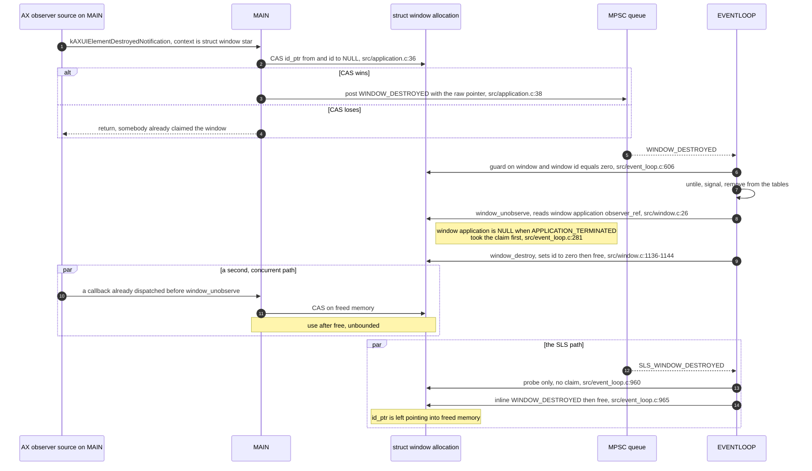

### 5.7 Diagram — window destruction and liveness in Rust

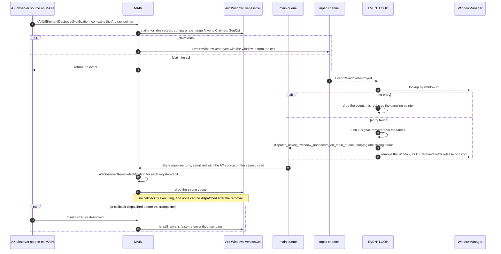

---

## 6. The process table — decision 22

### 6.1 `Process`

```rust
struct Process {
    process_serial_number: ProcessSerialNumber,
    process_id: ProcessId,
    name: String,
    ns_application: AtomicPtr<AnyObject>,
    policy: AtomicI32,
    terminated: AtomicBool,
}

unsafe impl Send for Process {}
unsafe impl Sync for Process {}
```

`process_serial_number`, `process_id` and `name` are written once in `process_create`
(`src/process_manager.c:31-67`) and never mutated, which is what makes the type immutable plus
atomic.

| C field | C access | Rust type | Rust orderings |
| --- | --- | --- | --- |
| `terminated` | release store on MAIN `src/process_manager.c:65,189`; relaxed load on EVENTLOOP `src/event_loop.c:79`; plain volatile reads on MAIN `src/workspace.m:213,238` | `AtomicBool` | `store(Release)`, `load(Relaxed)` |
| `ns_application` | release store on MAIN `src/process_manager.c:66` and on EVENTLOOP `src/event_loop.c:87`; relaxed loads `src/event_loop.c:85,89,113,132` and `src/workspace.m:35,71,81,91,105,117` | `AtomicPtr<AnyObject>` | `store(Release)`, `load(Relaxed)` |
| `policy` | plain `int` written and read from both threads, `src/workspace.m:107,110,230` | `AtomicI32` | `store(Relaxed)`, `load(Relaxed)` |

`policy` is the only one C leaves unsynchronised. Decision 4 makes it an atomic and the change is
one line in `DEVIATIONS.md`: C had a data race on `process->policy`, Rust uses a relaxed atomic
with identical values.

`Process` has no `Drop`. `process_destroy` (`src/process_manager.c:260-266`) stays an explicit
function called from the `out:` label of `EVENT_HANDLER(APPLICATION_TERMINATED)` at
`src/event_loop.c:344`, so the `removeObserver:` pair and the `NSRunningApplication` release keep
the exact position and thread the C gives them. The allocation itself is freed whenever the last
`Arc` goes, which the C could not express and which removes the "who frees it" argument entirely.

### 6.2 The table and its lock rule

```rust
static PROCESS_MANAGER_TABLE: OnceLock<Mutex<Table<ProcessSerialNumber, Arc<Process>>>> = OnceLock::new();
```

Decision 16 keeps `Table`, not `HashMap`, because `window_manager_begin` iterates it
(`src/window_manager.c:2740`) and the iteration order determines the order in which applications
are first observed.

**The rule: the lock is never held across an ObjC or AX call.** Every call site therefore has the
same shape — take the lock, do one table operation, drop the guard, then call out.

`Mutex::lock` returns a `LockResult`. Under decision 7 the panic hook aborts the process before
any guard can be dropped by unwinding, so a poisoned mutex is unreachable and every `lock` site is
followed by `.unwrap()`.

`kEventAppLaunched` (`src/process_manager.c:161-184`), step by step:

| C line | Rust | Lock held? |
| --- | --- | --- |
| `:162` `process_manager_find_process` | lock, `table_find`, drop the guard, return early when present | briefly |
| `:170` `process_pid_for_psn` | `GetProcessPID`, a Carbon call | no |
| `:171` `process_is_being_debugged` | `sysctl` | no |
| `:177` `process_create` | `GetProcessInformation`, `CopyProcessName`, and `workspace_application_create_running_ns_application`, which is `[[NSRunningApplication runningApplicationWithProcessIdentifier:] retain]` | **no** |
| `:182` `table_add` | lock, insert `Arc::clone`, drop the guard | briefly |
| `:183` `event_loop_post` | `send(Event::ApplicationLaunched(process))` | no |

`kEventAppTerminated` (`src/process_manager.c:186-195`) keeps the C order exactly:

```rust
process.terminated.store(true, Ordering::Release);
let removed_process = {
    let mut process_table = PROCESS_MANAGER_TABLE.get().unwrap().lock().unwrap();
    table_remove(&mut process_table, &process_serial_number)
};
let Some(removed_process) = removed_process else { return NO_ERR };
workspace_application_unobserve(&removed_process);
compiler_fence(Ordering::SeqCst);
event_loop_post(Event::ApplicationTerminated(removed_process));
```

`workspace_application_unobserve` is two `removeObserver:forKeyPath:context:` calls inside
`objc2::exception::catch` (`src/workspace.m:89-101`) — an ObjC call, therefore outside the lock.
`compiler_fence(Ordering::SeqCst)` is the exact equivalent of the
`__asm__ __volatile__ ("" ::: "memory")` at `src/process_manager.c:192`; `fence` would emit a real
barrier the C does not have.

### 6.3 The KVO re-entrancy path

`workspace_application_observe_finished_launching` (`src/workspace.m:69-77`) and
`workspace_application_observe_activation_policy` (`:79-87`) pass
`NSKeyValueObservingOptionInitial`. That makes `-observeValueForKeyPath:ofObject:change:context:`
(`:209-259`) run **synchronously, on the calling thread, inside `addObserver:`**. The calling
thread is EVENTLOOP at `src/event_loop.c:104` and `:123`, and MAIN at
`src/window_manager.c:2753`.

The re-entrant callback reads `process->terminated`, reads and writes `process->policy`, calls
`removeObserver:` and posts `APPLICATION_LAUNCHED`. None of that touches the process table, and
under this design none of it may: if `addObserver:` were called with the table lock held, the
re-entrant callback would be one table access away from deadlocking against a non-reentrant
`std::sync::Mutex` on the same thread.

That is the concrete reason for the rule in §6.2, and it is why `window_manager_begin` snapshots
the table into a `Vec<Arc<Process>>` under the lock and iterates the snapshot with the lock
released: the loop body calls `workspace_application_observe_activation_policy` at
`src/window_manager.c:2753`.

The KVO refcon is `Arc::into_raw(Arc::clone(&process)) as *mut c_void`, one strong count per live
observation. A `removeObserver:` that returns without throwing drops exactly one count; one that
throws drops none, because the observation is still registered and the refcon must stay valid —
which is the same accounting the C's `@try`/`@catch` at `src/workspace.m:56-62`, `:93-99`,
`:226-228` and `:251-253` performs implicitly by leaving the `struct process` alive until
`process_destroy`. Every such drop goes through the main queue, for the reason given in §5.5.

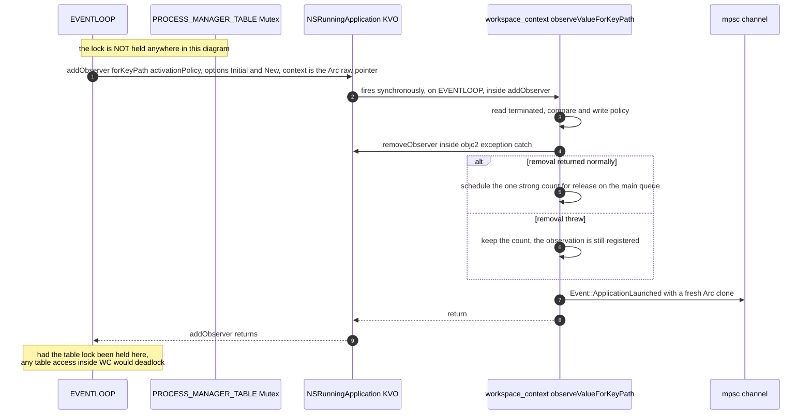

---

## 7. The mouse state split — decision 23

`struct mouse_state` (`src/mouse_handler.h:62-81`) is one global straddling MAIN and EVENTLOOP.
Decision 23 cuts it along the line the C already draws.

### 7.1 Field by field

| C field | C threads and sites | Rust home | Rust type and orderings |
| --- | --- | --- | --- |
| `handle` | relaxed load on MAIN `src/mouse_handler.c:28`; written on MAIN at start-up `:278` and on EVENTLOOP `src/window_manager.c:224,226`; release store of NULL `:302` | `MouseTapSharedState` | `AtomicPtr<__CFMachPort>`, `load(Relaxed)`, `store(Release)` |
| `runloop_source` | same two writers, non-atomic in C, `:287`, `:300` | `MouseTapSharedState` | `AtomicPtr<__CFRunLoopSource>`, `Relaxed` both ways |
| `consume_mouse_click` | MAIN only `:37,46,53` | `MouseTapSharedState` | `AtomicBool`, `Relaxed` |
| `drag_detected` | MAIN only `:47,52,60` | `MouseTapSharedState` | `AtomicBool`, `Relaxed` |
| `consumed_event` | MAIN only, `CFRetain` `:38`, `CFRelease` `:54` | `MouseTapSharedState` | `AtomicPtr<CGEvent>`, `Relaxed`, ownership held by the pointer |
| `modifier` | `volatile uint8_t`; plain reads on MAIN `:36,65`; plain reads and writes on EVENTLOOP `src/event_loop.c:1136,1138` and `src/message.c:1621-1631` | `MouseTapSharedState` | `AtomicU8`, `Relaxed` both ways |
| `action1` | written on EVENTLOOP `src/message.c:1640-1647`, read on EVENTLOOP `src/event_loop.c:1137` | `MouseTapSharedState` | `AtomicU8`, `Relaxed` |
| `action2` | written on EVENTLOOP `src/message.c:1651-1655`, read on EVENTLOOP `src/event_loop.c:1139` | `MouseTapSharedState` | `AtomicU8`, `Relaxed` |
| `drop_action` | written on EVENTLOOP `src/message.c:1662,1664`, read on EVENTLOOP `src/mouse_handler.c:119` | `MouseTapSharedState` | `AtomicU8`, `Relaxed` |
| `current_action` | EVENTLOOP only `src/event_loop.c:1120,1137,1230,1243,1251,1264` | `MouseDragState` | `MouseMode`, plain field |
| `down_location` | EVENTLOOP only | `MouseDragState` | `CGPoint`, plain field |
| `last_moved_time` | EVENTLOOP only `src/event_loop.c:1266,1274` | `MouseDragState` | `u64`, plain field |
| `window` | EVENTLOOP only; nulled at `src/event_loop.c:305,619,1228,1242`; read at `src/window.c:706` | `MouseDragState` | `Option<WindowId>`, decision 14 |
| `window_frame` | EVENTLOOP only, also written `src/event_loop.c:798` | `MouseDragState` | `CGRect`, plain field |
| `ffm_window_id` | EVENTLOOP only | `MouseDragState` | `WindowId` |
| `direction` | EVENTLOOP only, `HANDLE_*` bit flags `src/misc/macros.h:36-39` | `MouseDragState` | `u8` |
| `feedback_node` | EVENTLOOP only, borrowed from the `View` tree | `MouseDragState` | `Option<(SpaceId, NodeId)>`, decisions 14 and 15 |

```rust
struct MouseTapSharedState {
    handle: AtomicPtr<__CFMachPort>,
    runloop_source: AtomicPtr<__CFRunLoopSource>,
    consume_mouse_click: AtomicBool,
    drag_detected: AtomicBool,
    consumed_event: AtomicPtr<CGEvent>,
    modifier: AtomicU8,
    action1: AtomicU8,
    action2: AtomicU8,
    drop_action: AtomicU8,
}

static MOUSE_TAP_SHARED_STATE: MouseTapSharedState = MouseTapSharedState::new();
```

Every field is an atomic, so the static is `Sync` with no `unsafe impl` and no `UnsafeCell`, which
keeps it inside decision 39's list. `MouseTapSharedState::new()` is a `const fn` reproducing
`mouse_state_init` (`src/mouse_handler.c:266-272`) — `modifier = MouseMod::Fn`,
`action1 = MouseMode::Move`, `action2 = MouseMode::Resize`, `drop_action = MouseMode::Swap` — and
the zeroing that the C gets from BSS for everything else.

`MouseDragState` is the `mouse_drag_state` field of `EventLoopOwnedState` (§2.3) and is reached
only through `&mut`.

### 7.2 What the tap callback becomes

```rust
unsafe extern "C" fn mouse_handler(
    proxy: CGEventTapProxy,
    event_type: CGEventType,
    event: CGEventRef,
    context: *mut c_void,
) -> CGEventRef
```

`type` is a Rust keyword, so the second parameter is spelled `event_type`; it is the only C
parameter name in the tree that cannot be kept, and it is listed as such in the glossary decision
37 calls for. The glossary carries one other keyword collision, on a field rather than a
parameter: the `ref` of `struct window` (`src/window.h:90`), `struct application`
(`src/application.h:70`) and `g_mission_control_observer` (`src/mission_control.c:47`) is spelled
`reference`, which is the spelling §3.2, §5.4 and §8 use throughout.

`context` is `&MOUSE_TAP_SHARED_STATE`, installed at the position of `src/mouse_handler.c:278` and
valid for the whole process, so the cast needs no lifetime argument. Three details that must
survive:

* `mod == mouse_state->modifier` (`src/mouse_handler.c:36,65`) is equality of the whole bit set,
  not a mask test. `MouseModifier` is a newtype with associated constants per decision 31 and the
  comparison stays `==`.
* Returning `NULL` to swallow an event (`:39,55`) is `std::ptr::null_mut()`. Returning the event
  instead silently un-swallows the modifier click.
* `mouse_handler_end` (`:293-303`) releases the mach port at `:301` *before* storing NULL at
  `:302`, so MAIN can relaxed-load a released port. The Rust keeps the same sequence and the same
  orderings; the hazard is recorded in `DEVIATIONS.md` rather than silently reordered, because
  reordering changes when the tap stops firing.

---

## 8. Animation — decision 24

### 8.1 The types

```rust
struct AnimationContext {
    animation_connection: SlsConnectionId,
    animation_easing: AnimationEasing,
    animation_duration: f32,
    animation_clock: AtomicU64,
    animation_list: Box<[WindowAnimation]>,
    animation_count: i32,
    window_animations_table: Arc<Mutex<Table<WindowId, WindowAnimationHandle>>>,
}

struct WindowAnimation {
    window_id: WindowId,
    x: f32,
    y: f32,
    w: f32,
    h: f32,
    cid: SlsConnectionId,
    proxy: WindowProxy,
    skip: AtomicBool,
}

struct WindowProxy {
    id: AtomicU32,
    frame_origin_x: AtomicU64,
    frame_origin_y: AtomicU64,
    frame_size_width: AtomicU64,
    frame_size_height: AtomicU64,
    level: AtomicI32,
    sub_level: AtomicI32,
    tx: AtomicU32,
    ty: AtomicU32,
    tw: AtomicU32,
    th: AtomicU32,
    core_graphics_objects: Mutex<Option<WindowProxyCoreGraphicsObjects>>,
}

struct WindowProxyCoreGraphicsObjects {
    context: CFRetained<CGContext>,
    image: Option<CFRetained<CGImage>>,
}

struct WindowAnimationHandle {
    context: Arc<AnimationContext>,
    index: usize,
}

unsafe impl Send for AnimationContext {}
unsafe impl Sync for AnimationContext {}
```

Mapping to `src/view.h:57-86`:

* `struct window_animation::window`, a `struct window *` at `src/view.h:70`, becomes `window_id`.
  It is dereferenced only on EVENTLOOP, at `src/window_manager.c:694`, and decision 14 replaces it
  with a handle and a lookup there.
* `volatile bool skip` (`src/view.h:75`) becomes `AtomicBool`: release store at the position of
  `src/window_manager.c:633`, relaxed loads at `src/window_manager.c:449,558,582` and
  `src/sa.m:550,566`.
* `tx` / `ty` / `tw` / `th` are the raced field group — CVLINK writes them every frame at
  `src/window_manager.c:560-563` without the lock, EVENTLOOP reads them under the lock at
  `src/window_manager.c:635-642`. Decision 24 makes them `AtomicU32` holding `f32::to_bits`,
  relaxed both ways. This turns the one genuine data race in the C into defined behaviour with
  identical values; it is one line in `DEVIATIONS.md`.
* `frame`, `level`, `sub_level` and `id` are written once by the builder and read afterwards by
  both threads. They are atomics for the same reason, all relaxed. `CGRect` is four `CGFloat`,
  which is `f64` on both targets, so each component is an `AtomicU64` holding `f64::to_bits`.
* `context` and `image` are the only CF objects. They are written once and destroyed once, and
  both destruction sites already hold the table lock, so a `Mutex<Option<…>>` is uncontended
  there and keeps the per-frame path lock-free.
* `animation_clock` (`src/view.h:82`) is latched on the first tick at `src/window_manager.c:543`
  by CVLINK and read by nobody else; it is `AtomicU64`, relaxed, only because the context is
  shared behind an `Arc`.

`window_manager_destroy_window_proxy` (`src/window_manager.c:489-505`) becomes, in the same order
as the C:

```rust
fn window_manager_destroy_window_proxy(animation_connection: SlsConnectionId, proxy: &WindowProxy) {
    let mut core_graphics_objects = proxy.core_graphics_objects.lock().unwrap();
    *core_graphics_objects = None;
    let id = proxy.id.swap(0, Ordering::Relaxed);
    if id != 0 {
        unsafe { SLSReleaseWindow(animation_connection, id) };
    }
}
```

Dropping the `WindowProxyCoreGraphicsObjects` releases the image and the context, replacing
`CFRelease(proxy->image)` at `:492` and `CGContextRelease(proxy->context)` at `:497`; the `swap`
to zero reproduces `proxy->id = 0` at `:503`.

### 8.2 The lock scopes, identical to C

There are exactly four lock regions in the C and exactly four in the Rust, at the same positions
and covering the same work.

| # | C | Held by | Covers |
| --- | --- | --- | --- |
| 1 | `pthread_mutex_lock` `src/window_manager.c:619` to `pthread_mutex_unlock` `:675` | EVENTLOOP | the whole per-window setup loop: filling each record, the `table_find` at `:631`, the supersede branch `:633-663`, the `pthread_create` at `:666`, the `table_add` at `:673` |
| 2 | no lock | PROXY | the builder body, `src/window_manager.c:507-533` |
| 3 | no lock | CVLINK | the per-frame body, `src/window_manager.c:545-574` |
| 4 | `pthread_mutex_lock` `src/window_manager.c:577` to `pthread_mutex_unlock` `:589` | CVLINK | `SLSDisableUpdate`, the JankyBorders notify with its 20 ms sleep, `scripting_addition_swap_window_proxy_out`, the `table_remove` and proxy-destroy loop, `SLSReenableUpdate` |

The Rust holds `window_animations_table.lock()` across exactly regions 1 and 4 and nothing else.
In particular the lock is **not** taken in the per-frame path, which is why `tx`/`ty`/`tw`/`th`
had to become atomics rather than move under the mutex: taking the lock per frame per window would
change the timing of an animation, and decision 3 makes timing observable.

Region 1 in Rust. The C reads `existing_animation` after `table_remove` at
`src/window_manager.c:662` — the destroy at `:663` takes `existing_animation->cid` and
`&existing_animation->proxy` — and gets away with it because `existing_animation` is a raw
interior pointer into the superseded batch's `malloc`'d `animation_list`
(`src/window_manager.c:609`, `:631`), which that batch's display-link refcon keeps alive. §8.1
makes the table value a `WindowAnimationHandle` owning an `Arc<AnimationContext>`, so the removal
drops a strong count on the very object the reference points into, and `table_find` borrowing the
guard immutably across a `table_remove` that needs `&mut` is E0502 besides.

This is recipe **R5** of `patterns/state-and-ownership.md` §4.5: `Table::remove` returns the
value, so the entry comes **out** of the table first and is held as an owned local for the rest of
the branch. The handle keeps its own strong count on the superseded `AnimationContext`, so the
object stays alive exactly as long as the C's pointer was valid, and the count is dropped at the
end of the branch rather than by the `table_remove` itself:

```rust
unsafe { SLSDisableUpdate(animation_context.animation_connection) };
{
    let mut window_animations_table = animation_context.window_animations_table.lock().unwrap();
    for index in 0..window_count {
        window_animation_fill_from_capture(&animation_context.animation_list[index], &window_list[index]);
        match table_remove(&mut window_animations_table, &window_id) {
            Some(existing_animation_handle) => {
                let existing_animation = existing_animation_handle.animation();
                existing_animation.skip.store(true, Ordering::Release);
                window_animation_adopt_in_flight_proxy_geometry(
                    &animation_context.animation_list[index],
                    existing_animation,
                );
                compiler_fence(Ordering::SeqCst);
                window_animation_build_replacement_proxy_and_order_it_in_front(
                    &animation_context,
                    &animation_context.animation_list[index],
                    existing_animation,
                );
                window_manager_destroy_window_proxy(existing_animation.cid, &existing_animation.proxy);
                drop(existing_animation_handle);
            }
            None => {
                builders_to_spawn.push(index);
            }
        }
        table_add(&mut window_animations_table, window_id, WindowAnimationHandle {
            context: Arc::clone(&animation_context),
            index,
        });
    }
}
std::thread::scope(|scope| {
    for index in builders_to_spawn.iter() {
        window_manager_spawn_window_proxy_builder_or_run_it_inline(scope, &animation_context, *index);
    }
});
```

So the C's two table statements swap roles. The `table_remove` in the sketch sits where the C's
`table_find` is (`src/window_manager.c:631`) and only detaches the entry; the C's own
`table_remove` (`:662`) becomes the explicit `drop`, which is where the superseded context's
strong count actually goes. Writing that `drop` out rather than letting the handle fall off the
end of the branch keeps the C's position visible.

`existing_animation_handle.animation()` borrows the owned handle, not the table, so the guard is
free to be used mutably by the `table_add` that follows.

The three helper names spell out what the C does inline at `src/window_manager.c:620-630`,
`:635-647` and `:650-660`; decision 37 prefers the long name to the comment that would otherwise
have described the block.

Three things move relative to the C. The first is the removal, above; it is a reordering within
one lock scope that nothing outside the scope can observe, because every other reader of the table
takes the same lock. The other two are forced by `thread::scope`, not chosen:

* The builder threads are spawned after the guard is dropped rather than inside the loop. In C
  they are created at `src/window_manager.c:666` while the mutex is held and joined at `:680`
  after it is released. The builders never take the lock and never touch the table, so the only
  difference is that they start a few microseconds later. The join point is unchanged: the closing
  brace of `thread::scope` is the position of `src/window_manager.c:680`.
* `compiler_fence(Ordering::SeqCst)` is the `__asm__ __volatile__ ("" ::: "memory")` at
  `src/window_manager.c:648`. It is a compiler barrier, not a hardware one; `fence` would be
  stronger than the C and would change timing.

### 8.3 The superseding hand-off

When a second batch animates a window that is already animating, `src/window_manager.c:631-663`
hands the in-flight animation over: it sets `skip` on the old record, copies the old proxy's
current interpolated geometry through an `(int)` truncation at `:635-642`, retains the old image,
builds a replacement proxy, orders it in front of the real window, zeroes the old proxy's system
alpha, removes the old table entry and destroys the old proxy — all while holding the lock, while
the old batch's CVLINK thread is still ticking.

In C the old CVLINK can relaxed-load `skip == false` at `:558` and then transform a proxy window
that `:663` has already released. SLS rejects the stale window id and the frame is dropped, so the
C is lucky rather than correct. In Rust the same interleaving is harmless for a different and
sufficient reason: `proxy.id` is an `AtomicU32` that `window_manager_destroy_window_proxy` swaps
to zero, and `core_graphics_objects` is a `Mutex<Option<…>>` that the destroy sets to `None`, so a
late frame either reads the old id and has SLS reject it exactly as in C, or reads zero and skips
— never a freed `CGContextRef`.

### 8.4 The reference cycle, and why it always breaks

`AnimationContext` holds an `Arc` to the table, and the table holds a `WindowAnimationHandle`
which holds an `Arc` to the `AnimationContext`. That is a cycle while the entry is present. It is
also exactly the C's shape: `table_add` at `src/window_manager.c:673` stores
`&context->animation_list[i]`, an interior pointer into the array that CVLINK frees at `:592`.

The cycle is broken by removal, and removal is guaranteed: every entry that a batch adds at
`src/window_manager.c:673` is removed either by a superseding batch at `:662` or by that batch's
own final tick at `:584`, and the final tick runs for every entry whose `skip` is false — which is
exactly the set no superseding batch took. Both removals happen under the lock. The strong counts
on an `AnimationContext` are therefore: one held by EVENTLOOP for the duration of
`window_manager_animate_window_list_async`, one per table entry, and one held by the display-link
refcon, released by `Arc::from_raw` on the final tick at the position of the `free(context)` at
`src/window_manager.c:593`.

### 8.5 Diagram — animation lifecycle in C

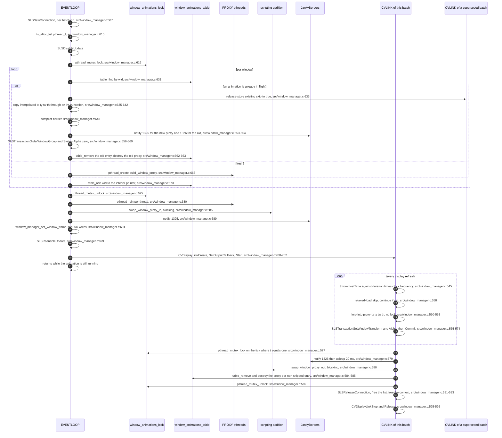

### 8.6 Diagram — animation lifecycle in Rust

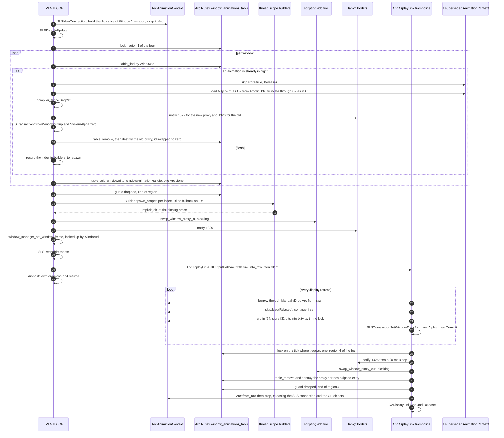

---

## 9. Child processes — decision 25

Children are spawned with `libc::fork` and `execvp`, never with `std::process::Command`, so that
the `signal(SIGCHLD, SIG_IGN)` and `signal(SIGPIPE, SIG_IGN)` dispositions set at
`src/yabai.c:151-152` are inherited exactly as they are in C and no child is ever reaped by a
`Child` handle. The double fork of `src/event_signal.c:64` and `:83` is kept.

### 9.1 What is computed in the parent, before the fork

In C the intermediate child (`src/event_signal.c:64-96`) inherits a copy-on-write snapshot of
`g_signal_storage`, `g_signal_event[]`, the `ts` arena and every compiled `regex_t`, and then runs
`event_signal_filter` (`src/event_signal.c:8-58`), `buf_len`, `debug` and `setenv` before
`execvp`. None of those is async-signal-safe: `malloc`'s lock can be held by MAIN or by a CVLINK
thread at the instant of the fork, and the child would deadlock.

Decision 25 moves every one of them into the parent, on EVENTLOOP, which is already the only
thread that can run them:

| Computed in the parent | Replaces | C site |
| --- | --- | --- |
| the subscriber count and its `debug!` line | `buf_len` and `debug` in the child | `src/event_signal.c:75-76` |
| the regex filter verdict, one `bool` per (queued signal, subscriber) pair | `event_signal_filter` in the child | `src/event_signal.c:81` |
| `argv` as owned `CString`s: `/usr/bin/env`, `sh`, `-c`, the subscriber's command | the compound literal in the grandchild | `src/event_signal.c:91` |
| `envp` as owned `CString`s: the daemon's current environment with the four `YABAI_*` entries overriding | the four `setenv` calls in the grandchild | `src/event_signal.c:86-89` |
| the NUL-terminated `Vec<*const c_char>` for both | — | — |

The result is a `Vec<PreparedSignalCommand>` where each entry owns its `CString`s and its two
pointer arrays. That vector is the only thing the fork needs, and every pointer in it is already
valid and immutable at the moment of the fork.

### 9.2 What the child calls

```rust
fn event_signal_flush(event_loop_owned_state: &mut EventLoopOwnedState) {
    if event_loop_owned_state.signal_storage.is_empty() { return }

    let prepared_commands = event_signal_prepare_commands(event_loop_owned_state);

    let process_id = unsafe { libc::fork() };
    if process_id != 0 {
        event_loop_owned_state.signal_storage.clear();
        return
    }

    for prepared_command in prepared_commands.iter() {
        let grandchild_process_id = unsafe { libc::fork() };
        if grandchild_process_id != 0 { continue }

        unsafe {
            *libc::_NSGetEnviron() = prepared_command.environment_pointers.as_ptr() as *mut *mut c_char;
            let execvp_result = libc::execvp(
                prepared_command.argument_pointers[0],
                prepared_command.argument_pointers.as_ptr(),
            );
            libc::_exit(execvp_result);
        }
    }

    unsafe { libc::_exit(EXIT_SUCCESS) };
}
```

Between the fork and the exec the child calls `fork`, a pointer store into `environ`, `execvp` and
`_exit`. `fork` and `_exit` are async-signal-safe; storing a pointer is a plain store; `execvp`
with an absolute path performs no `PATH` search and no allocation. Nothing else runs.

Four deviations, each one line in `DEVIATIONS.md`:

1. The filter, the argv and the environment are computed in the parent rather than the child.
   What runs is unchanged; when it is decided moves earlier by one `fork`.
2. `setenv` in the child becomes a store of a precomputed `environ` array. `execvp` passes
   `environ` to the new image either way, so the executed program sees the same variables.
3. `exit(execvp(...))` at `src/event_signal.c:92` and `exit(EXIT_SUCCESS)` at `:96` become
   `_exit`. `exit` in a forked child of a multithreaded process runs `atexit` handlers and flushes
   stdio streams whose locks may be held. The status is preserved by passing `execvp`'s return
   value through rather than substituting a constant: `execvp` only ever returns `-1`, and
   `_exit(-1)` is status 255, which is what `exit(-1)` gives. `_exit(EXIT_FAILURE)` would be
   status 1 and would not be the same thing. `exec_config_file` (`src/misc/helpers.h:482`) has the
   identical shape and takes the identical treatment.
4. The `debug` line at `src/event_signal.c:76` is printed by the parent. Under `-V` it therefore
   appears interleaved with the event loop's own output rather than with the child's.

The parent's `signal_storage.clear()` is at the position of `g_signal_storage.used = 0`
(`src/event_signal.c:66`), and there is still no `waitpid` anywhere: `SIGCHLD` is ignored.

### 9.3 `exec_config_file`

`exec_config_file` (`src/misc/helpers.h:463-487`) has exactly one caller: MAIN, at
`src/yabai.c:348`. There is no `config` domain command that reloads the file — `grep -rn
exec_config_file src/` returns the definition and that one call — so this is the only fork in the
daemon that is not on EVENTLOOP.

That does not make it simpler. In the Rust order it runs at step 17 of §4.2, after
`message_loop_begin` has spawned MSGLOOP at step 16 and after the event-loop thread was spawned at
step 15, so it is still a fork from a multithreaded process and the same async-signal-safety rules
apply. The child in C evaluates `file_can_execute` — a `stat` call — at `src/misc/helpers.h:479`
and builds one of two argument vectors. Under decision 25 both move into the parent; the child
forks, `execvp`s and `_exit`s with `execvp`'s return value, as in §9.2. The two vectors are
`{/usr/bin/env, sh, -c, <file>}` when the file is executable and `{/usr/bin/env, sh, <file>}` when
it is not, unchanged.

### 9.4 Diagram — child spawning in C

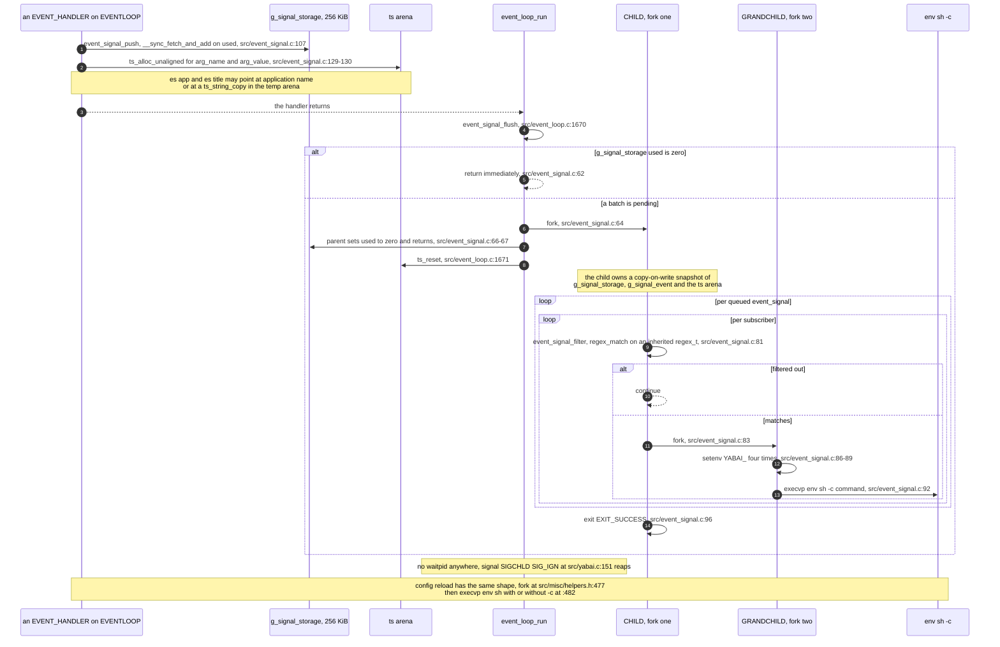

### 9.5 Diagram — child spawning in Rust

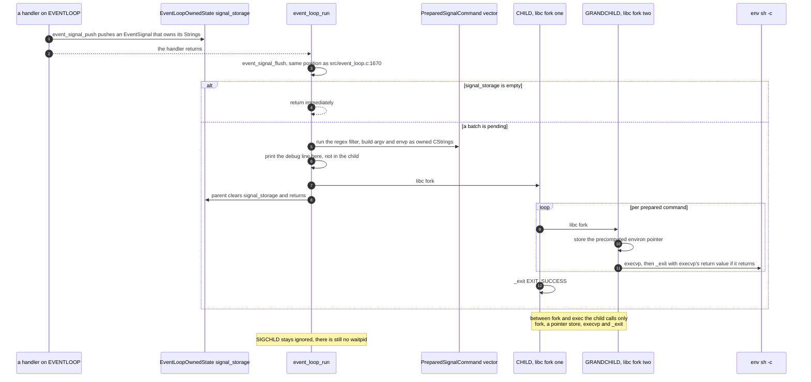

---

## 10. The message lifecycle

### 10.1 MSGLOOP stays a pure descriptor shuttle

`message_loop_run` (`src/message.c:3003-3013`) touches no manager state. The accepted descriptor
travels through the queue and ownership transfers to EVENTLOOP. In Rust that is
`Event::DaemonMessage(UnixStream)`, and "ownership transfers" stops being a comment.

### 10.2 The blocking read on the event-loop thread is preserved

`EVENT_HANDLER(DAEMON_MESSAGE)` (`src/event_loop.c:1614-1644`) does a blocking `read` of the
four-byte length prefix at `:1622`, allocates, loops on blocking `read` until the body is complete
at `:1625-1630`, `fdopen`s the descriptor for writing at `:1632`, runs `handle_message` at `:1634`
and `fflush`/`fclose`s at `:1636-1637`. There is no timeout and no `poll`. A client that connects,
sends a length prefix and then stalls wedges the entire event loop.

That stays. Adding `set_read_timeout` would change behaviour, and decision 3 makes every timing
threshold part of "behaviour identical". The handler is:

```rust
fn event_handler_daemon_message(
    event_loop_owned_state: &mut EventLoopOwnedState,
    mut stream: UnixStream,
) {
    let mut bytes_to_read = [0u8; 4];
    if stream.read(&mut bytes_to_read).ok() != Some(4) { return }
    let bytes_to_read = i32::from_ne_bytes(bytes_to_read);
    if bytes_to_read < 0 { return }

    let mut message = vec![0u8; bytes_to_read as usize];
    let mut bytes_read = 0usize;
    loop {
        let Ok(current_read) = stream.read(&mut message[bytes_read..]) else { break };
        if current_read == 0 { break }
        bytes_read += current_read;
        if bytes_read >= message.len() { break }
    }
    if bytes_read != message.len() { return }

    let message = String::from_utf8_lossy(&message).into_owned();
    debug_message("event_handler_daemon_message", &message);
    handle_message(event_loop_owned_state, &mut stream, &message);
    let _ = stream.flush();
}
```

Point for point against the C:

* `read` returning fewer than four bytes, or an error, falls through to the `return`, which drops
  the `UnixStream` — that is `socket_close(param1)` at `src/event_loop.c:1643`, which is
  `shutdown(SHUT_RDWR)` plus `close` (`src/misc/helpers.h:198-202`).
* The success path drops the same `UnixStream` at the end of the function, which is the `fclose`
  at `src/event_loop.c:1637`. Exactly one close either way, now by ownership rather than by two
  mutually exclusive code paths.
* `ts_alloc_unaligned(bytes_to_read)` at `:1623` becomes a `Vec<u8>` per decision 17.
* Decision 28 makes the socket bytes text with `from_utf8_lossy` at the point they are stored,
  which is here.
* `handle_message` writes the response incrementally as it walks the domains
  (`src/message.c:2990-2998`), so a long `query` still streams out while the handler runs.
  Decision 28's `Response` type owns the failure prefix byte and the "no response wanted" case;
  decision 32 keeps `Result` at the `io::Write` boundary, which is the only place it appears.
* A negative `bytes_to_read` is rejected before anything is allocated. `as usize` on a negative
  `i32` sign-extends, so a client-supplied prefix of `-1` would ask for
  `vec![0u8; 0xFFFF_FFFF_FFFF_FFFF]`, and under decision 7's panic hook the allocation failure
  aborts the whole daemon. The `if bytes_to_read < 0 { return }` in the sketch is that rejection;
  the `return` drops the `UnixStream`, which is `socket_close(param1)` at
  `src/event_loop.c:1643`. The C has no such check of its own — it passes the value to
  `ts_alloc_unaligned` at `src/event_loop.c:1623` and relies on the arena's bump check, which
  decision 17 deletes along with the arena. One line in `DEVIATIONS.md`.

### 10.3 Diagram — message lifecycle in C

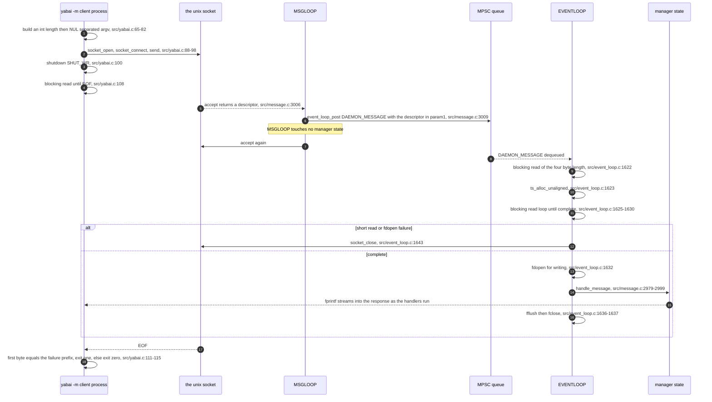

### 10.4 Diagram — message lifecycle in Rust

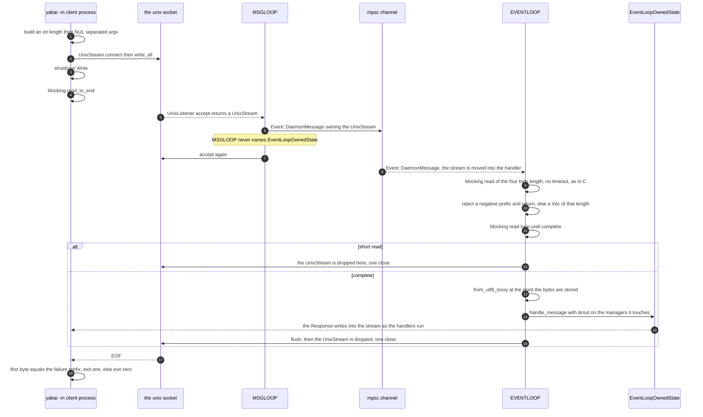

---

## 11. Every atomic in the C source, and what replaces it

`__sync_bool_compare_and_swap` and `__sync_fetch_and_add` are `__ATOMIC_SEQ_CST` on success and on
failure. `__atomic_*` carries its ordering in the call. `__asm__ __volatile__ ("" ::: "memory")` is
a compiler barrier with no hardware effect, so it is `compiler_fence`, never `fence`.

| # | C site | C operation | Rust type | Rust operation and `Ordering` |
| --- | --- | --- | --- | --- |
| 1 | `src/event_loop.c:11`, `src/application.c:11` | `__atomic_store_n(&__pending_window_focus, true, RELEASE)` | `static PENDING_WINDOW_FOCUS: AtomicBool` | `store(true, Release)` |
| 2 | `src/event_loop.c:422,638` | `__atomic_store_n(&__pending_window_focus, false, RELEASE)` | same | `store(false, Release)` |
| 3 | `src/event_loop.c:369` | `__atomic_load_n(&__pending_window_focus, RELAXED)` | same | `load(Relaxed)` |
| 4 | `src/mouse_handler.c:76,78` | `__atomic_store_n(&__pending_gesture, …, RELEASE)` | `static PENDING_GESTURE: AtomicBool` | `store(…, Release)` |
| 5 | `src/event_loop.c:1351` | `__atomic_load_n(&__pending_gesture, RELAXED)` | same | `load(Relaxed)` |
| 6 | `src/mouse_handler.c:79` | `__atomic_store_n(&__last_gesture_time, read_os_timer(), RELEASE)` | `static LAST_GESTURE_TIME: AtomicU64` | `store(…, Release)` |
| 7 | `src/event_loop.c:1352` | `__atomic_load_n(&__last_gesture_time, RELAXED)` | same | `load(Relaxed)` |
| 8 | `src/mission_control.c:24` | `__atomic_store_n(&__last_cmd_tab_time, read_os_timer(), RELEASE)` | `static LAST_CMD_TAB_TIME: AtomicU64` | `store(…, Release)` |
| 9 | `src/event_loop.c:362` | `__atomic_load_n(&__last_cmd_tab_time, RELAXED)` | same | `load(Relaxed)` |
| 10 | `src/process_manager.c:65` | `__atomic_store_n(&process->terminated, false, RELEASE)` | `Process::terminated: AtomicBool` | `store(false, Release)` |
| 11 | `src/process_manager.c:189` | `__atomic_store_n(&process->terminated, true, RELEASE)` | same | `store(true, Release)` |
| 12 | `src/event_loop.c:79` | `__atomic_load_n(&process->terminated, RELAXED)` | same | `load(Relaxed)` |
| 13 | `src/workspace.m:213,238` | plain `volatile` read of `terminated` on MAIN | same | `load(Relaxed)` |
| 14 | `src/process_manager.c:66`, `src/event_loop.c:87` | `__atomic_store_n(&process->ns_application, …, RELEASE)` | `Process::ns_application: AtomicPtr<AnyObject>` | `store(…, Release)` |
| 15 | `src/event_loop.c:85,89,113,132`, `src/workspace.m:35,71,81,91,105,117` | `__atomic_load_n(&process->ns_application, RELAXED)` | same | `load(Relaxed)` |
| 16 | `src/workspace.m:107,110,230` | plain `int` read and write of `process->policy` from two threads | `Process::policy: AtomicI32` | `load(Relaxed)` and `store(Relaxed)`; the C race is a `DEVIATIONS.md` line |
| 17 | `src/process_manager.c:192` | `__asm__ __volatile__ ("" ::: "memory")` | — | `compiler_fence(Ordering::SeqCst)` |
| 18 | `src/space_manager.c:752,796` | `__asm__ __volatile__ ("" ::: "memory")` around the saved-and-restored `window_animation_duration` | — | `compiler_fence(Ordering::SeqCst)` |
| 19 | `src/window_manager.c:648` | `__asm__ __volatile__ ("" ::: "memory")` | — | `compiler_fence(Ordering::SeqCst)` |
| 20 | `src/application.c:36` | `__sync_bool_compare_and_swap(&window->id_ptr, &window->id, NULL)` on MAIN | `WindowLivenessCell::state: AtomicU8` | `compare_exchange(Alive, Claimed, SeqCst, SeqCst)` |
| 21 | `src/event_loop.c:280` | the same claim on EVENTLOOP | same | same |
| 22 | `src/event_loop.c:647,681,731,833,877,930,960,1159,1240` | `__sync_bool_compare_and_swap(&window->id_ptr, &window->id, &window->id)`, nine probes | same | `load(SeqCst)`; site `:960` additionally becomes a claim, §5.3 |
| 23 | `src/window.h:92` | `uint32_t *volatile id_ptr` | `Arc<WindowLivenessCell>` | the cell is `Sync` with no `unsafe impl` |
| 24 | `src/window_manager.c:633` | `__atomic_store_n(&existing_animation->skip, true, RELEASE)` | `WindowAnimation::skip: AtomicBool` | `store(true, Release)` |
| 25 | `src/window_manager.c:449,558,582`, `src/sa.m:550,566` | `__atomic_load_n(&…skip, RELAXED)` | same | `load(Relaxed)` |
| 26 | `src/view.h:75` | `volatile bool skip` | same | — |
| 27 | `src/window_manager.c:560-563` versus `:635-642` | plain `float` writes on CVLINK against plain reads on EVENTLOOP, a genuine data race | `WindowProxy::tx/ty/tw/th: AtomicU32` | `store(f32::to_bits(…), Relaxed)` and `f32::from_bits(load(Relaxed))` |
| 28 | `src/window_manager.c:509-517` versus `:558-573` | `proxy.frame`, `level`, `sub_level`, `id` written once by PROXY, read by CVLINK and EVENTLOOP | `AtomicU64` per `CGRect` component, `AtomicI32`, `AtomicU32` | `Relaxed` both ways |
| 29 | `src/mouse_handler.c:28` | `__atomic_load_n(&mouse_state->handle, RELAXED)` | `MouseTapSharedState::handle: AtomicPtr<__CFMachPort>` | `load(Relaxed)` |
| 30 | `src/mouse_handler.c:302` | `__atomic_store_n(&mouse_state->handle, NULL, RELEASE)` | same | `store(null_mut(), Release)` |
| 31 | `src/mouse_handler.h:71` | `volatile uint8_t modifier`, read on MAIN `src/mouse_handler.c:36,65`, written on EVENTLOOP `src/message.c:1623-1631` | `MouseTapSharedState::modifier: AtomicU8` | `load(Relaxed)` and `store(Relaxed)` |
| 32 | `src/event_loop.c:1690-1693` | four `__atomic_store_n(…, RELEASE)` publishing an event node | — | removed with the queue, decision 19 |
| 33 | `src/event_loop.c:1694` | `__asm__ __volatile__ ("" ::: "memory")` after the publish | — | removed with the queue |
| 34 | `src/event_loop.c:1697` | `__atomic_load_n(&event_loop->tail, RELAXED)` | — | removed with the queue |
| 35 | `src/event_loop.c:1698` | `__sync_bool_compare_and_swap(&tail->next, NULL, new_tail)` in a retry loop | — | removed with the queue |
| 36 | `src/event_loop.c:1700` | `__sync_bool_compare_and_swap(&event_loop->tail, tail, new_tail)`, best effort | — | removed with the queue |
| 37 | `src/event_loop.c:1659,1660` | relaxed loads of `head` and `head->next` | — | removed with the queue |
| 38 | `src/event_loop.c:1662` | `__sync_bool_compare_and_swap(&event_loop->head, head, next)`, a single-consumer CAS that can never fail | — | removed with the queue |
| 39 | `src/event_loop.c:1664,1665` | relaxed loads of `type`, `context` and `param1` | — | removed; the `Event` is moved out of the channel whole |
| 40 | `src/misc/memory_pool.h:8,32,36,40` | `volatile uint64_t used` plus two CAS arms, one of which wraps the arena | — | removed, decision 19 |
| 41 | `src/misc/ts.h:7,55,59,68,79,93` | `volatile uint64_t used`, CAS and fetch-add allocation, non-atomic reset at `:102` | — | removed, decision 17 |
| 42 | `src/misc/sbuffer.h:58` | `__sync_fetch_and_add(&g_temp_storage.used, new_size)` | — | removed, decision 17 |
| 43 | `src/event_signal.c:107` | `__sync_fetch_and_add(&g_signal_storage.used, size)`, an atomic read-modify-write that only EVENTLOOP ever executes | `Vec<EventSignal>` in `EventLoopOwnedState` | `push`, decision 17 |
| 44 | `src/event_loop.c:1709,1678,1702` | `sem_open`, `sem_wait`, `sem_post` on a named POSIX semaphore used as an anonymous one | — | removed; `Receiver::recv` and `try_recv`, decision 19 |
| 45 | `src/window_manager.h:84`, locked `src/window_manager.c:619,675,577,589` | `pthread_mutex_t window_animations_lock`, the only mutex in the daemon | `Arc<Mutex<Table<WindowId, WindowAnimationHandle>>>` | `lock()` over the same four regions, §8.2 |
| 46 | `src/misc/timer.h:30,61` | `__asm__ __volatile__ ("mrs %0, cntvct_el0")` and `cntfrq_el0`, the clock readers live code calls | — | `std::arch::asm!` with the same instructions; decision 5 keeps these while removing the `PROFILE` machinery around them |

Nothing in the C source is left unaccounted for. The three `volatile` fields that are not in the
table because they are covered by their atomic rows are `src/view.h:75`, `src/process_manager.h:14`
and `src/mouse_handler.h:71`.

The orderings are not upgraded anywhere. `PENDING_WINDOW_FOCUS`, `PENDING_GESTURE`,
`LAST_GESTURE_TIME` and `LAST_CMD_TAB_TIME` are one-writer heuristics whose stale value costs at
most one mis-suppressed focus change (`src/event_loop.c:362-369`, `:1351-1354`), and the C's
release-store-against-relaxed-load pairing is reproduced literally rather than repaired.

---

## 12. Soundness invariants

Decision 38 keeps these out of the source. Each `unsafe impl` and each raw-pointer round trip in
the tree cites one of these numbers in the commit that introduces it.

**1. `unsafe impl Send for SendCFRetained<T>` and `unsafe impl Sync for SendCFRetained<T>`.**
`Event` itself carries no `unsafe impl`: the only payloads that are not `Send` on their own are
the CF objects, and each of those is wrapped in the `SendCFRetained<T>` newtype of
`patterns/memory-text-and-os-objects.md` §1.14. That newtype is sound because CF retain counts are
atomic, so a CF object retained on MAIN and released on EVENTLOOP is correctly counted; and
because each payload has exactly one owner at a time — the producer performs the retain and then
never names the object again (`src/application.c:9`, `src/mouse_handler.c:34,44,61,67`), so the
reference is moved, not shared. The `Sync` half is what lets the same newtype hold the
`static OnceLock<SendCFRetained<CFString>>` constants of that document's §1.9, which are immortal
and immutable. `Arc<Process>` is `Send` by invariant 3; `UnixStream` is `Send` in std. `Event` is
therefore `Send` by the automatic impl; it is deliberately not `Sync`, and nothing needs it to be.

**2. `unsafe impl Send for EventLoopOwnedState`.** The struct contains raw `AXUIElementRef`,
`AXObserverRef` and `CFStringRef` handles, which is why the automatic impl does not apply. It
crosses a thread boundary exactly once, at the spawn of step 15 in §4.2, by move. From that moment
`main` cannot name it — the borrow checker, not a convention, enforces that — and no `static`
holds it, so exactly one thread can reach it for the rest of the process's life. It is not `Sync`
and must never be made `Sync`. The C equivalent of this invariant is the fact that every
`EVENT_HANDLER_*` has exactly two call sites, both on EVENTLOOP (`src/event_loop.c:1665` and
`:965`).

**3. `unsafe impl Send for Process` and `unsafe impl Sync for Process`.** `Process` holds an
`NSRunningApplication` pointer, which is why neither applies automatically.
`process_serial_number`, `process_id` and `name` are written once in `process_create`
(`src/process_manager.c:31-67`) before the `Arc` is ever shared, and never mutated afterwards.
Every mutable field is an atomic (§6.1). The ObjC object behind `ns_application` is only messaged
from `workspace.m`, on MAIN or on EVENTLOOP but never on both at once, because MAIN writes it at
creation and EVENTLOOP writes it only when MAIN's attempt returned null
(`src/process_manager.c:66` against `src/event_loop.c:87`), by which time MAIN has no reason to
touch it again.

**4. The AX window refcon round trip.** `WindowLivenessCell` needs no `unsafe impl`: its fields
are two `Copy` scalars written once and one `AtomicU8`. The `unsafe` is the pointer round trip —
`Arc::into_raw` at registration (`src/window.c:10`), `&*(context as *const WindowLivenessCell)` in
the callback (`src/application.c:6`), `Arc::from_raw` in the main-queue teardown.

Exactly one strong count is created per `window_observe` and exactly one is dropped per
`window_unobserve`. On the creating side the count is minted **once, before** the loop over
`ax_window_notification`, although the loop registers the same refcon three times
(`src/window.c:9-16`), and it is minted unconditionally, so a registration that fails changes
nothing. On the reclaiming side the raw pointer is stored on the `Window` and taken out with
`Option::take`, so `window_unobserve` hands the trampoline *that* pointer rather than a fresh
clone; it reclaims it whether the `notification` mask is full, partial
(`src/window_manager.c:1458-1462`) or empty, and whether or not the application's observer can
still be resolved. The drop runs on the main queue after the notifications are removed, and the
main queue is serialised with the AX run-loop source on the same thread. §5.4 has the two
functions and §5.5 the full argument.

**5. The KVO refcon round trip.** Same shape with `Arc<Process>`: one strong count per live
observation (`src/workspace.m:73,83`), one dropped per `removeObserver:` that returns without
throwing, none dropped when it throws because the observation survives. Releases go through the
main queue for the reason in invariant 4. The synchronous `NSKeyValueObservingOptionInitial`
callback re-enters on the registering thread, which is why invariant 9 exists.

**6. `unsafe impl Send for AnimationContext` and `unsafe impl Sync for AnimationContext`.** The
context holds an `SLSConnectionID`, `CFRetained<CGContext>` and `CFRetained<CGImage>` handles.
`animation_connection`, `animation_easing`, `animation_duration`, `animation_count` and the length
of `animation_list` are written once, before the `Arc` exists. Every field written afterwards is
an atomic or is inside `Mutex<Option<WindowProxyCoreGraphicsObjects>>` (§8.1). The CF objects are
created by exactly one thread per entry, before the join, and destroyed by exactly one thread per
entry, under the table lock, which is invariant 8.

**7. The CVDisplayLink refcon round trip.** `Arc::into_raw` at the position of
`src/window_manager.c:701`; on every non-final tick the callback borrows through
`ManuallyDrop<Arc<AnimationContext>>` so the count is unchanged; on the tick where `t == 1.0` it
reclaims with `Arc::from_raw` and drops, at the position of the `free(context)` at
`src/window_manager.c:593`. CoreVideo delivers the final tick exactly once because
`CVDisplayLinkStop` is called from inside that same tick (`src/window_manager.c:595`).

**8. An animation entry is destroyed exactly once.** Every entry a batch adds to the table at the
position of `src/window_manager.c:673` is removed either by a superseding batch
(`src/window_manager.c:662`, EVENTLOOP, under the lock) or by its own batch's final tick
(`src/window_manager.c:584`, CVLINK, under the lock). The two sets are disjoint because the final
tick skips every entry whose `skip` flag is set and the superseding batch sets that flag before
removing the entry (`src/window_manager.c:633` then `:662`). Removal is what breaks the
`AnimationContext` to table to `WindowAnimationHandle` to `AnimationContext` reference cycle, so
the cycle is guaranteed to break.

**9. The process-table lock is never held across an ObjC or AX call.** `addObserver:` with
`NSKeyValueObservingOptionInitial` re-enters our own code synchronously on the calling thread
(`src/workspace.m:73,83` into `:209`), and `std::sync::Mutex` is not reentrant, so holding the
lock across such a call is a self-deadlock one table access away. Every call site therefore takes
the lock, performs one table operation and drops the guard before calling out; §6.2 lists them.
`window_manager_begin` (`src/window_manager.c:2740`) snapshots the table into a
`Vec<Arc<Process>>` under the lock, in the bucket order decision 16 preserves, and iterates the
snapshot with the lock released.

**10. Lock order is always table then entry.** The only two locks an animation touches are
`window_animations_table` and a `WindowProxy::core_graphics_objects`. Every site that takes both
takes the table first (`src/window_manager.c:619` and `:577`). The per-frame path takes only the
entry lock and never the table lock. There is therefore no cycle and no deadlock.

**11. A window is destroyed exactly once.** `claim_for_destruction` is a compare-exchange from
`WINDOW_LIVENESS_ALIVE`; only the thread that observes the transition proceeds to teardown. Every
other path calls `is_still_alive` first and returns on `false`. The two claiming sites are
`src/application.c:36` on MAIN and `src/event_loop.c:280` on EVENTLOOP, plus
`src/event_loop.c:960` which becomes a claim in Rust (§5.3).

**12. The accepted socket is owned in exactly one place at a time.** MSGLOOP accepts and
immediately moves the `UnixStream` into `Event::DaemonMessage`; the handler takes it by value and
drops it. That replaces the C's "`fclose` at `src/event_loop.c:1637` exclusive-or `socket_close`
at `:1643`" argument with ownership.

**13. `MouseTapSharedState` needs no `unsafe impl`.** Every field is an atomic, so the static is
`Sync` by the automatic impls. The one ownership rule that is not expressed in the type is that
`consumed_event` holds a `+1` `CGEvent` reference between `src/mouse_handler.c:38` and `:54`, and
only MAIN ever stores or loads it. The leak the C has when a tap is torn down between a consumed
mouse-down and its mouse-up is reproduced and recorded in `DEVIATIONS.md`.

**14. Run-loop handles travel between threads; what must not travel is the *drain* of the main
queue.** `CFRunLoopAddSource`, `CFRunLoopRemoveSource` and `CFRunLoopSourceInvalidate` are
thread-safe, and the daemon relies on that: `window_manager_set_focus_follows_mouse`
(`src/window_manager.c:219-230`) runs on EVENTLOOP and calls `mouse_handler_end` at `:221`, which
does `CFRunLoopRemoveSource(CFRunLoopGetMain(), …)` at `src/mouse_handler.c:299` and releases the
source at `:300`, and `mouse_handler_begin` at `:224` or `:226`, which creates a new source with
`CFMachPortCreateRunLoopSource` and adds it to the main run loop at `src/mouse_handler.c:287-288`.
So the `CFRunLoopSourceRef` for the mouse tap is created, added, removed and released from
EVENTLOOP as often as from MAIN. `application_observe` / `application_unobserve`
(`src/application.c:57`, `:74`) and `mission_control_observe` / `mission_control_unobserve`
(`src/mission_control.c:87`, `:102`) do the same with the AX observers' sources, and the
`workspace_context` object is messaged from EVENTLOOP at `src/event_loop.c:104`, `:115`, `:123`,
`:134` and `src/process_manager.c:262` as well as from MAIN at `src/process_manager.c:191` and
`src/window_manager.c:2753`.

The design matches that, and no type carries `PhantomData<*const ()>`:
`MOUSE_TAP_SHARED_STATE.runloop_source` is an `AtomicPtr<__CFRunLoopSource>` in a `Sync` static
(§7.1), and `WORKSPACE_CONTEXT` is a `OnceLock` holding the one immortal `WorkspaceContext`
(`patterns/state-and-ownership.md` §1.2), which needs `Send + Sync` to live in a static at all.
`WorkspaceContext` earns them the same way `Process` does: it is created once by
`workspace_event_handler_begin` at the position of `src/yabai.c:295`, never mutated, and every
method on it either posts an `Event` or calls a thread-safe KVO entry point.

The narrow rule that does hold, and that decision 20 rests on, is about the *main queue*, not
about handles: `dispatch_get_main_queue()` is drained only by the main thread, and it is
serialised with the AX run-loop sources on that thread, so a block submitted with
`dispatch_async_f` never overlaps a callback. That is what makes the teardown trampolines of §5.4
sound, and it is a property of where the block runs, not of which thread submitted it.

**15. No panic crosses an `extern "C"` boundary.** Decision 7 installs a hook as the first
statement of `main` that prints and calls `std::process::abort`, so a panic anywhere — in a
callback, on EVENTLOOP, on MSGLOOP, in a builder thread or in the display-link trampoline — takes
the whole daemon down before unwinding reaches a foreign frame. That is also why every
`Mutex::lock().unwrap()` in the tree is unreachable on the poisoned arm: no guard is ever dropped
by an unwind. `panic = "unwind"` remains necessary because `objc2::exception::catch` is what lets
the daemon keep swallowing the `removeObserver:` exception the C swallows at
`src/workspace.m:56-62`, `:93-99`, `:226-228`, `:251-253` and `src/event_loop.c:112-118`,
`:131-137`.

**16. Every producer runs only after the managers exist.** Restated from §4.3 and §4.4 because it
is the invariant the whole start-up design rests on: the channel exists from the position of
`src/yabai.c:291`, `EventLoopOwnedState` is fully built before the thread that owns it is spawned,
and the run loop that drives every OS producer does not turn until `NSApp run`. The C is safe by
the same argument but leaves it implicit for the 45 lines between `src/yabai.c:291` and `:336`.
