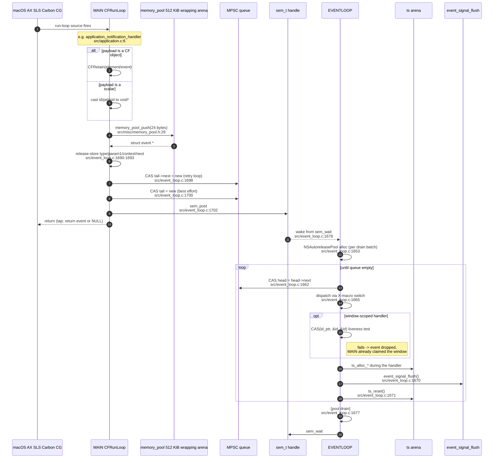
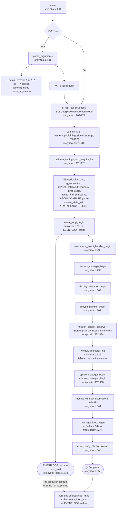

# Phase 1 cross-cutting sweep — threads, run loops and cross-thread data flow

Scope: every execution context in the yabai **daemon**. `src/osax/` is excluded (it stays C/ObjC and
runs inside Dock.app, not in our process). `src/sa.m` is in scope: it is daemon-side and is a plain
synchronous client of the scripting addition's unix socket.

Sources read in full for this sweep:
`src/yabai.c`, `src/event_loop.h`, `src/event_loop.c`, `src/message.c` (loop + dispatch),
`src/process_manager.c`, `src/process_manager.h`, `src/application.c`, `src/application.h`,
`src/mission_control.c`, `src/mouse_handler.c`, `src/mouse_handler.h`, `src/workspace.m`,
`src/display.c`, `src/display_manager.c` (begin), `src/window.c` (observe/create/destroy),
`src/window.h`, `src/view.h` (animation structs), `src/window_manager.c` (animation subsystem,
`window_manager_init`, `window_manager_begin`, focus/key-window, native-fullscreen spin locks),
`src/window_manager.h`, `src/space_manager.h`, `src/space_manager.c` (gesture focus, swap-spaces),
`src/event_signal.c`, `src/sa.m` (socket transport), `src/misc/ts.h`, `src/misc/memory_pool.h`,
`src/misc/helpers.h` (sockets, fork/exec), `src/misc/hashtable.h`, `src/misc/notify.h`,
`src/misc/timer.h`, `src/misc/extern.h`, `src/manifest.m`, `makefile`.

---

## 1. Inventory of execution contexts

| Tag | What it is | How many | Created at | Dies at |
| --- | --- | --- | --- | --- |
| **MAIN** | process main thread, running the CFRunLoop/NSRunLoop entered by `[NSApp run]` | 1 | process start | never (no clean shutdown path exists) |
| **EVENTLOOP** | one pthread running `event_loop_run` | 1 | `pthread_create` at `src/event_loop.c:1718` | never; `event_loop->is_running` is set `true` at `src/event_loop.c:1717` and **never set back to false** — there is no `event_loop_end` |
| **MSGLOOP** | one pthread running `message_loop_run` | 1 | `pthread_create` at `src/message.c:3042` | never; `g_message_loop.is_running` is likewise never cleared |
| **CVLINK** | a `CVDisplayLink` output-callback thread, one per in-flight animation batch | 0..n | `CVDisplayLinkCreateWithActiveCGDisplays` + `CVDisplayLinkStart` at `src/window_manager.c:700-702` | `CVDisplayLinkStop`/`CVDisplayLinkRelease` at `src/window_manager.c:595-596` when `t == 1.0` |
| **PROXY** | short-lived pthreads that capture a window image and build its SLS proxy window | 0..window_count, per animation batch | `pthread_create` at `src/window_manager.c:666` | `pthread_join` at `src/window_manager.c:680`, same batch |
| **CHILD(config)** | `fork()`ed child that `exec`s the config file | 1 per config load | `fork()` at `src/misc/helpers.h:477` | `execvp` at `src/misc/helpers.h:482` |
| **CHILD(signal-flush)** | `fork()`ed child that owns a batch of queued signals | 1 per non-empty flush | `fork()` at `src/event_signal.c:64` | `exit(EXIT_SUCCESS)` at `src/event_signal.c:96` |
| **CHILD(signal-exec)** | grandchild that `exec`s one user command | 1 per matching subscriber | `fork()` at `src/event_signal.c:83` | `execvp` at `src/event_signal.c:92` |
| **CLIENT** | `yabai -m …` — a completely separate, single-threaded process | 1 | `client_send_message` at `src/yabai.c:54`, reached from `parse_arguments` at `src/yabai.c:212` | `exit()` at `src/yabai.c:212` |

There is **no thread pool, no libdispatch concurrent queue and no async I/O**. Every `dispatch_*`
call in the daemon targets `dispatch_get_main_queue()` (`src/event_loop.c:93,157,1478,1516,1520`),
i.e. it schedules work back onto MAIN.

### 1.1 The client mode never starts any of this

`main` (`src/yabai.c:261`) calls `parse_arguments` first (`src/yabai.c:264`). Every
`--*-service`, `--*-sa`, `--version`, `--help` and `-m/--message` branch calls `exit()` inside
`parse_arguments` (`src/yabai.c:201,207,212,216,220,224,228,232,236,240`). So the client path is:

`main → parse_arguments → client_send_message → socket_open/socket_connect/send/shutdown(SHUT_WR)
→ blocking read() loop → socket_close → exit(code)` (`src/yabai.c:54-124`).

No CFRunLoop, no threads, no globals beyond `errno`. In Rust this is a small, entirely separate
code path that must not pull in any of the daemon's state.

---

## 2. MAIN

### 2.1 How it is created and what wakes it

MAIN is the process thread. Up to `src/yabai.c:350` it runs straight-line startup code; from
`[NSApp run]` onward it is a CFRunLoop pump. Everything that wakes it is a run-loop source:

| Source | Installed at | Callback | Posts |
| --- | --- | --- | --- |
| Carbon application events (`kEventAppLaunched`, `kEventAppTerminated`, `kEventAppFrontSwitched`) | `InstallEventHandler` at `src/process_manager.c:251`, from `process_manager_begin` called at `src/yabai.c:299` | `process_handler` `src/process_manager.c:151` | `APPLICATION_LAUNCHED` `:183`, `APPLICATION_TERMINATED` `:194`, `APPLICATION_FRONT_SWITCHED` `:200` |
| Per-application AX observer | `CFRunLoopAddSource(CFRunLoopGetMain(), …)` at `src/application.c:57` | `application_notification_handler` `src/application.c:6` | `WINDOW_CREATED` `:9`, `WINDOW_FOCUSED` `:12`, `WINDOW_MOVED` `:14`, `WINDOW_RESIZED` `:16`, `WINDOW_TITLE_CHANGED` `:18`, `MENU_OPENED` `:20`, `MENU_CLOSED` `:22`, `WINDOW_MINIMIZED` `:24`, `WINDOW_DEMINIMIZED` `:26`, `WINDOW_DESTROYED` `:38` |
| Mission-control AX observer (on Dock.app) | `CFRunLoopAddSource(CFRunLoopGetMain(), …)` at `src/mission_control.c:87`, from `mission_control_observe` called at `src/yabai.c:316` and `src/event_loop.c:1555` | `mission_control_notification_handler` `src/mission_control.c:59` | `MISSION_CONTROL_SHOW_ALL_WINDOWS` `:62`, `…SHOW_FRONT_WINDOWS` `:64`, `…SHOW_DESKTOP` `:66`, `MISSION_CONTROL_EXIT` `:68` |
| SLS connection notify procs (events 1204 / 1327 / 1328 / 808 / 804 / 1202) | `SLSRegisterConnectionNotifyProc` at `src/yabai.c:322,323,326,329,330,333` | `connection_handler` `src/mission_control.c:7` | `MISSION_CONTROL_ENTER` `:10`, `SLS_SPACE_CREATED` `:13`, `SLS_SPACE_DESTROYED` `:16`, `SLS_WINDOW_ORDERED` `:19`, `SLS_WINDOW_DESTROYED` `:22`; event 1202 only stores `__last_cmd_tab_time` `:24` |
| CGEventTap (HID tap, head-insert) | `CGEventTapCreate` `src/mouse_handler.c:278`, source added at `src/mouse_handler.c:288` with `kCFRunLoopCommonModes`, from `mouse_handler_begin` called at `src/yabai.c:307` | `mouse_handler` `src/mouse_handler.c:21` | `MOUSE_DOWN` `:34`, `MOUSE_UP` `:44`, `MOUSE_DRAGGED` `:61`, `MOUSE_MOVED` `:67`; dock-swipe gesture only stores `__pending_gesture`/`__last_gesture_time` `:76-79` |
| Display reconfiguration | `CGDisplayRegisterReconfigurationCallback` at `src/display_manager.c:505`, from `display_manager_begin` called at `src/yabai.c:303` | `display_handler` `src/display.c:6` | `DISPLAY_ADDED` `:9`, `DISPLAY_REMOVED` `:11`, `DISPLAY_MOVED` `:13`, `DISPLAY_RESIZED` `:15` |
| `NSWorkspace` notification center | `-[workspace_context init]` `src/workspace.m:157-180`, from `workspace_event_handler_begin` called at `src/yabai.c:295` | `activeDisplayDidChange:` `:281`, `activeSpaceDidChange:` `:286`, `didHideApplication:` `:291`, `didUnhideApplication:` `:297`, `didWake:` `:261` | `DISPLAY_CHANGED`, `SPACE_CHANGED`, `APPLICATION_HIDDEN`, `APPLICATION_VISIBLE`, `SYSTEM_WOKE` |
| `NSDistributedNotificationCenter` | `src/workspace.m:182-185` and `:192-195` | `didChangeMenuBarHiding:` `:266`, `didChangeDockPref:` `:276` | `MENU_BAR_HIDDEN_CHANGED`, `DOCK_DID_CHANGE_PREF` |
| `NSNotificationCenter` (default) | `src/workspace.m:187-190` | `didRestartDock:` `:271` | `DOCK_DID_RESTART` |
| KVO on `NSRunningApplication` (`finishedLaunching`, `activationPolicy`) | `addObserver:` in `workspace_application_observe_finished_launching` `src/workspace.m:73` and `…observe_activation_policy` `src/workspace.m:83` | `-observeValueForKeyPath:…` `src/workspace.m:209` | `APPLICATION_LAUNCHED` `:232` and `:256` |
| `dispatch_after` onto the main queue | `src/event_loop.c:93,157,1478,1516,1520` | anonymous blocks | `APPLICATION_LAUNCHED` `:95,:159`, `MISSION_CONTROL_CHECK_FOR_EXIT` `:1479,:1517`, `MISSION_CONTROL_EXIT` `:1521` |

### 2.2 State MAIN reads and writes

MAIN is deliberately kept almost stateless. What it touches:

* `g_process_manager.process` table — `table_add` `src/process_manager.c:182`, `table_remove` `:190`,
  `table_find` via `process_manager_find_process` `:162,186,197` and from the `dispatch_after`
  blocks `src/event_loop.c:94,158`. **This table is MAIN-owned after startup.**
* `struct process` fields — `process->terminated` (release store `src/process_manager.c:189`),
  `process->ns_application` (release store `:66`), `process->policy` (plain write
  `src/workspace.m:107,110,230`).
* `struct window` — only the `id_ptr` CAS at `src/application.c:36`. Nothing else.
* `g_mouse_state` — `handle` (atomic load `src/mouse_handler.c:28`), `modifier` (plain read `:36,65`),
  `consume_mouse_click`, `drag_detected`, `consumed_event` (`:37,38,46-54,60`).
* The four file-scope flags in `src/event_loop.c:11-14`: writes `__pending_window_focus`
  (`src/application.c:11`), `__pending_gesture` and `__last_gesture_time`
  (`src/mouse_handler.c:76,78,79`), `__last_cmd_tab_time` (`src/mission_control.c:24`).
* `g_mission_control_observer` (`src/mission_control.c:46-50`) — MAIN at startup (`src/yabai.c:316`),
  but also EVENTLOOP via `DOCK_DID_RESTART` (`src/event_loop.c:1554-1555`). See §5.8.
* The event queue, through `event_loop_post`.

MAIN **never** touches `g_window_manager`, `g_space_manager` or `g_display_manager` after
`[NSApp run]` — with the single startup exceptions in §4.

### 2.3 MAIN must not block

The CGEventTap is a *synchronous* filter: `mouse_handler` returns the (possibly modified, possibly
`NULL`) event to the window server. If MAIN is slow, macOS disables the tap and re-delivers
`kCGEventTapDisabledByTimeout`, handled by re-enabling at `src/mouse_handler.c:26-30`. This is the
whole reason the event-loop thread exists: MAIN does the absolute minimum (`CFRetain` + enqueue)
and hands the work off.

---

## 3. EVENTLOOP

### 3.1 The queue

`struct event` (`src/event_loop.h:55-61`) is `{ enum event_type type; int param1; void *context; struct event *next; }`.

`struct event_loop` (`src/event_loop.h:63-71`) is `{ bool is_running; pthread_t thread; sem_t *semaphore; struct memory_pool pool; struct event *head; struct event *tail; }`.

`event_loop_begin` (`src/event_loop.c:1705-1721`):

1. `memory_pool_init(&event_loop->pool, KILOBYTES(512))` — a 512 KiB `mmap` arena with a `PROT_NONE`
   guard page (`src/misc/memory_pool.h:11-27`).
2. `sem_open("yabai_event_loop_semaphore", O_CREAT, 0600, 0)` immediately followed by
   `sem_unlink(...)` (`:1709-1710`). A **named** POSIX semaphore used as an anonymous one, because
   macOS does not implement `sem_init`. The name is process-global; two daemons racing between
   `sem_open` and `sem_unlink` would share one semaphore — prevented only by the lock file
   (`src/yabai.c:164-177`).
3. A dummy node is pushed and `head = tail = dummy` (`:1713-1715`). This is a Michael–Scott
   **multi-producer / single-consumer** linked queue with a sentinel head.
4. `is_running = true`, `pthread_create(&thread, NULL, &event_loop_run, event_loop)` (`:1717-1718`).

`event_loop_post` (`src/event_loop.c:1684-1703`) — producer side, called from MAIN, MSGLOOP and
EVENTLOOP itself:

```
new_tail = memory_pool_push(&pool, sizeof(struct event));   // CAS bump allocator, WRAPS
__atomic_store_n(&new_tail->type,    type,    __ATOMIC_RELEASE);
__atomic_store_n(&new_tail->param1,  param1,  __ATOMIC_RELEASE);
__atomic_store_n(&new_tail->context, context, __ATOMIC_RELEASE);
__atomic_store_n(&new_tail->next,    NULL,    __ATOMIC_RELEASE);
__asm__ __volatile__ ("" ::: "memory");                      // compiler barrier only
do { tail = __atomic_load_n(&tail, RELAXED);
     success = __sync_bool_compare_and_swap(&tail->next, NULL, new_tail); } while (!success);
__sync_bool_compare_and_swap(&event_loop->tail, tail, new_tail);   // best-effort tail swing
sem_post(semaphore);
```

`event_loop_run` (`src/event_loop.c:1647-1682`) — consumer side:

```
while (is_running) {
    pool = [[NSAutoreleasePool alloc] init];
    for (;;) {
        do { head = load(head, RELAXED); next = load(head->next, RELAXED);
             if (!next) goto empty; } while (!CAS(&event_loop->head, head, next));
        switch (load(next->type, RELAXED)) { EVENT_HANDLER_<T>(next->context, next->param1); }
        event_signal_flush();
        ts_reset();
    }
empty:
    [pool drain];
    sem_wait(semaphore);
}
```

Notes that matter for the port:

* The consumer CASes `head` even though it is the **only** consumer. Harmless; a plain store would do.
* The autorelease pool wraps a whole **drain batch**, not a single event. Objects autoreleased by a
  handler live until the queue goes empty.
* `event_signal_flush()` runs after **every** event (`:1670`), and `ts_reset()` after every event
  (`:1671`) — so the temporary arena's lifetime is exactly one event handler.
* The semaphore counts posts, not queue length. After a batch drain the count can exceed the number
  of pending events, so `sem_wait` can return with an empty queue. The loop simply re-drains. This
  over-signalling is bounded and benign.
* `profile_begin()` / `profile_end_and_print()` (`:1656,:1673`) write the file-scope `g_profiler`
  (`src/misc/timer.h:16-22`) and are compiled away unless `PROFILE >= 1`.

### 3.2 What runs on EVENTLOOP

**Every** `EVENT_HANDLER_*` body in `src/event_loop.c` — all 40 of them, at
`:75, 250, 349, 426, 490, 551, 603, 636, 675, 725, 829, 873, 924, 944, 952, 968, 980, 994, 1031,
1083, 1092, 1101, 1109, 1117, 1154, 1235, 1345, 1452, 1459, 1466, 1473,
1485, 1528, 1545, 1564, 1575, 1587, 1594, 1601, 1614` — because the only call sites are the X-macro
switch at `src/event_loop.c:1665` and one direct in-handler call
`EVENT_HANDLER_WINDOW_DESTROYED(window, 0)` at `src/event_loop.c:965`.

Transitively that means EVENTLOOP owns **all** of `window_manager.c`, `space_manager.c`, `view.c`,
`window.c`, `display_manager.c`, `rule.c`, `mouse_handler.c` (the drop-action half),
`event_signal_push`, and all of `message.c`'s `handle_*` dispatch — because `DAEMON_MESSAGE`
(`src/event_loop.c:1614`) calls `handle_message` at `:1634`.

### 3.3 State EVENTLOOP owns

`g_window_manager`, `g_space_manager`, `g_display_manager`, `g_mission_control_mode`,
`g_process_manager.front_pid` / `last_front_pid` / `switch_event_time`
(`src/event_loop.c:382-384`), `g_signal_event[]` and `g_signal_storage`, the `is_menu_open` /
`ffm_value` pair (`src/event_loop.c:1561-1585`), `g_event_bytes`
(`src/window_manager.c:1280-1317`), and the `ts` temporary arena.

### 3.4 EVENTLOOP blocks, on purpose

* `usleep(40000)` in `window_manager_focus_window_without_raise` (`src/window_manager.c:1313`).
* `usleep(20000)` in `window_manager_notify_jankyborders(..., wait=true)` (`src/window_manager.c:458`),
  reached from the CVLINK callback (`:579`), not from EVENTLOOP.
* spin loops with `usleep(100000)` around native-fullscreen transitions
  (`src/window_manager.c:2278, 2291, 2309`).
* every `scripting_addition_*` call: `connect` + `send` + a blocking `recv` of one ack byte
  (`src/sa.m:428-437`).
* `pthread_join` on the proxy threads (`src/window_manager.c:680`).

So EVENTLOOP is *not* latency-critical the way MAIN is; it is allowed to stall for hundreds of
milliseconds. Events queue up behind it.

---

## 4. Startup ordering — why the "uninitialised managers" race does not happen

`main` (`src/yabai.c:261-353`) does, in order:

1. `parse_arguments` (`:264`) — may `exit()`.
2. `is_root` / `ax_privilege` / `SLSGetSpaceManagementMode` guards (`:267-277`).
3. `ts_init(MEGABYTES(8))` (`:279`), `memory_pool_init(&g_signal_storage, KILOBYTES(256))` (`:283`).
4. `configure_settings_and_acquire_lock` (`:287`) — `NSApplicationLoad()`, `g_connection`,
   `g_cv_host_clock_frequency`, layer levels, two `macho_find_symbol` lookups, `signal(SIGCHLD, SIG_IGN)`
   and `signal(SIGPIPE, SIG_IGN)` (`:151-152`), `mouse_state_init`, `task_get_special_port(...&g_bs_port)`,
   and the `fcntl(F_SETLK)` lock file.
5. **`event_loop_begin` (`:291`) — EVENTLOOP starts here**, before any manager exists.
6. `workspace_event_handler_begin` (`:295`) — installs all the NS observers.
7. `process_manager_begin` (`:299`) — fills `pm->process`, installs the Carbon handler.
8. `display_manager_begin` (`:303`) — registers the display callback.
9. `mouse_handler_begin` (`:307`) — creates and arms the event tap.
10. `mission_control_observe` + `SLSRegisterConnectionNotifyProc` (`:311-334`).
11. `window_manager_init` (`:336`) — **this is where `g_window_manager`'s tables and the animations
    mutex are initialised** (`src/window_manager.c:2727-2734`).
12. `space_manager_begin` (`:337`), `window_manager_begin` (`:338`).
13. `update_window_notifications()` (`:341`) — reads `g_window_manager.window` **on MAIN**.
14. `message_loop_begin` (`:344`) — MSGLOOP starts.
15. `exec_config_file` (`:348`) — forks the config child.
16. `[NSApp run]` (`:350`).

The window between step 5 and step 11 is a latent hazard: EVENTLOOP is alive while
`g_window_manager` is still zeroed. **It is safe only because every event producer is a
main-run-loop callback, and the main run loop does not turn until step 16.** Carbon handlers,
AX observers, the event tap, `NSNotificationCenter`, `NSDistributedNotificationCenter`,
`SLSRegisterConnectionNotifyProc` and `dispatch_get_main_queue()` blocks all require a running
run loop on MAIN. `process_manager_begin` enumerates processes with `GetNextProcess`
(`src/process_manager.c:211`) and posts nothing. So EVENTLOOP goes straight to `sem_wait` and
sleeps until step 16. Step 13's MAIN-side read of `g_window_manager.window` is likewise safe for
the same reason.

**This is a load-bearing invariant. The Rust port must make it explicit rather than implicit.**

---

## 5. MSGLOOP and the message lifecycle

### 5.1 The loop

`message_loop_begin` (`src/message.c:3016-3045`), called from MAIN at `src/yabai.c:344`:
`socket(AF_UNIX, SOCK_STREAM)` → `unlink(path)` → `bind` → `chmod 0600` → `listen(SOMAXCONN)` →
`fcntl(F_SETFD, FD_CLOEXEC)` → `is_running = true` → `pthread_create(message_loop_run)`.

`message_loop_run` (`src/message.c:3003-3013`) is three lines:

```
while (g_message_loop.is_running) {
    int sockfd = accept(g_message_loop.sockfd, NULL, 0);
    if (sockfd == -1) continue;
    event_loop_post(&g_event_loop, DAEMON_MESSAGE, NULL, sockfd);
}
```

MSGLOOP touches **no** manager state. It is a pure fd shuttle: the accepted fd travels as
`param1` (an `int`) through the queue, and ownership of the fd transfers to EVENTLOOP.

`FD_CLOEXEC` is set on the *listening* fd only. Accepted fds are **not** `CLOEXEC`, so a
`fork`+`exec` from `event_signal_flush` or `exec_config_file` that happens while a client fd is
open leaks that fd into the child. The child `exec`s immediately, and the parent still owns and
closes its copy, so the observable effect is only that a client can see its response socket held
open by a signal command for the duration of that command.

### 5.2 Wire protocol and the response fd

Client side (`src/yabai.c:54-124`): builds `int message_length` followed by NUL-separated argv and a
final extra NUL, `send`s it, then `shutdown(sockfd, SHUT_WR)` (`:100`) and blocks in
`read()` until EOF (`:108`). A response whose first byte equals `FAILURE_MESSAGE[0]` flips the exit
code to `EXIT_FAILURE` and routes the remainder to `stderr` (`:111-115`).

Daemon side, `EVENT_HANDLER(DAEMON_MESSAGE)` (`src/event_loop.c:1614-1644`), **on EVENTLOOP**:

```
read(param1, &bytes_to_read, sizeof(int))            // blocking
message = ts_alloc_unaligned(bytes_to_read)          // temp arena
loop read() until bytes_read == bytes_to_read        // blocking
rsp = fdopen(param1, "w")
handle_message(rsp, message)                         // all of message.c
fflush(rsp); fclose(rsp);                            // fclose closes param1
```

On any failure path it falls through to `socket_close(param1)` (`:1643`), which is
`shutdown(SHUT_RDWR)` + `close` (`src/misc/helpers.h:198-202`). So the fd is closed **exactly once**,
either by `fclose` on the success path or by `socket_close` on the failure path.

The reads are blocking and unbounded — a client that connects, sends a length prefix and then
stalls **wedges the entire event loop**. There is no timeout and no `poll`. This is a genuine
(unexploited, because the socket is `0600`) denial-of-service on the daemon's own event processing.

`handle_message` writes the response through the `FILE *` incrementally as it walks the domains
(`src/message.c:2990-2998`), so a long `query` streams out while the handler runs.

---

## 6. The animation subsystem — CVLINK and PROXY

### 6.1 Structures

`struct window_animation` (`src/view.h:68-76`): `{ struct window *window; uint32_t wid; float x,y,w,h;
int cid; struct window_proxy proxy; volatile bool skip; }`.
`struct window_animation_context` (`src/view.h:78-86`): `{ int animation_connection; int animation_easing;
float animation_duration; uint64_t animation_clock; struct window_animation *animation_list; int animation_count; }`.

Guarded by `pthread_mutex_t window_animations_lock` (`src/window_manager.h:84`, initialised
`src/window_manager.c:2734`) together with `struct table window_animations_table`
(`src/window_manager.h:82`, keyed by `wid`).

### 6.2 Setup — on EVENTLOOP

`window_manager_animate_window_list_async` (`src/window_manager.c:603-703`) runs entirely on
EVENTLOOP (every caller is an event handler or a `message.c` handler — see the call list at
`src/mouse_handler.c:146,148,178,215`, `src/window_manager.c:342,359,403,1828,1868,1879,1920,2053,
2177,2393,2398`, `src/view.c:378`).

1. `malloc` the context, `SLSNewConnection(0, &context->animation_connection)` — a **dedicated SLS
   connection per animation batch** (`:607`).
2. `ts_alloc_list(pthread_t, window_count)` (`:615`) — from the temp arena, so this whole function
   must complete within one event handler.
3. `SLSDisableUpdate` then `pthread_mutex_lock(&window_animations_lock)` (`:618-619`).
4. For each window: fill the animation record; look up `window_animations_table` by `wid` (`:631`).
   * **If an animation for that wid is already running**: `__atomic_store_n(&existing->skip, true,
     __ATOMIC_RELEASE)` (`:633`), copy the in-flight proxy's current interpolated geometry
     (`:635-647`), `__asm__ __volatile__ ("" ::: "memory")` (`:648`), build a replacement proxy,
     order it in front, zero the old proxy's system alpha, `table_remove` the old entry and destroy
     the old proxy (`:662-663`). This is a **hand-off of an in-flight animation between EVENTLOOP
     and the CVLINK thread that owns it**.
   * **Otherwise**: `pthread_create(window_manager_build_window_proxy_thread_proc, &animation_list[i])`
     (`:666`); on failure, run it inline (`:669`).
   * `table_add(&window_animations_table, &wid, &animation_list[i])` (`:673`).
5. `pthread_mutex_unlock` (`:675`), then `pthread_join` every proxy thread (`:680`).
6. `scripting_addition_swap_window_proxy_in` (`:685`) — blocking socket round-trip.
7. `window_manager_notify_jankyborders(..., 1325, true, false)` (`:689`) — `bootstrap_look_up` +
   `mach_send` (`src/window_manager.c:437-459`).
8. `window_manager_set_window_frame` for each real window (`:694`) — AX writes.
9. `SLSReenableUpdate`, `CVDisplayLinkCreateWithActiveCGDisplays`, `CVDisplayLinkSetOutputCallback`,
   `CVDisplayLinkStart` (`:699-702`). **The function returns while the animation is still running.**

### 6.3 Tick — on CVLINK

`window_manager_animate_window_list_thread_proc` (`src/window_manager.c:537-600`):

* Reads `output_time->hostTime`, latches `context->animation_clock` on the first tick (`:543`),
  computes `t` against `context->animation_duration * g_cv_host_clock_frequency` (`:545`).
* For each entry: `if (__atomic_load_n(&animation_list[i].skip, __ATOMIC_RELAXED)) continue;` (`:558`),
  lerp the proxy geometry, `SLSTransactionSetWindowTransform` on the **batch's own** SLS connection,
  `SLSGetWindowAlpha` on the real wid, commit (`:556-574`).
* On the final tick (`t == 1.0`): `pthread_mutex_lock(&g_window_manager.window_animations_lock)` (`:577`),
  `SLSDisableUpdate`, `window_manager_notify_jankyborders(..., 1326, true, true)` (`:579`, which does
  `usleep(20000)`), `scripting_addition_swap_window_proxy_out` (`:580`, a blocking socket round-trip),
  `table_remove` + `window_manager_destroy_window_proxy` per non-skipped entry (`:584-585`),
  `SLSReenableUpdate`, unlock (`:588-589`), `SLSReleaseConnection`, `free(animation_list)`,
  `free(context)`, `CVDisplayLinkStop`, `CVDisplayLinkRelease` (`:591-596`).

**CVLINK touches exactly two pieces of shared state**: `g_window_manager.window_animations_table`
and `window_animations_lock` (both correctly guarded), plus the read-only global
`g_cv_host_clock_frequency`. It reads `animation_list[i].window` **never** — only `wid` and `proxy`.
That is the reason a `struct window *` can safely be stored in the animation record: the pointer is
dereferenced only on EVENTLOOP, at `src/window_manager.c:694`.

### 6.4 PROXY threads

`window_manager_build_window_proxy_thread_proc` (`src/window_manager.c:507-533`) touches only its
own `struct window_animation *` and the batch's SLS connection: `SLSGetWindowAlpha`, `window_level`,
`window_sub_level`, `SLSGetWindowBounds`, `SLSHWCaptureWindowList`, `cgimage_restore_alpha`,
`window_manager_create_window_proxy`. No globals, no allocator, no CF autorelease pool (it uses
`CFRetain`/`CFRelease` only). They are spawned while the animations mutex is held and joined
immediately afterwards, so they are effectively a parallel-for.

### 6.5 The animation race that is real

`existing_animation->skip` is set to `true` with a release store on EVENTLOOP (`:633`), then the
*old* animation's proxy is destroyed at `:663` while EVENTLOOP holds `window_animations_lock`. The
CVLINK thread that owns that old animation reads `skip` with a **relaxed** load at `:558` — but
without the lock. So the sequence:

1. CVLINK reads `skip == false` at `:558`,
2. EVENTLOOP sets `skip = true` and destroys `proxy` (releases `proxy.id`) at `:633,:663`,
3. CVLINK proceeds to `SLSTransactionSetWindowTransform(transaction, proxy.id, …)` at `:567`,

is possible. In practice the window id is merely stale, SLS rejects the transform, and the frame is
dropped — the C code is *lucky*, not correct. The final-tick path (`:577-589`) is correctly locked
and re-checks `skip` under the lock at `:582`, so teardown itself is race-free.

---

## 7. Forked children

### 7.1 Config execution

`exec_config_file` (`src/misc/helpers.h:463-487`), called from MAIN at `src/yabai.c:348`
(after `message_loop_begin`, before `[NSApp run]`) and from `message.c` on EVENTLOOP for
`config`-domain reload. `fork()` at `:477`; the child immediately `execvp("/usr/bin/env", …)` —
`sh -c <file>` if executable, `sh <file>` otherwise (`:479-482`). No `waitpid`: reaping is handled
by `signal(SIGCHLD, SIG_IGN)` at `src/yabai.c:151`.

Forking from a multithreaded process is only safe because the child does nothing but `execvp`.

### 7.2 Signal dispatch

`event_signal_push` (`src/event_signal.c:99-341`) runs on EVENTLOOP inside a handler. It bump-allocates
a `struct event_signal` out of `g_signal_storage` with
`__sync_fetch_and_add(&g_signal_storage.used, size)` (`:107`) — an atomic RMW even though only
EVENTLOOP ever calls it — and fills `arg_name[]`/`arg_value[]` from the **temp arena**
(`ts_alloc_unaligned`, e.g. `:129-130`), plus `es->app` / `es->title` which may point at
long-lived strings (`application->name`, `src/event_signal.c:135`) or at temp-arena copies
(`ts_string_copy`, `:146,:209`).

`event_signal_flush` (`src/event_signal.c:60-97`) runs at `src/event_loop.c:1670`, **after every
single event and before `ts_reset()`** — which is exactly why the temp-arena pointers are still
valid at fork time.

```
if (!g_signal_storage.used) return;
pid = fork();
if (pid) { g_signal_storage.used = 0; return; }      // parent: drop the batch, carry on
... for each queued event_signal, for each matching subscriber:
      pid = fork(); if (pid) continue;               // grandchild
      setenv(arg_name[i], arg_value[i], 1) x4
      execvp("/usr/bin/env", {"sh", "-c", signal->command})
exit(EXIT_SUCCESS);
```

The intermediate child is a snapshot: it inherits a copy-on-write image of `g_signal_storage`,
`g_signal_event[]` and the temp arena, so the parent is free to `ts_reset()` immediately. The
`regex_match` calls in `event_signal_filter` (`src/event_signal.c:8-58`) run **in the child**, on
the inherited `regex_t`s.

Forking a multithreaded process and then running `regex_match`, `buf_len`, `debug()` (which does
`fprintf`) and `setenv` before `exec` is **not** async-signal-safe. `malloc`'s lock could be held by
MAIN or CVLINK at fork time and the child would deadlock. This is the single most genuinely
dangerous thing in the codebase; it works because the parent threads rarely allocate at that instant.

---

## 8. Synchronisation primitive catalogue

| Primitive | Location | Guards | Notes for the port |
| --- | --- | --- | --- |
| named POSIX semaphore | `src/event_loop.c:1709,1678,1702` | EVENTLOOP wake-up | counts posts, over-signals; `sem_open`+`sem_unlink` because macOS lacks `sem_init` |
| `__sync_bool_compare_and_swap` on `tail->next` / `head` | `src/event_loop.c:1662,1698,1700` | MPSC queue linkage | seq-cst full barriers in GCC/clang `__sync_*` semantics |
| `__atomic_store_n(..., __ATOMIC_RELEASE)` on event fields | `src/event_loop.c:1690-1693` | publication of the event payload | paired with **relaxed** loads at `:1659,1660,1664,1665` — the real ordering comes from the `__sync` CAS |
| `__asm__ __volatile__ ("" ::: "memory")` | `src/event_loop.c:1694`, `src/process_manager.c:192`, `src/window_manager.c:648`, `src/space_manager.c:752,796` | compiler-only reordering fence | **no hardware barrier**; on arm64 these are not sufficient on their own. Each one happens to be adjacent to a real atomic, which is what actually saves it |
| `__sync_bool_compare_and_swap(&window->id_ptr, &window->id, NULL)` | `src/application.c:36`, `src/event_loop.c:280` | claims the right to destroy a window | see §9.1 |
| `__sync_bool_compare_and_swap(&window->id_ptr, &window->id, &window->id)` | `src/event_loop.c:647,681,731,833,877,930,960,1159,1240` | **liveness test only** — CAS a value to itself | see §9.1 |
| `pthread_mutex_t window_animations_lock` | `src/window_manager.h:84`; locked `src/window_manager.c:619,675` (EVENTLOOP) and `:577,589` (CVLINK) | `window_animations_table` + proxy teardown | the only mutex in the daemon |
| `volatile bool skip` | `src/view.h:75`; RELEASE store `src/window_manager.c:633`; RELAXED loads `:449,558,582`, `src/sa.m:550,566` | cancels an in-flight animation | §6.5 |
| `volatile bool __pending_window_focus` | `src/event_loop.c:11`; RELEASE store `src/application.c:11` (MAIN) and `src/event_loop.c:422,638` (EVENTLOOP); RELAXED load `:369` | "an AX focus event is already on its way" | MAIN→EVENTLOOP one-shot flag |
| `volatile bool __pending_gesture`, `volatile uint64_t __last_gesture_time` | `src/event_loop.c:12-13`; RELEASE stores `src/mouse_handler.c:76,78,79` (MAIN); RELAXED loads `src/event_loop.c:1351,1352` | suppress focus-follows-mouse during a dock swipe | |
| `volatile uint64_t __last_cmd_tab_time` | `src/event_loop.c:14`; RELEASE store `src/mission_control.c:24` (MAIN); RELAXED load `src/event_loop.c:362` | suppress the AX `__fence` hack right after cmd-tab | |
| `bool volatile process->terminated` | `src/process_manager.h:14`; RELEASE stores `src/process_manager.c:65,189` (MAIN); RELAXED load `src/event_loop.c:79`; **plain** reads `src/workspace.m:213,238` (MAIN) | "this process died during launch" | |
| `void *process->ns_application` | RELEASE stores `src/process_manager.c:66` (MAIN), `src/event_loop.c:87` (EVENTLOOP); RELAXED loads `src/event_loop.c:85,89,113,132`, `src/workspace.m:35,71,81,91,105,117` | the retained `NSRunningApplication` | written from **both** threads |
| `volatile uint8_t mouse_state->modifier` | `src/mouse_handler.h:71`; plain reads `src/mouse_handler.c:36,65` (MAIN); plain read/writes `src/event_loop.c:1136,1138` and `src/message.c:1621-1631` (EVENTLOOP) | mouse modifier config | a single aligned byte; torn access impossible, but formally a data race |
| `CFMachPortRef mouse_state->handle` | RELAXED load `src/mouse_handler.c:28`; RELEASE store `:302` | event tap handle | |
| bump allocator CAS (`memory_pool_push`) | `src/misc/memory_pool.h:29-45` | event node allocation | **wraps around and reuses memory** — see §9.3 |
| bump allocator CAS (`ts_alloc_*`) | `src/misc/ts.h:52-98` | temp arena | reset **non-atomically** at `src/misc/ts.h:102` |
| `__sync_fetch_and_add(&g_signal_storage.used, size)` | `src/event_signal.c:107` | signal batch arena | EVENTLOOP-only in practice |
| `fcntl(F_SETLK)` on `/tmp/yabai_$USER.lock` | `src/yabai.c:164-177` | single-instance | |
| `signal(SIGCHLD, SIG_IGN)` / `signal(SIGPIPE, SIG_IGN)` | `src/yabai.c:151-152` | auto-reap children; survive a client hanging up mid-response | |

**There is no `event_loop_post` variant that waits for completion.** Every post is fire-and-forget.
The only synchronous cross-context wait in the daemon is `pthread_join` on the proxy threads
(`src/window_manager.c:680`) and the blocking `recv` inside `scripting_addition_send_bytes`
(`src/sa.m:431`) — and the latter talks to Dock.app, not to one of our own threads.

---

## 9. Shared-state audit — what is actually two-context, and is it sound?

### 9.1 `struct window` and the `id_ptr` liveness trick — **sound, and clever**

`window->id_ptr` is initialised to `&window->id` in `window_create` (`src/window.c:1101`).

* MAIN, on `kAXUIElementDestroyedNotification` (`src/application.c:27-38`), does
  `CAS(&window->id_ptr, &window->id, NULL)`. **Winning the CAS is the licence to post
  `WINDOW_DESTROYED`.** Losing it means somebody else already claimed the window, so MAIN returns
  without posting. The comment at `src/application.c:30-34` states the rule explicitly: *"Flag events
  that are already queued, but not yet processed, so that they will be ignored; the memory we
  allocated is still valid and will be freed when this event is handled."*
* EVENTLOOP, in `APPLICATION_TERMINATED` (`src/event_loop.c:280`), uses the same
  claiming CAS. If it **loses**, it sets `window->application = NULL` (`:281`) and skips
  `window_unobserve`/`window_destroy`, leaving the already-queued `WINDOW_DESTROYED` to free it.
* EVENTLOOP, in nine other handlers, uses `CAS(&window->id_ptr, &window->id, &window->id)` — a CAS
  of a value to **itself**, purely as an atomic "is this pointer still non-NULL-and-unclaimed?" test
  (`src/event_loop.c:647,681,731,833,877,930,960,1159,1240`). Stale events referring to a window
  MAIN has since marked dead are silently dropped.

Why it is sound: **only EVENTLOOP ever calls `free()` on a `struct window`**
(`window_destroy`, `src/window.c:1136-1144`, reached from `src/event_loop.c:315` and `:629`), and it
only does so after winning the claiming CAS. MAIN only ever CASes a pointer *inside* an allocation
that is still alive, because the claim it would need to win in order for the free to happen is the
same one it is attempting.

The trick is really a one-bit ownership token stored in a pointer field, so that both the "has it
been claimed" test and the "claim it" operation are one atomic instruction.

**Two sharp edges the Rust port must decide about, not silently inherit:**

* `SLS_WINDOW_DESTROYED` (`src/event_loop.c:952-966`) **tests** liveness at `:960` but does **not**
  claim; it then calls `EVENT_HANDLER_WINDOW_DESTROYED(window, 0)` inline at `:965`, which frees the
  window at `:629`. `id_ptr` is therefore left pointing at `&window->id` inside freed memory. A
  later `kAXUIElementDestroyedNotification` on MAIN for the same window would CAS on freed memory.
  In practice `window_unobserve(window)` at `:628` runs *before* `window_destroy` at `:629`, which
  removes the AX notifications that carry `window` as `context` (`src/window.c:26`), so the callback
  should never fire afterwards — unless one is already in flight on MAIN.
* `WINDOW_DESTROYED` calls `window_unobserve(window)` at `:628`, which dereferences
  `window->application->observer_ref` (`src/window.c:26`). But `APPLICATION_TERMINATED` sets
  `window->application = NULL` at `src/event_loop.c:281` exactly for windows whose `WINDOW_DESTROYED`
  is still queued. The guard at `:606` (`!window || window->id == 0`) does not cover that case, and
  `window_destroy` sets `id = 0` only *after* the struct is already being torn down (`src/window.c:1138`),
  so reading it is itself a read of memory that is about to be freed. This is a latent NULL
  dereference that the type system will force us to confront.

### 9.2 `struct process` — **sound by handoff**

MAIN creates it (`src/process_manager.c:61-67`), inserts it into `pm->process`, and posts
`APPLICATION_LAUNCHED` with the pointer as `context` (`:182-183`). On termination MAIN sets
`terminated` (release), `table_remove`s it, calls `workspace_application_unobserve`, emits a
compiler barrier, and posts `APPLICATION_TERMINATED` (`:189-194`). EVENTLOOP is the one that
finally `free`s it, in `process_destroy` at `src/event_loop.c:344`.

So the table is MAIN-owned, the struct is jointly read, and the free is EVENTLOOP-only after the
last MAIN reference has been dropped from the table. `process->ns_application` is written from
**both** threads (`src/process_manager.c:66` on MAIN, `src/event_loop.c:87` on EVENTLOOP) but at
disjoint times: MAIN writes it at creation, EVENTLOOP only writes it if MAIN's attempt returned
NULL, and by then MAIN has no reason to touch it again.

The `terminated` flag is read with `__ATOMIC_RELAXED` at `src/event_loop.c:79` but also with a
**plain** volatile read at `src/workspace.m:213` and `:238` (inside the KVO callback, on MAIN —
same thread that wrote it, so fine).

### 9.3 The event-node arena — **lucky**

`memory_pool_push` (`src/misc/memory_pool.h:29-45`) is a bump allocator that **wraps**: when
`used + size >= pool->size` it CASes `used` back to `size` and hands out the base of the arena
again. `struct event` is 24 bytes; the pool is 512 KiB; so after roughly 21 845 posts the allocator
starts overwriting the oldest event nodes. If more than ~21 845 events are queued and unconsumed,
an in-flight node is recycled under the consumer's feet and the queue's `next` chain is corrupted.

EVENTLOOP normally drains far faster than events arrive, so this never happens — but EVENTLOOP can
block for hundreds of milliseconds (§3.4) and MAIN can post mouse-moved events at HID rate.
It is a bounded-queue problem solved by hoping the queue is never full.

### 9.4 The temp arena `ts` — **sound, by discipline**

`ts_alloc_*` uses CAS (`src/misc/ts.h:52-98`), so allocation is multi-thread safe; but `ts_reset`
(`:102`) is a plain non-atomic store, called only from EVENTLOOP at `src/event_loop.c:1671`.

Auditing every `ts_*` call site: after startup, all of them are reached from EVENTLOOP. MAIN's
callbacks allocate with `malloc`/`cfstring_copy` (`src/process_manager.c:44,61`) and never touch
`ts`. CVLINK and PROXY never touch `ts`. Startup code on MAIN does touch `ts` (via
`display_manager_active_display_list` inside `display_manager_begin`), but that is before the run
loop turns, so EVENTLOOP is parked in `sem_wait`. **Invariant: `ts` is single-threaded in effect.**

The Rust port should make this a compile-time fact rather than an audited accident.

### 9.5 `g_event_bytes` — **sound, by accident of call sites**

`g_event_bytes` is a single 256-byte heap buffer allocated once (`src/yabai.c:141-142`) and reused
as the scratch buffer for synthesised `SLPSPostEventRecordTo` records
(`src/window_manager.c:1280-1317`). The two functions that use it,
`window_manager_make_key_window` and `window_manager_focus_window_without_raise`, are reached only
from event handlers and `message.c` handlers — all EVENTLOOP. It would be a live data race the
moment anything else called them. The `usleep(40000)` at `:1313` is *inside* the region where the
buffer is live, which makes the window wide.

### 9.6 `g_window_manager.window_animations_table` — **sound**

Written by EVENTLOOP (`src/window_manager.c:662,673`) and by CVLINK (`:584`), always under
`window_animations_lock` (`:619/:675` and `:577/:589`). `struct table` (`src/misc/hashtable.h:16-24`)
resizes by reallocating the bucket array, so unguarded concurrent access would be catastrophic —
the mutex is genuinely required here, and it is genuinely held on both sides.

Note that the *values* stored in the table are interior pointers into a `malloc`ed
`animation_list` array (`src/window_manager.c:673` stores `&context->animation_list[i]`), and that
array is `free`d by CVLINK at `:592`, under the lock, after removing every one of its entries.

### 9.7 The four `__*` flags — **sound**

`__pending_window_focus`, `__pending_gesture`, `__last_gesture_time`, `__last_cmd_tab_time`
(`src/event_loop.c:11-14`) are all one-writer-one-reader hints: MAIN publishes with a release store,
EVENTLOOP consumes with a relaxed load and uses the value only as a heuristic (`src/event_loop.c:362-369,
1351-1354`). A stale read costs at most one mis-suppressed focus change. `__pending_window_focus` is
also cleared from EVENTLOOP (`:422,:638`), so it has two writers — but the two writers write
different values at causally-ordered moments (MAIN sets on notification, EVENTLOOP clears on
handling), and a lost clear only means one extra suppression.

### 9.8 `g_mission_control_observer` — **latently racy**

`mission_control_observe`/`mission_control_unobserve` (`src/mission_control.c:73-106`) mutate the
file-scope struct and call `CFRunLoopAddSource(CFRunLoopGetMain(), …)` / `CFRunLoopSourceInvalidate`.
They are called from MAIN at `src/yabai.c:316`, but also from **EVENTLOOP** in
`EVENT_HANDLER(DOCK_DID_RESTART)` at `src/event_loop.c:1554-1555`. Mutating a CFRunLoop's source set
from a foreign thread is permitted by `CFRunLoop`'s documented thread safety, but `AXObserver`
creation/teardown from a non-main thread is not documented as safe. Same class of issue:
`application_unobserve` (`src/application.c:63-77`) invalidates an AX observer's run-loop source from
EVENTLOOP (`src/event_loop.c:318`), and `window_unobserve` (`src/window.c:21-29`) calls
`AXObserverRemoveNotification` from EVENTLOOP (`src/event_loop.c:314,628`), while that observer's
source may be mid-dispatch on MAIN.

Verdict: **lucky**. The Rust port inherits the behaviour but should record it as a known hazard.

### 9.9 `g_mouse_state` — **partitioned, formally racy**

Field-by-field ownership:

* MAIN-only: `consume_mouse_click`, `drag_detected`, `consumed_event`
  (`src/mouse_handler.c:37,38,46-54,60` — no other reader anywhere).
* EVENTLOOP-only: `window`, `window_frame`, `down_location`, `direction`, `current_action`,
  `action1`, `action2`, `drop_action`, `ffm_window_id`, `feedback_node`, `last_moved_time`.
* Cross-thread: `handle` (atomics, `src/mouse_handler.c:28,302`) and `modifier` (plain `volatile`
  reads on MAIN at `:36,65`; plain writes on EVENTLOOP at `src/message.c:1623-1631`).

`modifier` is a single aligned byte, so the "race" cannot tear — but it is a data race by the
letter of the memory model, and it is the only field that needs real synchronisation in Rust.

### 9.10 CF object ownership crossing threads

Several event payloads are CF objects retained on MAIN and released on EVENTLOOP:

* `CGEventRef` — `CFRetain(event)` at `src/mouse_handler.c:34,44,61,67`, `CFRelease(context)` at
  `src/event_loop.c:1151,1232,1244,1342,1449`.
* `AXUIElementRef` — `CFRetain(element)` at `src/application.c:9` for `WINDOW_CREATED`; released on
  the early-exit paths at `src/event_loop.c:554,557,560,563`, or adopted by `window_create`
  (`src/window.c:1099`) and released in `window_destroy` (`src/window.c:1142`).

CF retain counts are atomic, so this is sound. It does mean the Rust `Event` enum carries raw
CF pointers with transfer-of-ownership semantics.

---

## 10. Diagrams

### (a) Overview — all contexts and the channels between them

```mermaid
flowchart TB
    subgraph CLIENTPROC["yabai -m  (separate process)"]
        CLI["client_send_message<br/>src/yabai.c:54"]
    end

    subgraph DAEMON["yabai daemon process"]
        subgraph MAIN["MAIN — CFRunLoop after [NSApp run] (src/yabai.c:350)"]
            CARBON["process_handler<br/>src/process_manager.c:151"]
            AXOBS["application_notification_handler<br/>src/application.c:6"]
            MCOBS["mission_control_notification_handler<br/>src/mission_control.c:59"]
            SLSNOTIFY["connection_handler<br/>src/mission_control.c:7"]
            TAP["mouse_handler (CGEventTap)<br/>src/mouse_handler.c:21"]
            DISP["display_handler<br/>src/display.c:6"]
            NSOBS["workspace_context observers + KVO<br/>src/workspace.m:209-301"]
            DISPATCH["dispatch_after blocks<br/>src/event_loop.c:93,157,1478,1516,1520"]
        end

        QUEUE[["MPSC queue + named semaphore<br/>event_loop_post src/event_loop.c:1684<br/>512 KiB wrapping arena"]]

        subgraph EL["EVENTLOOP — pthread, src/event_loop.c:1718"]
            RUN["event_loop_run<br/>src/event_loop.c:1647"]
            HANDLERS["40 x EVENT_HANDLER_*"]
            FLUSH["event_signal_flush<br/>src/event_signal.c:60"]
            TSRESET["ts_reset<br/>src/misc/ts.h:100"]
        end

        subgraph ML["MSGLOOP — pthread, src/message.c:3042"]
            ACCEPT["accept() loop<br/>src/message.c:3003"]
        end

        subgraph ANIM["animation, per batch"]
            PROXY["PROXY pthreads<br/>src/window_manager.c:666"]
            CVL["CVLINK output callback<br/>src/window_manager.c:537"]
        end

        STATE[("g_window_manager<br/>g_space_manager<br/>g_display_manager<br/>g_mission_control_mode")]
        ANIMTBL[("window_animations_table<br/>+ window_animations_lock<br/>src/window_manager.h:82,84")]
        PROCTBL[("g_process_manager.process<br/>src/process_manager.h:19")]
    end

    subgraph KIDS["forked children"]
        CFGCHILD["exec_config_file<br/>src/misc/helpers.h:477"]
        SIGCHILD["event_signal_flush child<br/>src/event_signal.c:64"]
        CMDCHILD["per-subscriber grandchild<br/>src/event_signal.c:83"]
    end

    SA[["Dock.app scripting addition<br/>unix socket /tmp/yabai-sa_$USER.socket"]]
    JB[["JankyBorders<br/>mach port git.felix.jbevent"]]

    CARBON --> QUEUE
    AXOBS --> QUEUE
    MCOBS --> QUEUE
    SLSNOTIFY --> QUEUE
    TAP --> QUEUE
    DISP --> QUEUE
    NSOBS --> QUEUE
    DISPATCH --> QUEUE

    CLI -- "unix socket<br/>/tmp/yabai_$USER.socket" --> ACCEPT
    ACCEPT -- "DAEMON_MESSAGE, param1 = accepted fd" --> QUEUE

    QUEUE --> RUN --> HANDLERS
    HANDLERS --> FLUSH --> TSRESET
    HANDLERS -- "re-post<br/>src/event_loop.c:167,917 / window_manager.c:1467" --> QUEUE

    HANDLERS <--> STATE
    HANDLERS -- "spawn + join" --> PROXY
    HANDLERS -- "CVDisplayLinkStart<br/>src/window_manager.c:702" --> CVL
    HANDLERS -- "mutex" --> ANIMTBL
    CVL -- "mutex" --> ANIMTBL
    CARBON <--> PROCTBL
    DISPATCH --> PROCTBL

    HANDLERS -- "blocking send/recv<br/>src/sa.m:422" --> SA
    CVL -- "blocking send/recv<br/>src/window_manager.c:580" --> SA
    HANDLERS -- "mach_send<br/>src/window_manager.c:457" --> JB
    CVL -- "mach_send + usleep(20ms)" --> JB

    FLUSH -- "fork" --> SIGCHILD --> CMDCHILD
    HANDLERS -- "fork (config reload)" --> CFGCHILD
    HANDLERS -- "fdopen/fprintf/fclose<br/>src/event_loop.c:1632-1637" --> CLI
```



### (b) Event lifecycle — OS callback to handler



### (c) Message lifecycle — socket accept to response

```mermaid
sequenceDiagram
    autonumber
    participant C as yabai -m client process
    participant SOCK as /tmp/yabai_$USER.socket
    participant ML as MSGLOOP
    participant Q as MPSC queue
    participant EL as EVENTLOOP
    participant ST as manager state

    C->>C: build [int len][arg\0]...[\0]<br/>src/yabai.c:65-82
    C->>SOCK: socket_open + socket_connect + send<br/>src/yabai.c:88-98
    C->>C: shutdown(SHUT_WR)<br/>src/yabai.c:100
    C->>C: blocking read() until EOF<br/>src/yabai.c:108

    SOCK-->>ML: accept() returns fd<br/>src/message.c:3006
    ML->>Q: event_loop_post(DAEMON_MESSAGE, NULL, fd)<br/>src/message.c:3009
    Note over ML: MSGLOOP touches no manager state;<br/>ownership of fd moves to EVENTLOOP
    ML->>SOCK: accept() again

    Q-->>EL: DAEMON_MESSAGE dequeued
    EL->>EL: read(fd, &bytes_to_read, 4) [blocking]<br/>src/event_loop.c:1622
    EL->>EL: ts_alloc_unaligned(bytes_to_read)<br/>src/event_loop.c:1623
    EL->>EL: read loop until complete [blocking]<br/>src/event_loop.c:1625-1630
    alt short read or fdopen failure
        EL->>SOCK: socket_close(fd)<br/>src/event_loop.c:1643
    else complete
        EL->>EL: rsp = fdopen(fd, "w")<br/>src/event_loop.c:1632
        EL->>ST: handle_message(rsp, message)<br/>src/message.c:2979-2999
        ST-->>C: fprintf streams into rsp as handlers run
        EL->>EL: fflush(rsp); fclose(rsp)<br/>src/event_loop.c:1636-1637
    end
    SOCK-->>C: EOF
    C->>C: first byte == FAILURE_MESSAGE[0] ? exit 1 : exit 0<br/>src/yabai.c:111-115
```

### (d) Animation lifecycle

```mermaid
sequenceDiagram
    autonumber
    participant EL as EVENTLOOP
    participant MTX as window_animations_lock
    participant TBL as window_animations_table
    participant PX as PROXY pthreads
    participant SA as scripting addition
    participant JB as JankyBorders
    participant CV as CVLINK
    participant OLDCV as CVLINK of superseded batch

    EL->>EL: SLSNewConnection (per-batch cid)<br/>src/window_manager.c:607
    EL->>EL: ts_alloc_list(pthread_t, n)<br/>src/window_manager.c:615
    EL->>EL: SLSDisableUpdate
    EL->>MTX: pthread_mutex_lock<br/>src/window_manager.c:619
    loop per window
        EL->>TBL: table_find(wid)
        alt animation already in flight
            EL->>OLDCV: release-store existing->skip = true<br/>src/window_manager.c:633
            EL->>EL: copy interpolated tx/ty/tw/th, rebuild proxy<br/>:635-652
            EL->>JB: notify 1325 (new) / 1326 (old)<br/>:653-654
            EL->>EL: SLSTransactionOrderWindowGroup + SystemAlpha 0<br/>:656-660
            EL->>TBL: table_remove(old); destroy old proxy<br/>:662-663
        else fresh
            EL->>PX: pthread_create(build_window_proxy)<br/>:666
        end
        EL->>TBL: table_add(wid, &animation_list[i])<br/>:673
    end
    EL->>MTX: pthread_mutex_unlock<br/>:675
    EL->>PX: pthread_join x thread_count<br/>:680
    EL->>SA: swap_window_proxy_in [blocking]<br/>:685
    EL->>JB: notify 1325<br/>:689
    EL->>EL: window_manager_set_window_frame (real AX writes)<br/>:694
    EL->>EL: SLSReenableUpdate<br/>:699
    EL->>CV: CVDisplayLinkCreate + SetOutputCallback + Start<br/>:700-702
    EL-->>EL: returns; animation continues without it

    loop every display refresh
        CV->>CV: t = (hostTime - clock) / (duration * freq)<br/>:545
        CV->>CV: relaxed-load skip; skip entry if set<br/>:558
        CV->>CV: lerp + SLSTransactionSetWindowTransform/Alpha<br/>:560-571
        CV->>CV: SLSTransactionCommit<br/>:573
    end

    CV->>MTX: pthread_mutex_lock (t == 1.0)<br/>:577
    CV->>JB: notify 1326 + usleep(20ms)<br/>:579
    CV->>SA: swap_window_proxy_out [blocking]<br/>:580
    CV->>TBL: table_remove + destroy proxy per live entry<br/>:584-585
    CV->>MTX: pthread_mutex_unlock<br/>:589
    CV->>CV: SLSReleaseConnection; free list; free context<br/>:591-593
    CV->>CV: CVDisplayLinkStop + Release<br/>:595-596
```

### (e) Startup sequence



### (f) Signal / rule child process spawning

```mermaid
sequenceDiagram
    autonumber
    participant H as EVENT_HANDLER on EVENTLOOP
    participant STG as g_signal_storage 256 KiB
    participant TS as ts arena
    participant EL as event_loop_run
    participant CH as CHILD fork 1
    participant GC as GRANDCHILD fork 2
    participant SH as env sh -c

    H->>STG: event_signal_push: __sync_fetch_and_add(used, sizeof)<br/>src/event_signal.c:107
    H->>TS: ts_alloc_unaligned for arg_name/arg_value<br/>src/event_signal.c:129-130 etc.
    Note over H,TS: es->app / es->title may point at<br/>application->name (long-lived) or ts_string_copy (temp)
    H-->>EL: handler returns

    EL->>EL: event_signal_flush()<br/>src/event_loop.c:1670
    alt g_signal_storage.used == 0
        EL-->>EL: return immediately<br/>src/event_signal.c:62
    else batch pending
        EL->>CH: fork()<br/>src/event_signal.c:64
        EL->>STG: parent: used = 0; return<br/>src/event_signal.c:66-67
        EL->>TS: ts_reset()<br/>src/event_loop.c:1671
        Note over CH: child owns a COW snapshot of<br/>g_signal_storage, g_signal_event[], ts arena
        loop per queued event_signal
            loop per subscriber of es->type
                CH->>CH: event_signal_filter (regex_match on inherited regex_t)<br/>src/event_signal.c:81
                alt filtered out
                    CH-->>CH: continue
                else matches
                    CH->>GC: fork()<br/>src/event_signal.c:83
                    GC->>GC: setenv YABAI_* x4<br/>src/event_signal.c:86-89
                    GC->>SH: execvp("/usr/bin/env", {"sh","-c",command})<br/>src/event_signal.c:92
                end
            end
        end
        CH->>CH: exit(EXIT_SUCCESS)<br/>src/event_signal.c:96
    end
    Note over EL: no waitpid anywhere —<br/>signal(SIGCHLD, SIG_IGN) at src/yabai.c:151 reaps

    Note over H,SH: config reload takes the same shape:<br/>exec_config_file fork at src/misc/helpers.h:477<br/>-> execvp env sh [-c] <config> at :482
```

---

## 11. Rust design per context

Constraint recap: phase 2 transposes file-by-file and behaviour-preserving. So the goal here is a set
of Rust primitives that map **one to one** onto what exists, not a redesign.

### 11.1 MAIN

* Keep `[NSApp run]`. There is no Rust replacement for the Cocoa run loop, and every AX/SLS/Carbon
  callback requires it. Use `objc2` / `objc2-app-kit` (or raw `msg_send!` through `objc2`'s
  `extern "C"` bindings) for `NSApplicationLoad`, `NSApp run`, `NSAutoreleasePool`,
  `NSRunningApplication`, `NSWorkspace`, `NSDistributedNotificationCenter` and the KVO observer.
  `workspace_context` becomes an `objc2::declare_class!` type with the same selectors.
* All callbacks are `extern "C" fn` with the exact C signatures
  (`OBSERVER_CALLBACK`, `CONNECTION_CALLBACK`, `DISPLAY_EVENT_HANDLER`, `MOUSE_HANDLER`,
  `PROCESS_EVENT_HANDLER`). Each body is `unsafe`, does the minimum, and calls a safe
  `event_loop.post(...)`.
* Every `extern "C" fn` callback must be panic-safe: wrap the body in
  `std::panic::catch_unwind(AssertUnwindSafe(|| …))`, because unwinding across the ObjC/CF frame is
  UB. (Alternatively build with `panic = "abort"`, which is simpler and matches the C behaviour of
  crashing.)
* `dispatch_after(..., dispatch_get_main_queue(), block)` has no clean safe wrapper. Keep raw
  `dispatch_after_f` with an `extern "C" fn` and a leaked `Box<T>` context, or use the `dispatch2`
  crate. The captured value in all five sites is either nothing or a `ProcessSerialNumber` — small
  and `Copy`.

### 11.2 EVENTLOOP

**The queue.** Replace the hand-written MPSC with `crossbeam_channel::unbounded::<Event>()`, or
`std::sync::mpsc::channel` if we want zero non-std dependencies.

Rationale for *not* porting the lock-free queue literally:

* The C queue's arena wraps and can corrupt under backpressure (§9.3). A real channel removes a
  latent bug without changing observable behaviour in any normal scenario.
* The semaphore, the CAS retry loop, the sentinel node and the arena all collapse into
  `Receiver::recv()`.
* Ordering is preserved: both are FIFO across all producers.
* The only behavioural difference is that an unbounded channel allocates per send instead of bumping
  an arena. That is strictly better than silently recycling live nodes.

If we insist on matching the C allocator exactly for phase 2 and revisiting in phase 3, the literal
port is: `AtomicPtr<EventNode>` head/tail, `compare_exchange` with `Ordering::AcqRel`/`Acquire`,
and a `Condvar`+`Mutex<usize>` counting semaphore. It is more code and strictly worse. **Recommend
the channel.**

**The semaphore.** There is no `sem_t` in std. The channel subsumes it. If a standalone semaphore is
ever needed, `Mutex<u32> + Condvar` is the idiomatic replacement — never a named POSIX semaphore.

**The thread.**

```rust
let handle = std::thread::Builder::new()
    .name("yabai-event-loop".into())
    .spawn(move || event_loop_run(receiver, state))?;
```

**The autorelease pool.** `objc2::rc::autoreleasepool(|_| { … })` wrapped around the drain batch,
matching `src/event_loop.c:1653/1677`. Not per event — per batch, as the C does.

**The temp arena.** `ts` becomes a thread-local bump arena owned by EVENTLOOP:

```rust
thread_local! { static TEMP: RefCell<Bump> = … }
```

`ts_reset` is then `TEMP.with(|a| a.borrow_mut().reset())` at the same point
(`src/event_loop.c:1671`), and the `&'a str` / `&'a [T]` returned by allocations get a lifetime tied
to the arena borrow. `bumpalo` is the obvious crate. This turns §9.4's audited invariant into a
compile-time one: nothing outside EVENTLOOP can even name the arena.

**Event payloads.** `enum Event` with real variants replacing the `(void *context, int param1)` pair:

```rust
enum Event {
    ApplicationLaunched(ProcessRef),
    WindowCreated(AxElement),          // owns the CFRetain, CFRelease on drop
    WindowFocused(WindowId),
    SlsSpaceCreated(SpaceId),
    MouseDown { event: CgEvent, modifier: u8 },
    DaemonMessage(OwnedFd),            // closed exactly once by the handler
    ...
}
```

This is the single highest-value change: it removes every `(void *)(intptr_t)` cast
(`src/application.c:12`, `src/mission_control.c:13,16,19,22`, `src/display.c:9-15`,
`src/workspace.m:294,300`) and makes the `CFRelease(context)` sites
(`src/event_loop.c:1151,1232,1244,1342,1449`) fall out of `Drop`. The `Event` enum stays the same
*size class* and the dispatch stays a `match`, so the transposition is mechanical.

### 11.3 MSGLOOP

`std::thread::spawn` around a `UnixListener::incoming()` loop.

```rust
let listener = UnixListener::bind(&socket_path)?;   // after unlink
fs::set_permissions(&socket_path, Permissions::from_mode(0o600))?;
for stream in listener.incoming() {
    let Ok(stream) = stream else { continue };
    let _ = event_loop.post(Event::DaemonMessage(OwnedFd::from(stream)));
}
```

`FD_CLOEXEC` on the listener is what `UnixListener` already does on macOS (`SOCK_CLOEXEC` is not
available, so `std` sets it with `fcntl` after `socket`). Accepted streams from `std` are **also**
`CLOEXEC` by default — which differs from the C (§5.1). That is a behaviour change, and it is the
right one, but it must be noted rather than assumed.

The response side becomes `impl Write for UnixStream`, and "close exactly once" becomes "the
`UnixStream` is moved into the handler and dropped at the end". The blocking-read DoS in §5.2 stays
unless we add `set_read_timeout` — which would change behaviour, so phase 2 keeps it and phase 3 can
revisit.

### 11.4 CVLINK

`CVDisplayLink` has no safe Rust binding; declare the C API in an `extern "C"` block
(`CVDisplayLinkCreateWithActiveCGDisplays`, `CVDisplayLinkSetOutputCallback`, `CVDisplayLinkStart`,
`CVDisplayLinkStop`, `CVDisplayLinkRelease`) and keep the callback as
`unsafe extern "C" fn(... , data: *mut c_void) -> CVReturn`.

The `*mut window_animation_context` passed as `data` is a `Box::into_raw(Box<AnimationContext>)`,
reclaimed with `Box::from_raw` on the final tick (matching the `free` at
`src/window_manager.c:592-593`).

`AnimationContext` must be `Send` (it crosses to the CVLINK thread) — assert it with an explicit
`unsafe impl Send for AnimationContext {}` and a comment naming the invariant: *the context is
handed to exactly one CVDisplayLink and is never touched by the creating thread again.*

### 11.5 PROXY

`std::thread::scope` is the exact match for spawn-then-join-within-the-same-frame:

```rust
std::thread::scope(|scope| {
    for animation in fresh.iter_mut() {
        scope.spawn(|| build_window_proxy(animation));
    }
});   // implicit join
```

This removes the `ts_alloc_list(pthread_t, …)` array entirely and makes the `&mut
window_animation` borrows sound by construction. Note the C falls back to running inline when
`pthread_create` fails (`src/window_manager.c:669`); `thread::scope` panics instead, so either keep
that fallback with a manual `Builder::spawn` + collect, or accept the divergence.

### 11.6 Forked children

`fork()` from a multithreaded Rust process is exactly as dangerous as in C and Rust's std gives us
no help. Two options:

* **Literal port**: `libc::fork()` in `unsafe`, with the child restricted to async-signal-safe calls
  before `execvp`. For `exec_config_file` this is already true. For `event_signal_flush` it is
  **not** (§7.2 — `regex`, `fprintf`, `setenv` all run in the child).
* **Behaviour-preserving-but-safer**: do the regex filtering and env-var construction **in the
  parent** on EVENTLOOP (it is already the only thread that can run it), then spawn each matching
  command with `std::process::Command::new("/usr/bin/env").args(["sh","-c",cmd]).envs(vars).spawn()`.
  `Command::spawn` uses `posix_spawn` where it can and a careful `fork`+`exec` otherwise, and it
  never runs unsafe code between fork and exec.

The second changes *when* the filtering happens (parent instead of child) but not *what* runs, and
it removes the whole COW-snapshot trick — which means `g_signal_storage` can become a plain
`Vec<EventSignal>` drained on EVENTLOOP. The cost: filtering now runs inline on EVENTLOOP instead of
in a forked child, so a pathological regex stalls the event loop. **Recommend option 2, flagged
explicitly for the user's sign-off, since it is the one place where a faithful transposition means
keeping known-unsafe code.**

`signal(SIGCHLD, SIG_IGN)` must stay (`src/yabai.c:151`) — but note that `Command::spawn` returns a
`Child` whose `Drop` does not wait; with `SIGCHLD` ignored the kernel reaps, so
`std::mem::forget(child)` or an explicit ignore of the `Child` matches the C behaviour.

### 11.7 The global managers

The C has nine mutable globals defined in `src/yabai.c:27-52`. §2.2 / §3.3 establish that after
startup:

* `g_window_manager`, `g_space_manager`, `g_display_manager`, `g_mission_control_mode`,
  `g_signal_event[]`, `g_signal_storage` — **EVENTLOOP only**.
* `g_process_manager.process` — **MAIN only**; `front_pid`/`last_front_pid`/`switch_event_time` —
  **EVENTLOOP only**.
* `g_mouse_state` — split per §9.9.
* `g_connection`, `g_bs_port`, `g_pid`, `g_verbose`, `g_cv_host_clock_frequency`, the three layer
  levels, `g_socket_file`/`g_sa_socket_file`/`g_lock_file`/`g_config_file` — written once during
  `configure_settings_and_acquire_lock` and read-only thereafter.
* `g_event_bytes` — EVENTLOOP only (§9.5).

**Proposed shape.**

```rust
// One owning struct, moved into the event-loop thread at spawn time.
struct Daemon {
    window_manager:  WindowManager,
    space_manager:   SpaceManager,
    display_manager: DisplayManager,
    mission_control: MissionControlMode,
    signals:         SignalTable,
    front:           FrontProcessState,   // front_pid / last_front_pid / switch_event_time
    mouse:           MouseOwnedState,     // the EVENTLOOP-only half of g_mouse_state
    key_event_bytes: Box<[u8; 0x100]>,    // g_event_bytes
}
```

`Daemon` is created on MAIN during startup and **moved** into the closure passed to
`thread::spawn`. From that moment MAIN cannot name it. Every `EVENT_HANDLER_*` becomes
`fn handle_xxx(&mut self, …)` on `Daemon`, so the "single writer" rule is enforced by `&mut`.

* `Daemon` is `!Sync` (it contains raw `AXUIElementRef`/`CFStringRef`), which is correct and wanted.
* It must be `Send` to cross into the spawned thread. That requires an explicit
  `unsafe impl Send for Daemon {}` with the invariant written down (§12).

**What MAIN still needs.** MAIN's callbacks need: the `EventSender`, the process table, the mouse
tap state, and the immutable config. Group them:

```rust
struct MainThreadState {
    events:    EventSender,          // Clone + Send
    processes: ProcessTable,         // MAIN-owned
    tap:       MouseTapState,        // consume_mouse_click / drag_detected / consumed_event
}
```

Held in a `thread_local!` on MAIN, or — since the `extern "C"` callbacks receive a `context` pointer
in every case (`src/process_manager.c:251` passes `pm`, `src/application.c:47` passes `application`,
`src/mouse_handler.c:278` passes `mouse_state`) — threaded through that pointer as
`&mut MainThreadState`. The `thread_local!` is simpler and matches the C's use of globals.

**The genuinely shared values** get real types:

```rust
struct SharedFlags {
    pending_window_focus: AtomicBool,   // src/event_loop.c:11
    pending_gesture:      AtomicBool,   // :12
    last_gesture_time:    AtomicU64,    // :13
    last_cmd_tab_time:    AtomicU64,    // :14
    mouse_modifier:       AtomicU8,     // mouse_state.modifier, §9.9
}
static FLAGS: SharedFlags = SharedFlags::new();
```

Orderings, matching the C one-for-one:
`store(Ordering::Release)` at the MAIN write sites, `load(Ordering::Relaxed)` at the EVENTLOOP read
sites. `Relaxed` is what the C wrote and is correct here: these are heuristics whose staleness costs
at most one suppressed focus change (§9.7). `mouse_modifier` becomes `Relaxed` on both sides,
upgrading a formal data race to a defined one.

**Read-only globals** become a `OnceLock<Config>` or plain `static` set once in startup:

```rust
static CONNECTION:  OnceLock<i32>    = OnceLock::new();
static CLOCK_FREQ:  OnceLock<f64>    = OnceLock::new();
static VERBOSE:     AtomicBool       = AtomicBool::new(false);
```

**The process table**, because MAIN owns it but EVENTLOOP must be handed `struct process` pointers:

The C passes a raw `struct process *` through the queue and frees it on EVENTLOOP
(`src/event_loop.c:344`). In Rust, `Arc<Process>`:

* MAIN: `let p = Arc::new(Process::new(...)); table.insert(psn, Arc::clone(&p)); events.post(Event::ApplicationLaunched(p));`
* On termination MAIN does `table.remove(&psn)` and posts `Event::ApplicationTerminated(p)`; the last
  `Arc` drop happens wherever it happens, exactly reproducing "EVENTLOOP frees it" without the
  pointer discipline.
* `Process` has `terminated: AtomicBool` and `ns_application: AtomicPtr<NSRunningApplication>` (or
  `Mutex<Option<Retained<NSRunningApplication>>>`), preserving the two-writer pattern of §9.2.
* `Process` needs `unsafe impl Send + Sync` because of the `NSRunningApplication` pointer.

**The window liveness trick.** `window->id_ptr` becomes:

```rust
struct Window {
    id: WindowId,
    claimed: AtomicBool,     // false == alive; true == someone has claimed destruction
    ...
}
impl Window {
    fn claim_for_destruction(&self) -> bool { !self.claimed.swap(true, Ordering::AcqRel) }
    fn is_alive(&self) -> bool { !self.claimed.load(Ordering::Acquire) }
}
```

`claim_for_destruction` replaces `CAS(&id_ptr, &id, NULL)` (`src/application.c:36`,
`src/event_loop.c:280`); `is_alive` replaces `CAS(&id_ptr, &id, &id)` (the nine liveness tests).
The window itself is `Arc<Window>`, so "MAIN CASes inside a live allocation" stops being an
invariant we have to argue and becomes one the compiler guarantees. The `struct window` fields that
EVENTLOOP mutates go behind the `Arc` in a `RefCell`/`UnsafeCell` owned by `Daemon`, or — cleaner —
`Window` is stored in a `slotmap`/`HashMap<WindowId, Window>` in `WindowManager` and only the
`claimed` flag is shared as `Arc<AtomicBool>` registered as the AX observer's refcon. That second
shape is smaller and removes the §9.1 sharp edges entirely; it is a phase-3 refactor, not a phase-2
transposition.

**The animations table** stays a real mutex, because it is a real mutex:

```rust
struct WindowManager {
    animations: Mutex<HashMap<WindowId, AnimationHandle>>,
    ...
}
```

`AnimationHandle` holds `skip: Arc<AtomicBool>` so that the cancel at `src/window_manager.c:633`
is `handle.skip.store(true, Ordering::Release)` and the CVLINK check at `:558` is
`skip.load(Ordering::Relaxed)`. Moving the `skip` flag behind an `Arc` also fixes §6.5's
use-after-teardown, because the flag outlives the animation record.

### 11.8 Send/Sync obligations for raw CF/AX pointers

Types that must cross a thread boundary and therefore need an explicit `unsafe impl Send`:

| Type | Crosses | Why it is sound |
| --- | --- | --- |
| `Event::WindowCreated(AxElement)` | MAIN → EVENTLOOP | `CFRetain` on MAIN transfers ownership; CF retain counts are atomic; MAIN never touches it again after the post |
| `Event::MouseDown/Up/Dragged/Moved(CgEvent)` | MAIN → EVENTLOOP | same |
| `Daemon` | MAIN → EVENTLOOP, once, at spawn | moved, never shared; `!Sync` |
| `AnimationContext` | EVENTLOOP → CVLINK | handed to exactly one display link; the creating thread drops its pointer at `src/window_manager.c:702` |
| `&mut WindowAnimation` slices | EVENTLOOP → PROXY | disjoint per-thread slices, joined before any other access (`thread::scope` proves it) |
| `Arc<Process>` | MAIN → EVENTLOOP | needs `Send + Sync`; the `NSRunningApplication` inside is only messaged on MAIN or under the atomics of §9.2 |

Everything else — `AXObserverRef`, `AXUIElementRef` stored inside `Application`/`Window`,
`CFStringRef` titles, `CGContextRef` proxy contexts — lives inside `Daemon` and therefore never
needs `Send` on its own.

Types that must **not** be `Send`: anything that wraps a `CFRunLoopSourceRef` tied to the main run
loop, and the `workspace_context` ObjC object. Mark them with `PhantomData<*const ()>`.

---

## 12. Invariants that make the Rust design sound

State them once, assert them where possible, and cite them from the `unsafe impl` sites.

1. **Producer/consumer separation.** Exactly one thread (EVENTLOOP) calls any method on `Daemon`.
   Enforced by: `Daemon` is moved into the event-loop closure, is `!Sync`, and no `static` holds it.
   *(C equivalent: §3.2 — every `EVENT_HANDLER_*` has exactly two call sites, both on EVENTLOOP.)*

2. **No event producer runs before the managers exist.** Every OS callback is a main-run-loop
   source, and `[NSApp run]` is the last statement of startup. In Rust: build `Daemon` fully, then
   spawn EVENTLOOP, then install the callbacks, then `NSApp run`. This *reorders* the C
   (`src/yabai.c:291` currently precedes `:336`) but preserves behaviour, because §4 shows the C's
   order is safe only by the same argument. Making it explicit removes the hazard.
   **This is the one startup-order change I would make in phase 2.**

3. **A window is destroyed exactly once.** `claim_for_destruction` is a `swap(true)`; only the
   thread that observes `false` may proceed to teardown. All other paths must call `is_alive` first
   and bail on `false`. *(C: §9.1.)*

4. **CF/AX object ownership transfers with the event.** A `CFRetain` on MAIN is matched by exactly
   one `Drop` on EVENTLOOP. Expressed as newtypes (`AxElement`, `CgEvent`) whose `Drop` calls
   `CFRelease`, never as raw pointers in the `Event` enum. *(C: §9.10.)*

5. **The temp arena belongs to EVENTLOOP.** It is a `thread_local!`, reset at the end of every
   event, and no value allocated from it outlives that event. *(C: §9.4, and the reason
   `event_signal_flush` must run at `src/event_loop.c:1670` before `ts_reset()` at `:1671`.)*

6. **The animations map is only ever touched under its mutex**, by EVENTLOOP during setup and by
   CVLINK during teardown. A cancelled animation's `skip` flag is an `Arc<AtomicBool>` that outlives
   both. *(C: §6.5, §9.6.)*

7. **The event channel is the only path from MAIN to EVENTLOOP.** MAIN may additionally publish to
   `SharedFlags` (release stores) and mutate `MainThreadState`. It may not reach `Daemon`.

8. **The accepted socket is owned by exactly one place at a time.** MSGLOOP accepts and immediately
   moves the `OwnedFd` into the event; the handler drops it. *(C: §5.2 — `fclose` xor
   `socket_close`.)*

9. **Nothing unwinds across an `extern "C"` boundary.** Either `panic = "abort"` or
   `catch_unwind` in every callback.

10. **Fork-safety.** If we keep `fork()` at all, the child does nothing but `exec`. If we adopt
    §11.6 option 2, there is no raw `fork()` left in the daemon.

---

## 13. Things this sweep found that the port must decide, not inherit

1. **Startup order** — EVENTLOOP starts 45 lines before `g_window_manager` is initialised
   (`src/yabai.c:291` vs `:336`). Safe only by §4's invariant. Recommend reordering.
2. **`event_signal_flush` forks and then runs regex/stdio/setenv in the child**
   (`src/event_signal.c:64-96`). Not async-signal-safe. Recommend §11.6 option 2.
3. **The event arena wraps** (`src/misc/memory_pool.h:39-42`). Recommend a real channel.
4. **`DAEMON_MESSAGE` blocks the event loop on client I/O** (`src/event_loop.c:1622-1630`). Keep for
   phase 2; flag for phase 3.
5. **`WINDOW_DESTROYED` can dereference a NULL `window->application`** (§9.1, `src/event_loop.c:281`
   → `:628` → `src/window.c:26`).
6. **`SLS_WINDOW_DESTROYED` frees a window without claiming it** (`src/event_loop.c:960-965`), leaving
   `id_ptr` dangling for MAIN.
7. **AX observer teardown happens on EVENTLOOP** while the observer's source lives on MAIN
   (`src/application.c:74`, `src/window.c:26`, `src/mission_control.c:102`).
8. **Accepted client fds are not `CLOEXEC`** (`src/message.c:3039` sets it on the listener only);
   Rust's `UnixListener` will set it on accepted streams, which is a silent behaviour change.
9. **`window_animation.skip` is read without the lock on CVLINK** (`src/window_manager.c:558`) while
   EVENTLOOP tears down the proxy it refers to (`:663`).
10. **`sem_open` uses a fixed global name** (`src/event_loop.c:1709`); single-instance is enforced only
    by the lock file.
